- Unix
  collapsed:: true
	- Unix是从贝尔实验室的一个失败的操作系统Multics中涅槃而生的
	- 主要变体
		- 贝尔实验室的Unix System 3
			- BSD(Berkeley Software Distribution)
		- AT&T 的 System V
	- Unix的特点
		- 简洁
			- 只有几百个系统调用，且每个系统调用都有一个明确的目的
			- 一切皆文件，对数据或者设备的操作通过一套相同的系统调用接口完成
			- Unix内核及相关系统工具是用C语言实现的，使得Unix在不同的硬件体系结构面前具有很强的移植能力
			- Unix的进程创建非常迅速，通过独特的fork调用来完成
			- Unix提供了一套非常简单而又稳定的进程间通信元语
- Linux
  collapsed:: true
	- 类Unix系统，Linux借鉴了Unix的许多设计并且实现了Unix的API，但Linux没有像其他Unix变种那样直接使用Unix的源代码，它的实现可能和其他Unix完全不同，但是它没有抛弃Unix的设计目标并保证了应用程序编程接口的一致。
	- 处理器在任何时间点上的活动
		- 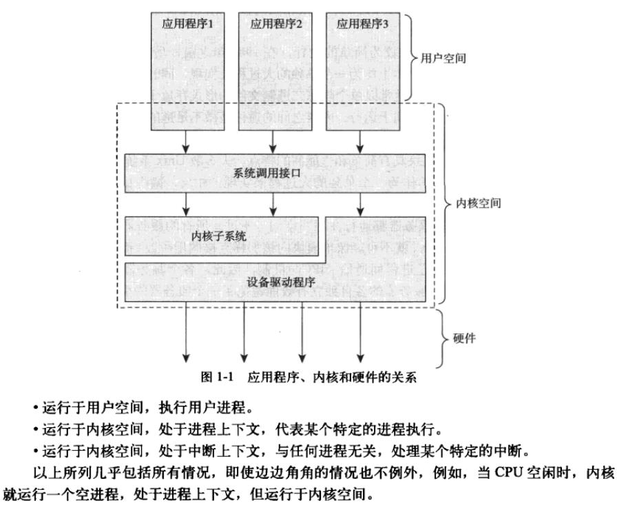{:height 627, :width 746}
	- Linux与传统Unix的差异
		- Linux支持动态加载内核模块
		- Linux支持对称多处理(SMP)机制
		- Linux可抢占Preemptive
		- Linux不区分进程和线程
		- Linux提供具有设备类的面向对象的设备模型、热插拔事件以及用户空间的文件系统sysfs
		-
- 操作系统内核
  collapsed:: true
	- 单内核
	  collapsed:: true
		- 内核以单个静态二进制文件的形式存放于磁盘，所有内核服务都在同一个大的内核地址空间上运行，由于处在同一个地址空间，在内核里可以直接调用函数，内核内部之间的通信是微不足道的，因此具有简单和性能高的特点
		- Linux属于单内核
	- 微内核
	  collapsed:: true
		- 功能被划分为多个独立的过程，每个过程被称为一个服务器，所有的服务器都保持独立运行并运行在各自的地址空间上，只有个别服务器运行在特权模式下，其他服务器都运行在用户空间，各个服务器之间通过IPC机制互通消息，互换“服务”，IPC会涉及用户空间和内核空间的上下文切换因此开销较大。
- linux内核开发的特点
  collapsed:: true
	- 内核编程不能访问C库也不能访问标准的C头文件
		- 完整的C库太大且太低效
		- 大部分C库函数在内核都已经实现
			- 基本头文件位于顶层的include目录下，如`<linux/string.h>`
			- 体系结构相关的头文件位于`arch/<architecture>/include/asm`目录下，例如如果编译的是x86体系结构，`<asm/ioctl.h>`对应的路径为`arch/x86/include/asm/ioctl.h`
	- 内核编程必须使用GNU C
		- 内联函数
			- 使用static关键字把内联函数定义在头文件中
		- 内联汇编
			- 在偏近体系结构底层或者对执行时间要求严格的地方使用内联汇编
		- 分支声明
			- 对于条件选择语句，gcc内建了一条指令用于优化，内核把这条指令封装成了宏，如likely和unlikely
	- 内核编程没有像用户空间的内存保护机制
		- 内核中的内存不分页，每用掉一个字节，物理内存就少一个字节
	- 内核编程难以执行浮点运算
		- 内核使用浮点数需要手动保存和恢复浮点寄存器等操作，除极少数情况例外，不要在内核中使用浮点操作
	- 内核给每个进程只有一个很小的定长堆栈
		- 内核栈的大小随体系结构而变，例如在x86上，栈的大小在编译时配置，可以是4KB也可以是8KB，但是是固定不变的，每个处理器有自己的栈
	- 内核支持异步中断、抢占和SMP，因此必须时刻注意同步和并发
		- 内核的许多特性都要求能够并发地访问共享数据，因此要求有同步机制保证不出现竞争条件
	- 考虑可移植性
		- 必须把体系结构相关的代码从内核代码树的特定目录中适当的分离出来。
- 进程管理
  collapsed:: true
	- 进程
		- 进程也称作任务task，处于执行期的程序以及相关资源的总称。相关资源包括打开的文件，挂起的信号，内核内部数据，处理器状态，一个或者多个具有内存映射的内存空间等资源
		- 进程的生命周期
			- [[fork]]
				- clone
			- [[execve]]
			- exit
				- 进程终结时，内核必须释放它所占用的资源并告知其父进程。
				- 进程的终结发生在进程调用do_exit系统调用时（显示或者隐式），当进程接收到它既不能处理也不能忽略的信号或异常时，也可能被动终结。无论怎么终结，最终都会调用do_exit来完成
				- do_exit最后调用schedule切换到新的进程，该进程处于EXIT_ZOMBIE退出状态，不会再被调度，这是该进程执行的最后一段代码，do_exit永不返回。进程的大部分资源都被释放掉了，它占用的内存只剩下内核栈，thread_info结构和task_struct结构。此时进程存在的唯一作用是向父进程提供信息，父进程检索到信息后，进程的剩余内存被释放。
			- wait
				- wait4
				- wait
				- waitpid
		- 进程描述符
			- 用来描述一个进程所用到的所有信息
			- 内核把进程的列表存放在叫做任务列表task list的双向循环列表中，链表中的每一项都是被称为进程描述符的结构task_struct
			- Linux通过slab分配器动态生成task_struct结构，因此只需在栈底（对于向下增长的栈）或栈顶（对于向上增长的栈）创建一个新的结构struct thread_info，指向实际分配的task_struct
				- 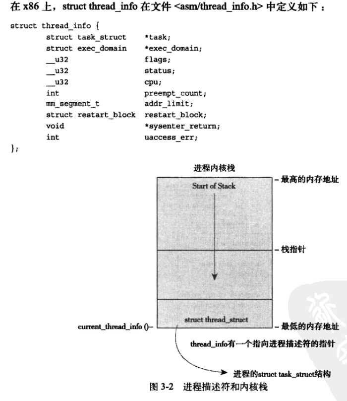
			- 内核通过一个唯一的进程标识值PID来标识每个进程(pid_t，默认最大值32768(short int最大值，可以通过`/proc/sys/kernel/pid_max`进行修改)，内核把每个进程的PID存放在他们各自的进程描述符中
			- 内核中大部分处理进程的代码都是直接通过task_struct进行的，因此如何快速高效的获得指向task_struct的指针变得很重要，内核通过current宏来查找正在运行的进程的进程描述符，硬件体系不同该宏的实现也不相同，例如PPC有专门的寄存器用来保存task_struct，而像x86只能在内核栈的尾端创建thread_info结构，通过偏移间接的查找task_struct结构
			- 进程的状态
				- TASK_RUNNING
					- 进程正在执行或者在运行队列中等待执行
				- TASK_INTERRUPTIBLE
					- 进程正在睡眠（被阻塞），等待某些条件的达成，一旦条件达成，内核会把进程状态设置为TASK_RUNNING。处于此状态的进程也会因为接收到信号而提前被唤醒并随时准备投入运行。
				- TASK_UNINTERRUPTIBLE
					- 处于此状态的任务对信号不做响应，其他行为和TASK_INTERRUPTIBLE相同。这个状态通常在进程必须在等待时不受干扰或等待事件很快就会发生时出现
				- __TASK_TRACED
					- 进程正在被其他进程跟踪，例如通过ptrace对调试程序进行跟踪
				- __TASK_STOPPED
					- 进程停止执行，进程没有投入运行也不能投入运行。通常发生在接收到SIGSTOP等信号的时候。在调试期间收到任何信号都会使进程进入这种状态
				- 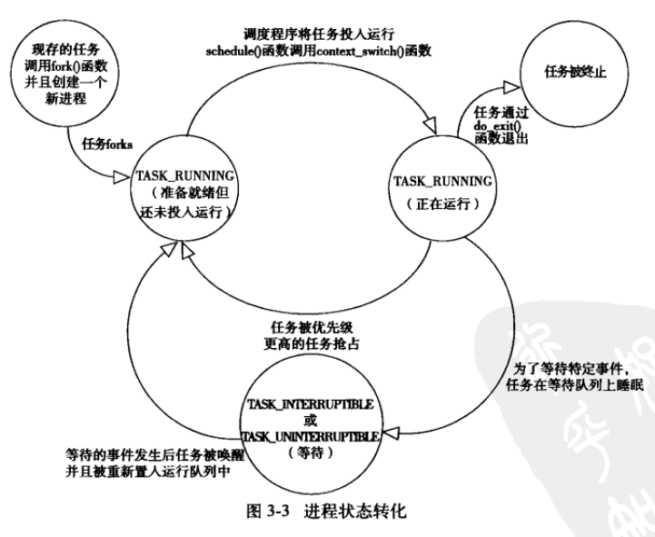
		- 进程上下文
			- 用户空间的进程通过系统调用或者触发异常陷入内核空间，此时内核“代表进程执行”并处于进程上下文中，进程退出内核后，进程恢复在用户空间继续执行。
	- 执行线程
		- 简称线程thread，是进程中活动的对象，每个线程都拥有一个独立的程序计数器、进程栈和一组进程寄存器。内核调度的对象是线程，而不是进程。对linux而言，线程只不过是一种特殊的进程，它被视为一个与其他进程共享某些资源的进程。
	- 内核线程
		- 内核经常需要在后台执行一些操作，这种任务通过内核线程kernel thread来完成，内核线程是独立运行在内核空间的标准进程。
		- 内核线程和普通进程的区别在于内核线程没有独立的地址空间，只在内核空间运行。
		- 内核线程和普通进程一样，可以被调用，也可以被抢占
	- 进程调度
		- 最大限度的利用处理器时间
			- 只要有可以执行的进程，那么总会有进程正在执行
			- 只要系统中可运行的进程的数目比处理器的个数多，就注定某一时刻会有一些进程不能执行，这些进程在等待运行，调度器需要在其中选择一个来执行。
		- Linux是抢占式的多任务系统，由调度程序决定何时停止一个进程以便于其他进程来执行，这个强制的挂起动作称为“抢占”preemption。
		- 时间片timeslice
			- 进程在被抢占之前能够运行的时间，linux的CFS调度器没有直接给分配时间片，而是将处理器的使用比划分给进程，如此一来，进程所获得的处理时间其实是和系统负载密切相关的，该比例还会收到nice值的影响，nice值作为权重将调整进程所使用的处理器时间使用比。
		- 进程的类型
			- IO密集型
			- CPU密集型
		- 调度策略
			- 针对不同类型的进程寻求平衡，进程响应迅速（响应时间短）和最大系统利用率（高吞吐量）
			- 进程的优先级
				- 两种优先级
					- nice值
						- 取值范围-20到19，默认为0，越大的nice值意味着更低的优先级，在linux系统中，nice值代表时间片的比例
					- 实时优先级
						- 取值范围可配置，默认范围0到99，越高的实时优先级意味着进程优先级越高，任何实时进程的优先级都高于普通的进程
			- linux调度算法
				- 调度器类
					- linux调度器以模块化的方式提供，目的是允许不同类型的进程有针对性的选择调度算法，模块化的结构称为调度器类scheduler classes，它允许多种不同的可动态添加的调度算法并存，调度属于自己的范畴。
					- 完全公平调度CFS是一个针对普通进程的调度类，在linux中称为SCHED_NORMAL
						- CFS的基本理念
							- 进程调度的效果如同系统具备一个理想中的的完美多任务处理器，n个进程中的每个进程将能获得`1/n`的处理器时间。同时可以调度给它们无限小的时间周期，即在任何可预测周期内，给予n个进程中每个进程同样多的运行时间
							- 假设有2个运行进程
								- 标准Unix调度模型中
									- 先运行其中一个5ms，之后再运行另外一个5ms，但它们运行时都将占有`100%`的处理器。
								- 完美的多任务处理模型
									- 能在10ms内同时运行2个进程，它们各自使用处理器一半的能力
							- 真实的CFS调度器
								- CFS在考虑进程换入换出的消耗的基础上，允许每个进程运行一段时间，循环轮转，选择运行最少的进程作为下一个运行进程，而不再采用分配给每个进程时间片的做法，CFS在所有可运行进程总数基础上计算出一个进程应该运行多久，而不是依靠nice值来计算时间片，而nice值用作进程获得的处理器运行比的权重
								- CFS为理想多任务中的无限小调度周期的近似值设立了一个目标，称为“目标延迟”。假定目标延迟为20ms，如果有2个同样优先级的可运行任务（无论优先级是多少），则每个任务在被其他任务抢占前运行10ms，如果是20个这样的任务，则每个只能运行1ms，为了避免造成不可接受的进程切换消耗，CFS引入每个进程获得的时间片底线，称为“最小粒度”，默认情况下为1ms
								- 具有不同nice值的两个可运行进程的运行情况
									- 假设目标延迟为20ms
										- 如果一个进程的nice值为0，另一个进程的nice值为5
											- 不同nice值对应不同的权重，因此进程将获得不同的处理器使用比，假设nice值为5的进程权重是默认nice进程的`1/3`，因此两个进程分别获得15ms和5ms的处理器时间
										- 如果一个进程的nice值为10，另一个进程的nice值为15
											- 由于绝对的nice值不再影响调度决策，只有相对值（15-10=5）才会影响处理器时间的分配比例，因此两个进程仍然分别获得15ms和5ms的处理器时间
									- 任何进程所获得的的处理器时间是由它自己和其他所有可运行进程nice值的^^相对差值^^决定的。nice值对时间片的作用不是算数加权，而是几何加权。任何nice值对应的绝对时间不再是一个绝对值，而是处理器的使用比。
			- linux调度的实现
				- 时间记账
					- 所有调度器都必须对进程运行时间进行记账，当1个进程的时间片被减少到0时，就会被另一个尚未减到0的时间片可运行进程抢占。
						- 调度器实体结构
						- 虚拟实时
							- vruntime变量存放进程的虚拟运行时间，该运行时间的计算是经过了所有可运行进程总数的标准化计算，虚拟时间以ns为单位，和定时器节拍不再相关。vruntime可以准确地测量给定进程的运行时间，而且可以知道谁应该是下一个被运行的进程。
				- 进程选择
					- CFS调度算法的核心是选择具有最小vruntime的任务
					- CFS使用红黑树组织可运行进程队列，并利用其迅速找到最小vruntime值的进程。
				- 调度器入口
					- 进程调度的主入口函数是schedule，是内核其他部分用于调用进程调度器的入口：选择哪个进程可以运行，何时将其投入运行。schedule通常都需要和一个具体的调度器类相关联。即它会找到一个最高优先级的调度器类，后者需要有自己的可运行队列，让后问后者谁才是下一个该运行的进程。
				- 睡眠和唤醒
					- 休眠（被阻塞）的进程处于一个特殊的不可执行状态。这点非常重要，如果没有这种特殊状态，调度程序可能会选出一个根本不愿被执行的进程。进程休眠的原因是因为需要等待一些事件。
					- 休眠与唤醒对应内核的操作
						- 休眠
							- 进程把自己标记成休眠状态，从可执行红黑树中移出，放入等待队列，然后调用schedule选择和执行一个其他进程
							- 等待队列
								- 休眠通过等待队列进行处理。等待队列是由等待某些事件发生的进程组成的简单链表。
						- 唤醒
							- 进程被设置为可执行状态，之后从等待队列中移出到可执行红黑树中
							- 唤醒操作会唤醒指定的等待队列上的所有进程。
				- 抢占和上下文切换
					- 上下文切换
						- 从一个可执行进程切换到另一个可执行进程
							- schedule会调用context_switch
								- switch_mm
									- 切换虚拟内存从一个进程到另外一个进程
								- switch_to
									- 切换处理器状态从一个进程到另外一个进程
					- 内核必须知道什么时候调用schedule，内核提供need_resched标志来表明是否需要重新执行一次调度，返回用户空间以及从中断返回时，内核也会检查该标志，如果need_resched被设置，内核会在继续执行之前调用调度程序。每个进程都包含一个need_resched变量，原因是访问进程描述符内的数值比访问全局变量快。
						- 用户抢占
							- 内核即将返回用户空间时，如果need_resched被设置，会导致schedule被调用，此时会发生用户抢占，如下2种情况可能会产生用户抢占
								- 从系统调用返回用户空间时
								- 从中断处理程序返回用户空间时
						- 内核抢占
							- 只要重新调度是安全的，内核就可以在任何时间抢占正在执行的任务
							- 调度安全意味着没有持有锁，锁是非抢占区域的标志
							- 内核抢占发生的情况
								- 中断处理程序正在执行，且返回内核空间之前
								- 内核代码再一次具有可抢占性的时候
								- 如果内核代码显式的调用schedule
								- 如果内核中的任务阻塞（同样会调用schedule）
				- 实时调度策略
					- 实时调度策略不被完全公平调度器来管理，而是被一个特殊的实时调度器管理，sched_rt.c
					- linux下的两种实时调度策略
						- SCHED_FIFO
						- SCHED_RR
					-
	-
- 系统调用
  collapsed:: true
	- 
	- 系统调用是用户空间访问内核的唯一手段，除异常和陷入外，它是内核唯一的合法入口
	- 系统调用的作用
		- 为用户空间提供一种硬件的抽象接口，屏蔽具体的底层硬件操作细节。
		- 保证系统的稳定和安全，内核保留裁决权，防止应用程序不正确的使用硬件设备，窃取进程资源，危害系统等行为
		- 进程运行在虚拟系统中，系统调用在用户空间和系统的其余部分提供了这样一层公共接口
	- 系统调用处理程序
		- 用户空间程序通过软中断通知内核自己需要执行一个系统调用，系统切换到内核态代表应用程序在内核空间执行系统调用
- 内核数据结构
  collapsed:: true
	- 链表
		- 单向链表
			- 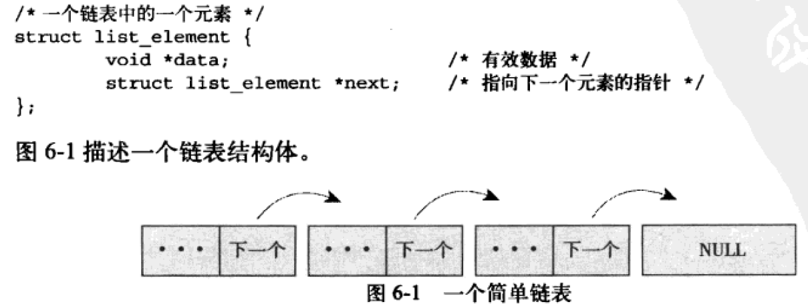{:height 267, :width 686}
		- 双向链表
			- 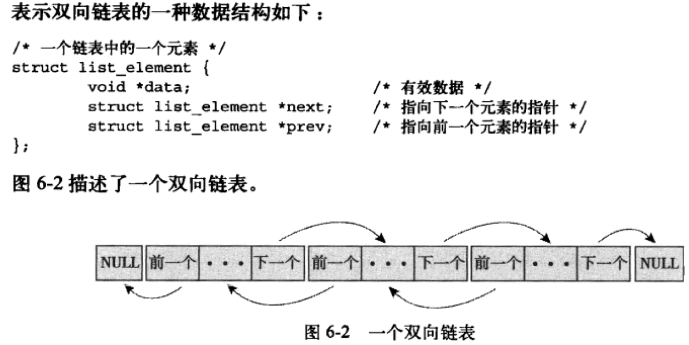
		- 环形链表
			- linux内核的标准链表采用环形链表
				- 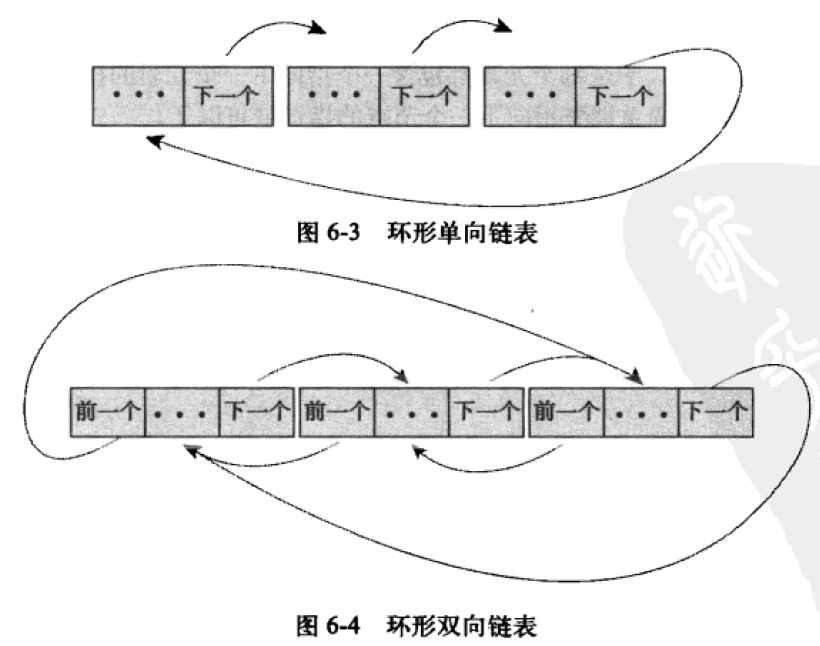
		- linux中链表的实现
			- 不是将数据结构塞入链表，而是将链表节点塞入数据结构
			- 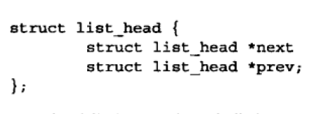
			- 
			- 操作链表
				- 添加节点
					- list_add
				- 删除节点
					- list_del
				- 移动和合并链表
					- list_move
					- list_move_tail
					- list_empty
					- list_splice
					- list_splice_init
				- 遍历链表
					- list_for_each
					- list_for_each_entry
					- list_for_each_entry_reverse
					- list_for_each_entry_safe
	- 队列
		- 队列也成为FIFO，是实现生产者消费者模型一种方式
		- 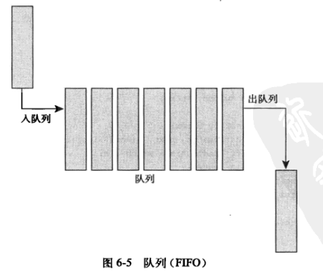
		- linux内核通用队列的实现为kfifo
			- 队列操作
				- 创建队列
					- kfifo_alloc
					- kfifo_init
				- 数据入队列
					- kfifo_in
				- 数据出队列
					- kfifo_out
				- 队列长度
					- kfifo_size
				- 重置和撤销队列
					- kfifo_reset
					- kfifo_free
	- 映射
		- 映射也成为关联数组，唯一的键关联某个特定的值，键到值的关联关系称为映射。键到值的映射是一种通用说法，更多时候使用二叉树而非散列表实现关联数组
		- linux内核提供了idr映射数据结构，但它并非是一个通用的映射，主要目标是映射一个唯一的标识数UID到一个指针。
	- 二叉树
		- 二叉搜索树
		- 自平衡二叉搜索树
			- 红黑树
			- linux实现的红黑树成为rbtree
- 中断和中断处理
  collapsed:: true
	- 中断
		- 中断使得硬件得以发出通知给处理器，中断本质是一种特殊的电信号，由硬件设备发向处理器，处理器收到中断后，会马上向操作系统反映中断信号的到来，之后由操作系统进行对应的中断处理。
		- 不同设备的对应的中断不同，中断通过唯一的数字进行标识，中断值通常被称为中断请求线IRQ，每个IRQ线都会被关联一个数值量，特定的中断总是与特定的设备相关联。
		- 异常
			- 异常与中断不同， 它的产生必须考虑与处理器时钟同步，异常页常常称为同步中断
	- 中断处理程序
		- 内核响应特定中断时执行的函数称为中断处理程序或者终端服务例程ISR，产生中断的每个设备都有一个对应的中断处理程序
		- 中断处理程序被内核调用来响应中断，运行于中断上下文，中断上下文中的代码不可阻塞
		- 中断处理程序是管理硬件的驱动程序的组成部分，驱动程序通过request_irq注册中断处理程序，通过free_irq注销相应的中断处理程序并释放中断线
		- 中断上下文
			- 当执行一个中断处理程序时，内核处于中断上下文
			- 中断上下文和进程无关（没有后备进程），所以中断上下文不可睡眠，因此中断处理程序中不能调用某些函数
			- 中断栈的空间是有限的，尽量节约内核栈空间的使用
		- 中断处理机制的实现
			- 
				- 设备产生中断，通过总线把电信号发送给中断控制器
				- 如果中断线是激活的（中断线允许被屏蔽），中断控制器把中断发送给处理器（通过电信号给处理器的特定管脚发送一个信号）
				- 除非处理器禁止该中断，否则处理器停止当前处理，关闭中断系统，跳转到预定义的中断处理程序入口处开始执行
				- `/proc/interrupts`
		- 中断处理程序的执行内容
			- 如果一个任务对时间非常敏感，将其放在中断处理程序中执行
			- 如果一个任务和硬件相关，将其放在中断处理程序中执行
			- 如果一个任务需要保证不被其他中断（特别是相同的中断）打断，将其放在中断处理程序中执行
			- 其他所有任务考虑放在下半部执行
	- 中断处理的上半部与下半部
		- 解决既想中断处理程序运行的快，又想中断处理程序完成的工作量多的矛盾
		- 网卡处理数据包的上半部和下半部
			- 网卡收到来自网络的数据包，网卡立即发出中断通知内核有最新数据包，内核通过执行网卡已注册的中断处理程序做出应答，中断开始执行，通知硬件，拷贝最新的网络数据包到内存，然后读取网卡更多的数据包，网卡上接收网络数据包的缓存大小固定，拷贝动作一旦被延迟，必然造成缓存溢出，后续的入包只能被丢弃，因此这些是重要、紧迫而又与硬件相关的工作，当网络数据包被拷贝到系统内存后，中断任务完成，控制权交还给系统被中断前原先运行的程序。
			- 对系统内存中数据包的处理和操作在随后的下半部中进行
		- 上半部
			- 中断处理程序属于上半部，收到中断后立即执行，但是只做有严格时限的工作
		- 下半部
- 下半部和推后执行的工作
  collapsed:: true
	- 下半部的任务是执行与中断处理密切相关但中断处理程序本身不执行的工作，用于指代中断处理流程中推后执行的那一部分。
	- 下半部是为了尽量减少中断处理程序中需要完成的工作量，因为中断处理程序在运行时，当前的中断线在所有处理器上都会被屏蔽，缩短中断被屏蔽的时间对系统的响应能力和性能是至关重要的。同时中断处理程序要与其他程序（甚至是其他中断处理程序）异步执行，因此必须尽力缩短中断处理程序的执行。解决办法就是把一些工作放到以后去做。
	- 以后是用来强调不上马上去做，下半部没有明确的执行时间，只是把任务推迟到系统不太繁忙并且中断恢复后执行就可以，下半部执行期间可以响应所有的中断，下半部的设计使得系统处于中断屏蔽状态的时间尽可能的短，从而提供系统的响应能力。
	- linux的下半部实现
		- 软中断softirq
			- 软中断保留给系统中对时间要求最严格以及最重要的下半部使用，当前只有两个子系统：网络和SCSI直接使用软中断
			- 软中断是在编译期间静态分配的
			- 软中断由softirq_action结构表示，每个注册的软中断占据预定义的32个softirq_action的数组的一项，最多可能有32个软中断
			- 软中断的实现
				- 注册软中断处理程序
				- 执行软中断
					- 一个注册的软中断必须在被标记后才会执行，该行为被称为触发软中断raising the softirq，通常中断处理程序会在返回前标记它的软中断，以便其在稍后被执行
					- 软中断被检查和执行的时机
						- 从一个硬件中断代码处返回时
						- 在ksoftirqd内核线程中
						- 在那些显式检查和执行待处理的软中断的代码中，如网络子系统中
		- tasklet
			- tasklet是利用软中断实现的一种下半部机制，是下半部最常用的实现形式，它相比于软中断，接口更简单，锁保护也要求较低
			- tasklet不是编译期间静态分配的，它支持静态创建和动态创建
			- 大多数情况下，tasklet是实现下半部的最佳选择
			- 使用tasklet
				- 声明tasklet
					- 静态创建tasklet
						- DECLARE_TASKLET
						- DECLARE_TASKLET_DISABLED
					- 动态创建tasklet
						- tasklet_init
				- 编写tasklet处理程序
					- void tasklet_handler(unsinged long data)
				- 调度tasklet
					- tasklet_schedule(&my_tasklet)
					- tasklet被调度后，只要有机会它就会尽可能早的运行
					- ksoftirqd
						- 每个处理器都有一组辅助处理软中断（和tasklet）的内核线程，当内核中出现大量软中断的时候，这些内核线程就会辅助处理它们。
		- 工作队列work queue
			- 工作队列不同于软中断和tasklet的实现机制，它可以把工作推后，交给一个内核线程去执行-这个下半部分总是会在进程上下文中执行，因此工作队列^^允许重新调度甚至是睡眠^^
			- 工作队列是唯一能在进程上下文中运行的下半部实现机制，也只有它才可以睡眠。
			- 工作队列的实现
				- 工作队列子系统是一个用于创建内核线程的接口，通过它创建的进程负责执行由内核其他部分排到队列里的任务，创建的内核线程称为工作者线程worker thread，用workqueue_struct表示
				- 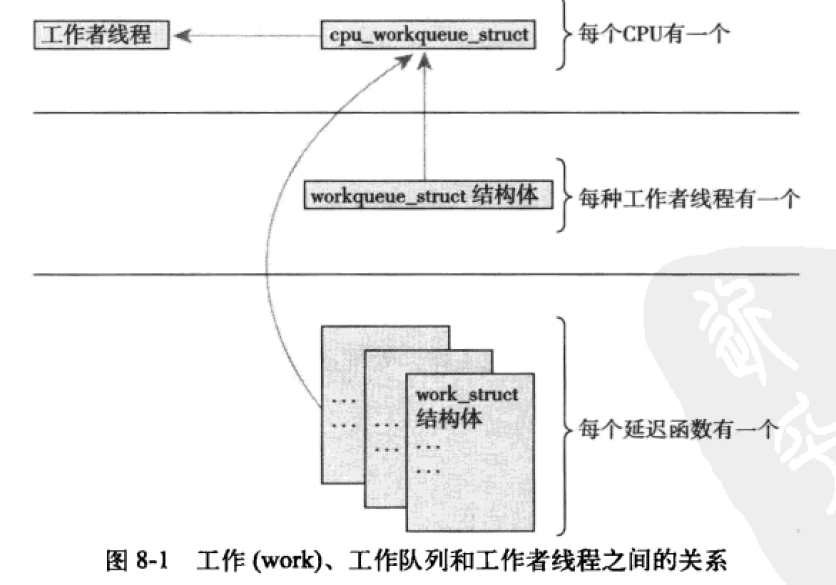
				- 使用工作队列
					-
	- 三种下半部接口的比较
		- 
		- 在下半部之间加锁
		- 禁止下半部
	-
- 内核同步介绍
  collapsed:: true
	- 临界区
		- 访问和操作共享数据的代码段
		- 两个执行线程有可能处于同一个临界区中同时执行，如果这种bug情况发生了，称它是竞争条件race conditions，避免并发和防止竞争条件称为同步
	- 加锁
		- 
		- 锁是采用原子操作实现的，而原子操作不存在竞争，锁的实现与具体的体系结构密切相关，几乎所有的处理器都实现了测试和设置指令，这一指令测试整数的值，如果其值为0就设置一新值。
		- 各种锁机制的主要区别
			- 当锁已经被其他线程持有，锁不可用时的行为表现
				- 一些锁被争用时会简单的执行忙等待
				- 一些锁会使当前任务睡眠直到锁可用为止
	- 造成并发执行的原因
		- 用户空间
			- 用户空间的程序会被调度程序抢占和重新调度，因此用户程序可能在任何时刻被抢占，而调度程序有可能选择另一个高优先级的进程到处理器上执行，这会使得正处在临界区的程序被非自愿抢占了，如果新调度的程序随后进入同一个临界区，就会发生竞争。
		- 内核
			- 中断几乎可以在任何时刻异步发生，因此可能随时打断当前正在执行的代码
			- 软中断和tasklet，内核能在任何时刻唤醒或调度软中断和tasklet，打断正在执行的代码
			- 内核抢占，因为内核具有抢占性，因此内核中的任务可能会被另一任务抢占
			- 睡眠及用户空间的同步，在内核执行的进程可能会睡眠，因此会唤醒调度程序从而导致调度一个新的用户进程执行
			- 对称多处理，两个或者多个处理器可以同时执行代码
	- 了解要保护什么
		- 找出哪些^^数据^^需要保护是关键所在，加锁的内容是数据而不是代码
		- 什么数据需要加锁
			- 如果有其他线程可以访问这些数据，那么给这些数据加锁
			- 如果任何其他东西都能看到它，那么应该加锁
		- 内核代码加锁的考虑
			- 这个数据是不是全局的？除了当前线程，其他线程能不能访问它？
			- 这个数据会不会在进程上下文和中断上下文中共享？是不是要在两个不同的中断处理程序中共享？
			- 进程在访问数据时可不可能被抢占？被调度的新程序会不会访问同一数据？
			- 当前进程是不是会睡眠（阻塞）在某些资源上，如果是，它会让共享数据处于何种状态？
			- 怎么防止数据失控？
			- 如果这个函数又在另外一个处理器上被调度将会发生什么？
			- 如果确保代码远离并发威胁？
	- 死锁
		- 死锁的产生条件
			- 有一个或多个执行线程和一个或多个资源，每个线程都在等待其中的一个资源，当所有资源都已被占用，所有线程都在相互等待但它们永远不会释放自己已占有的资源，此时死锁发生。
		- 预防死锁
			- 按顺序加锁
				- 使用嵌套的锁时必须保证以相同的顺序获取锁，可以阻止致命拥抱类型的死锁
			- 防止发生饥饿
			- 不要重复请求同一个锁
			- 设计应力求简单
- 内核同步方法
  collapsed:: true
	- 原子操作
		- 原子操作是其他同步方法的基石，原子操作可以保证指令以原子的方式执行---执行过程不被打断
		- 内核提供的原子操作接口
			- 原子整数操作
				- 针对整数的原子操作只能对atomic_t类型的数据进行处理
					- ```c
					  typedef struct {
					    volatile int counter;
					  } atomic_t;
					  
					  ATOMIC_INIT(int i);
					  int atomic_read(atomic_t *v);
					  void atomic_set(atomic_t *v, int i);
					  void atomic_add(int i, atomic_t *v);
					  void atomic_sub(int i, atomic_t *v);
					  void atomic_inc(atomic_t *v);
					  void atomic_dec(atomic_t *v);
					  ......
					  ```
				- 原子操作通常是内联函数，往往通过内嵌汇编指令来实现，如果某个函数本来就是原子的，那么它往往会被定义成一个宏。
				- 一个字长的读取总是原子地发生，绝不可能对同一个字交错地进行写；读总是返回一个完整的字，这或者发生在写操作之前，或者之后，绝不可能发生在写的过程中。
			- 原子位操作
				- 位操作函数是对普通的内存地址进行操作的，它的参数是一个指针和一个位号
					- ```c
					  void set_bit(int nr, void *addr);
					  void clear_bit(int nr, void *addr);
					  void change_bit(int nr, void *addr);
					  int test_and_set_bit(int nr, void *addr);
					  int test_and_clear_bit(int nr, void *addr);
					  int test_and_change_bit(int nr, void *addr);
					  int test_bit(int nr, void *addr);
					  ```
	- 自旋锁
	  collapsed:: true
		- 现实世界中，临界区可能跨越多个函数，此时对临界区的保护不能简单的通过简单的原子操作来处理，因此需要更为复杂的同步方法--锁来保护。
		- 自旋锁spin lock最多只能被一个可执行线程持有，如果一个执行线程视图获得一个被已经持有的自旋锁，那么该线程就会一直进行忙循环--等待锁重新可用。
		- 在任意时间，自旋锁都可以防止多于一个的执行线程同时进入临界区
			- ```c
			  DEFINE_SPINLOCK(mr_lock);
			  spin_lock(&mr_lock);
			  /* 临界区 */
			  spin_unlock(&mr_lock);
			  
			  spin_lock();
			  spin_unlock();
			  ......
			  ```
		- 自旋锁和下半部
			- 由于下半部可以抢占进程上下文中的代码，所以当下半部和进程上下文共享数据时，必须对进程上下文中的共享数据进行保护，所以需要加锁的同时还要禁止下半部执行
			- 由于中断处理程序可以抢占下半部，所以如果中断处理程序和下半部共享数据，那么就必须在获取恰当的锁的同时还要禁止中断
			- 同类的tasklet不可能同时运行，因此对于同类tasklet中的共享数据不需要保护
			- 当数据被两个不通种类的tasklet共享时，需要在访问下半部中的数据前先获得一个普通的自旋锁，这里不需要禁止下半部，因为在同一个处理器上绝不会有tasklet相互强占的情况。
			- 对于软中断，无论是否同种类型，如果数据被软中断共享，那么它必须得到锁的保护，因为即使是同种类型的两个软中断也可以同时运行在一个系统的多个处理器上。但是，同一处理器上的一个软中断绝不会抢占另一个软中断，因此没有必要禁止下半部。
		- 读-写自旋锁
			- 读-写自旋锁专门为读和写提供不同的锁。
				- 一个或者多个读任务可以并发地持有读者锁
				- 用于写的锁最多只能被一个写任务持有，而且此时不能有并发的读操作
			- ```c
			  DEFINE_RWLOCK(&mr_rwlock);
			  
			  read_lock(&mr_rwlock);
			  /* 临界区（只读）*/
			  read_unlock(&mr_rwlock);
			  
			  write_lock(&mr_rwlock);
			  /* 临界区（读写）*/
			  write_unlock(&mr_rwlock);
			  
			  通常，读锁和写锁位于完全分割开的代码分支中
			  
			  
			  read_lock();
			  read_lock_irq();
			  read_lock_irqsave();
			  ......
			  ```
	- 信号量
		- linux中的信号量是一种睡眠锁
		- 如果一个任务试图获得一个不可用的信号量时，信号量会将其推进一个等待队列，让后让其睡眠，从而处理器去执行其他代码。当持有的信号量可用时，处于等待队列中的那个任务将被唤醒并获得该信号量
		- 信号量比自旋锁有更大的开销
		- 信号量的睡眠特性
			- 争用信号量的进程在等待锁变为可用时会睡眠，所以信号量适用于锁会被长时间持有的情况
			- 锁被短时间持有时，信号量不适宜。因为睡眠，维护等待队列以及唤醒所花费的开销可能比锁被占用的时间还要长
			- 由于执行线程在锁被争用时会睡眠，所以只能在进程上下文中才能获得信号量锁，因为在中断上下文中是不能进行调度的
			- 你可以在持有信号量时去睡眠，因为当其他进程试图获得同一信号量时不会因此而死锁
			- 在你占用信号量的同时不能占用自旋锁，因为在你等待信号量的时候可能会睡眠，而在持有自旋锁的时是不允许睡眠的
		- 计数信号量和二值信号量
			- 信号量同时允许任意数量的锁持有者，而自旋锁在一个时刻最多允许一个任务持有它。
				- 计数信号量
					- 在一个时刻允许有多个锁持有者
				- 二值信号量
					- 在一个时刻仅允许有一个锁持有者，又称为互斥信号量
				- ```c
				  struct semaphore name;
				  sema_init(&name, count);
				  
				  static DECLARE_MUTEX(name);
				  
				  
				  /*  定义并声明一个信号量 */
				  static DECLARE_MUTEX(mr_sem);
				  /* 试图获取信号量 */
				  if(down_interruptible(&mr_sem)) {
				    /* 信号被接收，信号量还未获取 */
				  }
				  
				  /* 临界区 */
				  
				  /* 释放给定信号量 */
				  up(&mr_sem);
				  
				  
				  sema_init(struct semaphore *, int);
				  ......
				  ```
			- 读-写信号量
	- 互斥体
	  collapsed:: true
		- 互斥体mutex行为和使用计数为1的信号量类似，但操作接口更简单，实现也更高效，而且使用限制更强。
			- ```c
			  DEFINE_MUTEX(name); /* 静态初始化 */
			  mutex_init(&mutex); /* 动态初始化 */
			  
			  mutex_lock(&mutex);
			  /* 临界区 */
			  mutex_unlock(&mutex);
			  ```
		- mutex的简洁和高效源自于相比信号量更多的限制
			- 任何时刻只有1个任务持有mutex
			- 给mutex上锁者必须负责给其再解锁。最常用的使用方式是：在同一上下文中上锁和解锁
			- 递归第上锁和解锁是不允许的
			- 当持有一个mutex时，进程不可以退出
			- mutex不能在中断或者下半部中使用
			- mutex只能通过官方API管理
			- 相比于信号量，优先选择mutex，发现其不能满足条件或者没有其他选择时考虑使用信号量
	- 完成变量
		- 在内核中一个任务需要发出信号通知另一个任务发生了某个特定事件，可以使用完成变量completion variable
	- 大内核锁
	- 顺序锁
		- 提供简单的锁机制，用于读写共享数据
	- 禁止抢占
	- 顺序和屏障
		- 编译器和处理器为了提高效率，可能会对读和写重新排序，屏障barriers是确保顺序的指令，用来指示编译器不要对给定点周围的指令序列进行重新排序
		- ```c
		  rmb();
		  read_barrier_depends();
		  wmb();
		  mb();
		  smp_rmb();
		  ......
		  barrier();
		  ```
- 定时器和时间管理
  collapsed:: true
	- 系统定时器
		- 一种可编程硬件芯片，能以固定频率产生中断，即定时器中断，对应的中断处理程序负责更新系统时间，和负责执行需要周期性执行的任务
		- 连续两次时钟中断的间隔时间称为节拍tick，等于节拍率tick rate分之一
		- 系统定时器频率（节拍率）通过静态预处理HZ定义，在系统启动时按照HZ对硬件进行设置，体系结构不同，HZ值也不同。
		- 高HZ的优势和劣势
			- 优势
				- 内和定时器能够以更高的频率和更高的准确度运行
				- 依赖定时值执行的系统调用，如poll和select能够以更高的精度运行
				- 对诸如资源消耗和系统运行时间等测量会有更精细的解析度
				- 提高进程抢占的准确度
			- 劣势
				- 节拍率越高，时钟中断频率越高，系统负担越重
		- jiffies
			- 全局变量jiffies用来记录自系统启动以来产生的节拍的总数，初始值为0，之后每次时钟中断处理都会增加该变量的值
			- jiffies的回绕
				- 内核提供了4个宏来帮助比较节拍计数，它们能正确处理节拍计数回绕的情况
		- 时钟中断处理程序
			- 体系结构相关部分
				- 作为系统定时器的中断处理程序注册到内核
				- 实际时间（墙上时间）
					- ```c
					  kernel/time/timekeeping.c
					  struct timespec xtime;
					  
					  <linux/time.h>
					  struct timespec {
					  	_kernel_time_t tv_sec;
					      log tv_nsec;
					  }
					  
					  ```
			- 体系结构无关部分
	- 动态定时器
		- 简称定时器，用来推迟执行程序的工具
		- 动态定时器超时后自行撤销，因此可以不断的创建和撤销，运行次数不受限制。
		- 使用定时器
			- ```c
			  创建
			  初始化
			  填充
			  激活
			  struct timer_list my_timer;
			  
			  init_timer(&my_timer);
			  
			  my_timer.expires = jiffies + delay;
			  my_timer.data = 0;
			  my_timer.function = my_timer_function;
			  
			  void my_timer_function(unsigned long data);
			  
			  add_timer(&my_timer);
			  
			  另外还可以动态修改定时器的超时时间
			  mod_timer(&my_timer, jiffies+new_delay);
			  
			  删除
			  del_timer(&my_timer);
			  del_timer_sync(&my_timer);
			  ```
		- 内核在时钟中断发生后执行定时器，定时器作为软中断在下半部上下文中执行。
		- 延迟执行
			- 忙等待
			- 短延迟
			- schedule_timeout
			-
- 内存管理
  collapsed:: true
	- 页
		- 内核把物理页作为内存管理的基本单位，从虚拟内存的角度来看，页就是最小单位。
		- 内核用struct page表示物理页
			- ```c
			  <linux/mm_types.h>
			  struct page {
			  	unsigned long	flags;
			      atomic_t		_count;
			      atomic_t		_mapcount;
			      unsigned long	private;
			      struct address_space	*mapping;
			      pgoff_t			index;
			      struct list_head	lru;
			      void			*virtual;
			  }
			  ```
			- page数据结构的目的在于描述物理内存本身，而不是描述包含在其中的数据
			- 系统中的每个页都要分配这样一个结构体，因为内核需要知道一个页是否空闲，如果已经分配内核需要知道谁拥有这个页
	- 区
		- 由于硬件限制，内核并不能对所有的页一视同仁，有些页位于内存中特定的物理地址上，不能将其用于一些特定的任务。
		- 内核使用区对具有相似特性的页进行分组
		- 区的类型
			- ZONE_DMA
				- 这个区包含的页能用来执行DMA操作
			- ZONE_NORMAL
				- 这个区包含的都是能正常映射的页
			- ZONE_HIGHMEM
				- 这个区包含“高端内存”，其中的页不能永久地映射到内核地址空间
			- 需要注意的是，区的实际使用和分布和体系结构相关
			- 区的划分没有任何物理意义，只不过是为了内核管理页而采取的一种逻辑上的分组
			- 每个区用struct zone表示
	- 页的申请与释放
		- ```c
		  核心函数
		  struct page *alloc_pages(gfp_t gfp_mask, unsigned int order);
		  
		  转换给定页的逻辑地址
		  void *page_address(struct page *page);
		  ......
		    
		  void __free_pages(struct page *page, unsigned int order);
		  
		  ```
		- kmalloc
			- kmalloc返回的页在内存地址上是连续的
			- ```c
			  void *kmalloc(size_t size, gfp_t flags);
			  ```
			- gfp_mask标志
				- 行为修饰符
					- ```c
					  __GFP_WAIT
					  __GFP_HIGH
					  ......
					  ```
				- 区修饰符
					- ```c
					  __GFP_DMA
					  __GFP_DMA32
					  __GFP_HIGHMEM
					  ```
				- 类型标志
					- ```c
					  GFP_ATOMIC
					  GFP_NOWAIT
					  ......
					  ```
				- 
		- kfree
			- ```c
			  void kfree(const void *ptr);
			  ```
		- vmalloc
			- vmalloc只确保页在虚拟地址空间内是连续的
			- 通常只有硬件设备需要得到物理地址连续的内存，因为硬件设备处在内存管理单元以外，没有虚拟地址的概念。
			- ```c
			  void *vmalloc(unsigned long size);
			  void vfree(const void *addr);
			  ```
		- slab
			- 由于分配和释放数据结构是所有内核中最普遍的操作之一，因此slab分配器扮演了通用数据结构缓存层的角色。
			- slab由一个或多个物理上连续的页组成，每个slab都包含一些成员对象，对象指被缓存的数据结构。
			- slab的3钟状态
				- 满
				- 部分满
				- 空
			- 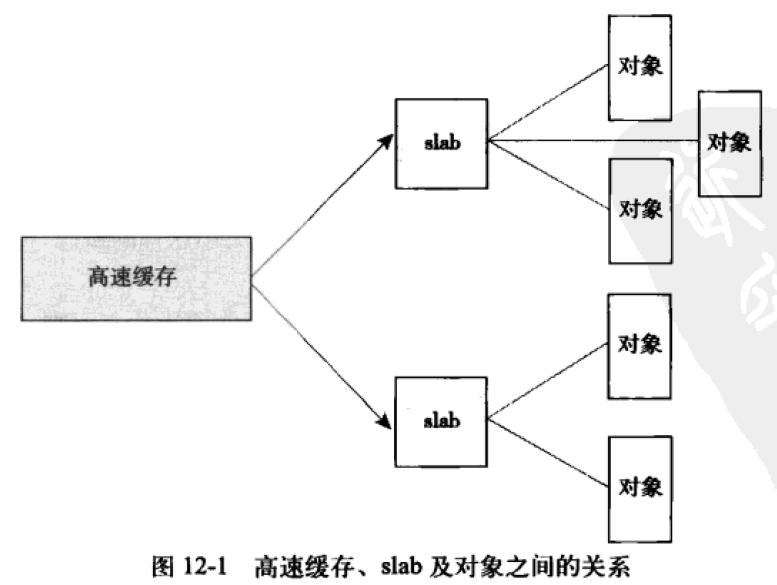
				- 高速缓存
					- ```c
					  每个高速缓存都使用kmem_cache结构来表示，该结构包含3个链表
					  slabs_full
					  slabs_partial
					  slabs_empty
					  
					  slab描述符
					  struct slab {
					  	struct list_head list;
					      unsigned long colouroff;
					      void *s_mem;
					      unsigned int inuse;
					      kmem_bufctl_t free;
					  }
					  ```
		- 内核栈的内存分配
			- 单页内核栈
				- 内核栈可以是1页，也可以是2页，取决于编译时的配置选项，因此栈的大小在4 ~ 16KB的范围
				- 在内核里的空间分配，动态分配是一种明智的选择
		- 高端内存
			- 在高端内存中的页不能永久地映射到内核地址空间上，因此，通过alloc_pages函数以__GFP_HIGHMEM标志获得的页不可能有逻辑地址
			- 永久映射
				- 映射给定的page结构到内核地址空间
					- ```c
					  void *kmap(struct page *page);
					  void kunmap(struct page *page);
					  ```
					- kmap可以睡眠，因此只能用在进程上下文
					- 允许永久映射的数量是有限的，因此当不再需要高端内存时要及时接触映射
			- 临时映射
				- 必须创建一个映射而当前的上下文又不能睡眠时，使用临时映射（原子映射）
				- ```c
				  void *kmap_atomic(struct page *page, enum km_type type);
				  ```
					- kmap_atomic不会阻塞，可以用在中断上下文和其他不能重新调度的地方，它也禁止内核抢占。
		- 每个CPU的分配
			- 使用每个CPU数据的优势
				- 可以减少数据锁定，可以不再需要任何锁，只需要确保本地处理器只会访问它自己的唯一数据。
				- 可以大大减少缓存失效
- 虚拟文件系统
  collapsed:: true
	- 虚拟文件系统使得程序可以通过标准的Unix系统调用对不同的文件系统设置不同介质的上的文件系统进行读写操作。
	- 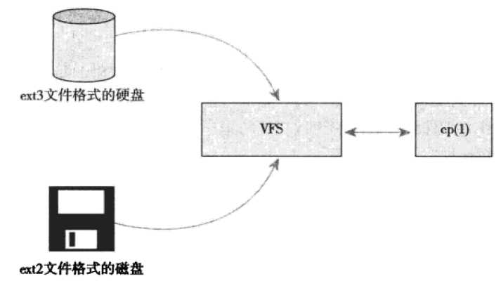
	- 文件系统抽象层
		- 之所以可以通过通用接口对所有类型的文件系统进行操作，是因为内核在它的底层文件系统接口上建立了一个抽象层VFS。VFS提供了一个通用文件系统模型，该模型囊括了任何文件系统的常用功能集和行为。
		- 系统调用
			- 系统调用是通用VFS接口，提供给用户空间前端
			- 系统调用是具体文件系统的后端，处理实现细节
			- 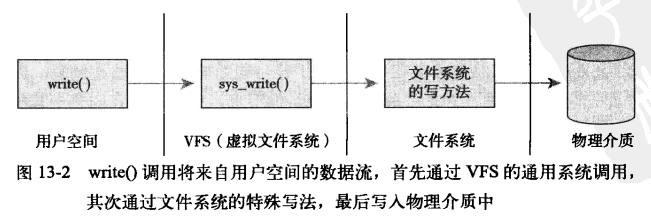
			- Unix文件系统
				- 文件
					- 文件被看作是一个有序的字节序列，文件名是为了方便系统和用户识别文件
				- 目录
					- 文件通过目录组织，用来容纳文件条目
				- 索引节点
				- 挂载点
			- VFS的对象类型
				- 超级块对象
					- 代表一个具体的已安装文件系统
					- 每个文件系统都必须实现超级块对象，该对象用于存储特定文件系统的信息，通常对应于存放在磁盘特定扇区中的文件系统超级块或文件系统控制块（所以称为超级块对象）
					- 超级块对象super_block
						- ```c
						  struct super_block {
						    
						  }
						  ```
					- 超级块操作
						- ```c
						  struct super_operations {
						    
						  }
						  ```
				- 索引节点对象
					- 代表文件系统中的一个文件
					- 索引节点对象包含了内核在操作文件或目录时需要的全部信息
					- 索引节点对象inode
						- ```c
						  struct inode {
						    
						  }
						  ```
					- 索引节点操作
						- ```c
						  struct inode_operations {
						    
						  }
						  ```
				- 目录项对象
					- 代表一个目录项，是路径的一个组成部分，目的是为了方便文件的查找操作
					- VFS将目录作为一个文件来处理，是一种特殊形式的文件
					- 目录项对象dentry
						- ```c
						  struct dentry {
						    
						  }
						  ```
					- 目录项操作
						- ```c
						  struct dentry_operations {
						    
						  }
						  ```
				- 文件对象
					- 已打开的文件在内存中的表示
					- 因为多个进程可以同时打开和操作同一个文件，因此同一个文件也可能存在多个对应的文件对象。
					- 文件对象file
						- ```c
						  struct file {
						    
						  }
						  ```
					- 文件操作
						- ```c
						  struct file_operations {
						    
						  }
						  ```
				- 和文件系统相关的数据结构
					- file_system_type用来描述各种特定文件系统类型
						- ```c
						  struct file_system_type {
						    
						  }
						  ```
					- vfsmount用来描述一个安装文件系统的实例
						- ```c
						  struct vfsmount {
						    
						  }
						  ```
				- 和进程相关的数据结构
					- file_struct结构体
						- 描述与单个进程相关的信息
							- ```c
							  struct file_struct {
							    
							  }
							  ```
					- fs_struct结构体
						- 包含文件系统和进程相关信息
							- ```c
							  struct fs_struct {
							    
							  }
							  ```
					- namespace结构体
						- 使得每个进程在系统中都看到唯一的安装文件系统
							- ```c
							  struct mnt_namespace {
							    
							  }
							  ```
- 块IO层
  collapsed:: true
	- 设备类型
		- 字符设备
			- 不支持随机访问
		- 块设备
			- 支持随机访问
			- 块设备最小的可寻址单元是扇区，最常见的是512字节
				- 扇区的大小是设备的物理属性，扇区是所有块设备的基本单元---块设备无法对比扇区还小的单元进行寻址和操作
				- 扇区又称为硬扇区或者设备块
			- 块是文件系统的一种抽象---只能基于块来访问文件系统，块是文件系统的最小寻址单元
				- 块又称作文件块或者IO块
			- 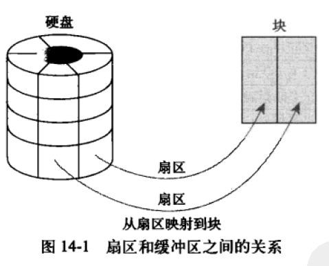
			- 缓冲区和缓冲区头
				- 块被调入内存时，存储在一个缓冲区中，每个缓冲区与一个块对应，每个缓冲区都有一个对应的描述符，描述符用缓冲区头buffer_head表示，它包含了内核操作缓冲区所需的全部信息
					- 缓冲区头的目的在于描述磁盘块和物理内存缓冲区（在特定页面上的字节序列）之间的映射关系
					- ```c
					  struct buffer_head {
					    
					  }
					  ```
			- bio结构体
				- bio结构体是内核中IO操作的基本容器，它代表了活动的以片段链表形式组织的块IO操作，片段是一小块连续的内存缓冲区，这样就不需要保证单个缓冲区一定要连续。
					- ```c
					  struct bio {
					    
					  }
					  ```
				- 使用bio结构体的目的主要是代表正在现场执行的IO操作
					- 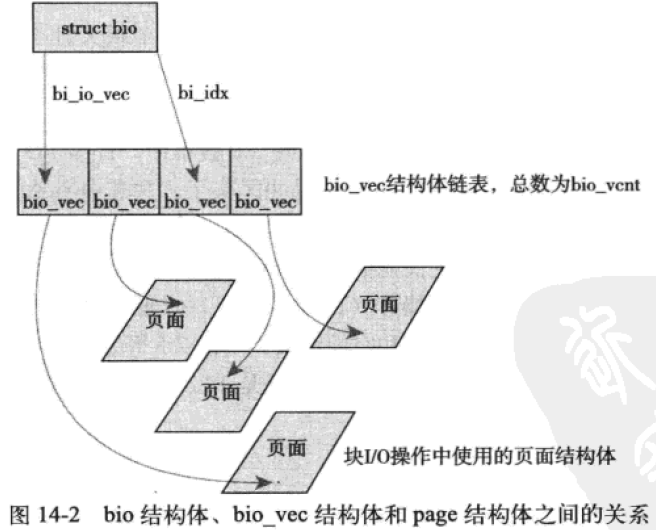
				- IO向量
					- 形式为`<page, offset, len>`向量的bio_vec结构，描述了一个特定的片段：片段所在物理页，块在物理页中偏移位置、从给定偏移量开始的块长度
					- 每一块IO请求都通过一个bio结构体表示
					- 整个bio_io_vec结构体数组表示了一个完整的缓冲区
						- ```c
						  struct bio_vec {
						    struct page *bv_page;
						    unsigned int bv_len;
						    unsigned int bv_offset;
						  }
						  ```
			- 请求队列
				- 块设备将它们挂起的的块IO请求保存在请求队列中，该队列由reques_queue结构体表示
				- 请求队列中的每一项都是一个单独的请求，由reques结构体表示
			- IO调度程序
				- 为了优化寻址操作，内核会在提交前，先执行名为合并与排序的预操作，可以极大地提高系统的整体性能，内核中负责提交IO请求的子系统称为IO调度程序
					- 合并
						- 将两个或多个请求合并成一个新请求
					- 排序
						- 将所有请求按照硬盘上扇区的排列顺序有序排列
						- 电梯调度
- 进程地址空间
  collapsed:: true
	- 进程地址空间由进程^^可寻址^^的虚拟内存组成
	- 可被访问的合法空间称为内存区域memory areas，通过内核，进程可以给自己的地址空间动态地添加或减少内存区域
	- 内存描述符
		- 内核使用内存描述符表示进程的地址空间，该结构包含了和进程地址空间有关的全部信息
			- ```c
			  struct mm_struct {
			    
			  }
			  ```
		- 内核线程没有进程地址空间，也没有相关的内存描述符。所以内核线程对应的进程描述符中的mm域为空。事实上，这也是内核线程的真实含义---它们没有用户上下文
	- 虚拟内存区域
		- 虚拟内存区域VMA vm_area_struct描述了指定地址空间内连续区间上的一个独立的内存范围
		- 内核将每个内存区域作为一个单独的内存对象管理
		- 每个内存区域都拥有一致的属性，比如访问权限等，相应的操作也都一致，即每个VMA代表不同类型的内存区域
		- ```c
		  struct vm_area_struct {
		    
		  }
		  ```
		- VMA标志
			- 标志了内存区域所包含的页面的行为和信息
		- VMA操作
			- ```c
			  struct vm_operations_struct {
			    
			  }
			  ```
		- 内存区域的访问
			- 内存区域可以通过内存描述符中的mmap和mm_rb域之一进行访问，这两个域各自独立地指向与内存描述符相关的全体内存区域对象，仅仅阻止方法不同
			- mmap域使用单独链表连接所有的内存区域对象
			- mm_rb域使用红黑树连接所有的内存区域对象
		- 内存区域相关函数
			- ```c
			  struct vm_area_struct *find_vma(struct mm_struct *mm, unsigned long addr);
			  struct vm_area_struct *find_vma(struct mm_struct *mm, unsigned long addr,
			                                 						  struct vm_area_struct **pprev);
			  static inline struct vm_area_struct *find_vma_intersection(struct mm_struct *mm,
			                                                            unsigned long start_addr,
			                                                            unsigned long end_addr);
			  ```
		- 创建地址空间
			- 内核使用do_map函数将一个地址区间加入到进程的地址空间中---扩展已经存在的内存区域（如果创建的地址区间和一个已经存在的地址区间相邻，并且它们具有相同的访问权限，两个区间将合并）或者创建一个新的区域
				- ```c
				  unsigned long do_map(struct file *file, unsigned long addr,
				                       unsigned long len, unsigned long prot,
				                       unsigned long flag, unsigned long offset);
				  ```
				- 用户空间通过mmap系统调用获取内核函数do_mmap的功能
		- 删除地址空间
			- do_mummap函数从特定的进程地址空间中删除指定地址空间
			- 系统调用mummap给用户空间程序提供了一种从自身地址空间中删除指定地址空间的方法
	- 页表
		- 应用程序直接操作的是虚拟内存，CPU直接操作的是物理内存，虚拟地址到物理地址的转换通过查询页表来完成。
		- 地址转换需要将虚拟地址分段，使每段虚拟地址都作为一个索引指向页表，而页表项则指向下一级的页表或最终的物理页面
		- Linux使用三级页表完成地址转换
			- 页全局目录PGD
				- PGD中的表项指向二级页目录中的表项PMD
			- 中间页目录PMD
				- PMD中的表项指向PTE中的表项
			- 页表
				- 包含了pte_t类型的页表项，页表项指向物理页面
			- 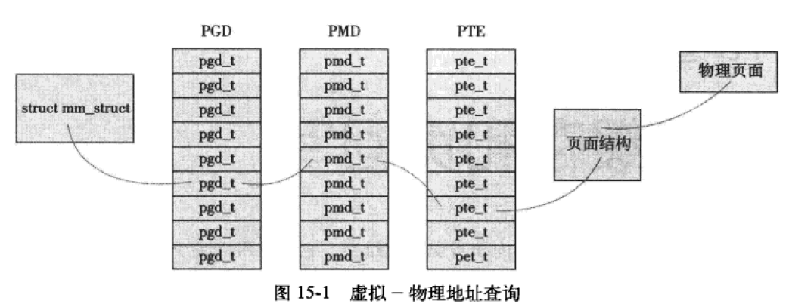
		- 每个进程都有自己的页表，内存描述符的pgd域指向的就是进程的页全局目录
		- TLB（Translate Lookaside Buffer）是一个将虚拟地址映射到物理地址的硬件缓存
			- 当CPU访问虚拟地址时，如果在缓存中直接命中，则直接返回物理地址
			- 否则，通过页表搜索对应的物理地址
		- 写时拷贝使得在fork操作中父子进程共享页表，消除了fork操作中页表拷贝锁带来的开销
- 页高速缓存和页回写
  collapsed:: true
	- 页高速缓存cache通过把磁盘中的数据缓存到物理内存，把对磁盘的访问变为对物理内存的访问，从而减少对磁盘的IO操作
	- 页高速缓存由内存中物理页面组成，其内容对应磁盘上的物理块
	- 正在被缓存的存储设备称为后备存储
	- 读缓存
		- 缓存命中
			- 读操作时，数据在页高速缓存中，直接从内存中读取数据
		- 缓存未命中
			- 读操作时，数据不在页高速缓存中，需要通过IO操作从磁盘读取数据，之后将数据放入页缓存
	- 写缓存
		- 三种策略
			- 不缓存nowrite
				- 跳过缓存直接写数据到磁盘
			- 写透缓存write-through mode
				- 写操作自动更新内存缓存，同时更新磁盘文件
			- “回写”
				- 写操作直接写到缓存，后端存储不会立即更新，而是将高速缓存中被写入的页面标记成“脏”，并加入到脏页链表中，然后由一个进程（回写进程）周期性将脏页链表中的页写回磁盘
	- 缓存回收
		- 决定缓存中什么内容将被清除
		- 回收策略
			- 最近最少使用
			- 双链策略
	- Linux页高速缓存
		- 页高速缓存中的页可能包含多个不连续的物理磁盘块
		- 管理缓存项和IO操作的address_space结构体
			- ```c
			  struct address_space {
			    
			  }
			  ```
			- address_space操作
				- ```c
				  struct address_space_operations {
				    
				  }
				  ```
	- 缓冲区高速缓存
		- 独立的磁盘块通过块IO缓冲也要被存入页高速缓存
		- 一个缓冲是一个物理磁盘块在内存中的表示，缓冲的作用是映射内存中的页面到磁盘块，从而减少了磁盘的IO访问
- 设备与模块
  collapsed:: true
	- 设备类型
		- 块设备
			- 寻址以块为单位，块大小由具体设备决定，支持重定位操作即数据的随机访问
		- 字符设备
			- 不可寻址，仅提供数据的流式访问
		- 网络设备
			- 通过套接字API的特殊接口进行访问
	- 模块
		- 允许内核在运行时动态地向其中插入或从中删除代码
	- 设备模型
		- 统一设备模型device model
			- 提供了一个独立的机制专门来表示设备，并描述其在系统中的拓扑结构
				- 代码重复最小化
				- 提供诸如引用计数等统一机制
				- 可以列举系统中的所有设备，观察它们的状态，查看它们连接的总线
				- 可以将系统中的设备以树的形式进行展示，包括所有的总线和内部连接
				- 可以将设备和其对应的驱动联系起来
				- 可以将设备按照类型进行归类，而无需理解物理设备的拓扑结构
				- 可以沿设备树的叶子向其根的方向依次遍历，以保证能以正确顺序关闭各设备的电源
			- kobject
				- 设备模型的核心是kobject，它提供了类似面向对象语言中类的概念，用来创建对象的层次结构
					- ```c
					  struct kobject {
					    
					  }
					  ```
				- kobject通常嵌入其他结构中，被嵌入的结构拥有了kobject提供的标准功能，嵌入kobject的结构体可以成为对象层次架构中的一部分
			- ktype
				- ktype用来描述一族kobject所具有的普遍特性
					- ```c
					  struct kobj_type {
					    
					  }
					  ```
			- kset
				- kset是kobject对象的集合体，可以将其看作是kobject对象的容器。
					- ```c
					  struct kset {
					    
					  }
					  ```
				- 具有ktype的kobject可以被分组到不同的kset，也就是说，在linux内核中，只有少数一些的ktype，却有多个kset
			- kobject, ktype, kset之间的关系
				- 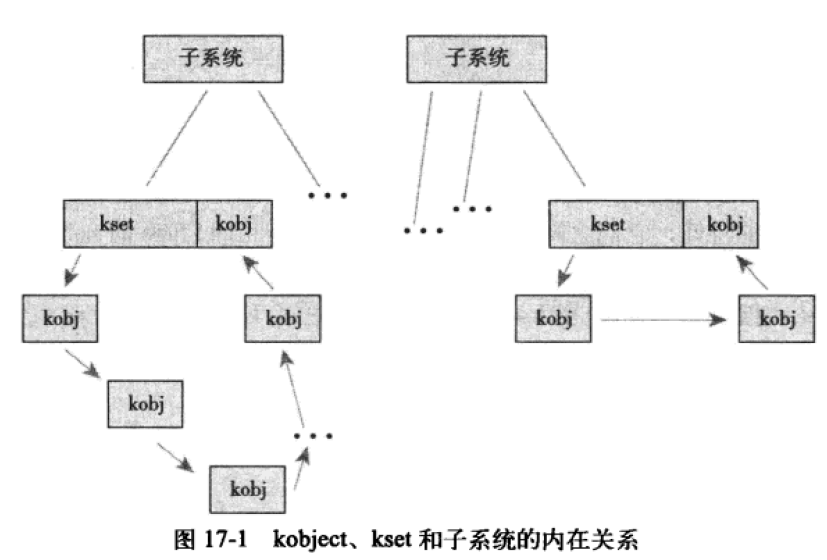
			- sysfs
				- sysfs文件系统是一个处于内存中的虚拟文件系统，提供了kobject对象层次结构的视图
				- sysfs把kobject对象与目录项directory entries紧密联系起来，这点是通过kobject对象中的dentry字段实现的（dentry表示目录项，通过连接kobject到指定的目录项上，可以方便的将kobject映射到该目录上）
				- sysfs中添加和删除kobject
					- ```c
					  int kobject_add(...);
					  struct kobject *kobject_creat_and_add(...);
					  void kobject_del(...);
					  ```
					- 向sysfs中添加文件
						- sysfs仅仅是一个漂亮的树，但是没有提供实际数据的文件，默认的文件集合是通过kobject和kset中的ktype字段提供的
						- kobj_type的default_attrs是attribute结构体数组，负责将内核数据映射成sysfs中的文件
							- ```c
							  struct attribute {
							    
							  }
							  ```
							- 如何使用默认属性
								- ```c
								  struct sysfs_ops {
								    
								  }
								  ```
							- 创建新属性
								- ```c
								  int sysfs_create_file(...);
								  int sysfs_create_link(...);
								  ```
							- 删除新属性
								- ```c
								  void sysfs_remove_file(...);
								  void sysfs_remove_link(...);
								  ```
					- sysfs约定
						- sysfs属性应该保证每个文件只导出一个值，该值应该是文本形式而且映射为简单的C类型
						- sysfs中要以一个清晰的层次组织数据
						- sysfs提供内核到用户空间的服务，这多少有些用户空间的ABI的作用
			- 内核事件层
				- 内核事件层实现了内核到用户的消息通知系统
				- 内核代码向用户空间发送信号
					- ```c
					  int kobject_uevent(...);
					  ```
	-
- [linux process scheduling](https://www.cs.cmu.edu/afs/grand.central.org/archive/twiki/pub/Main/SumitKumar/LinuxScheduling.pdf)
-