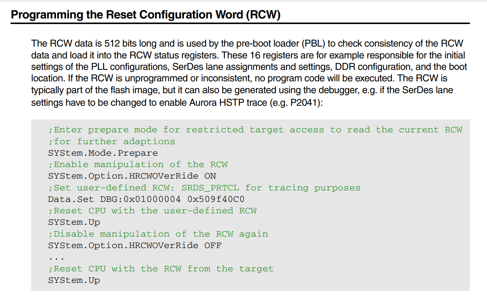

- 基本概念
	- RCW
		- 
- 参考文档
	- [QorIQ Processing Platform Board Bring-up Fundamentals](https://comm.eefocus.com/media/download/index/id-1009185)
	- [QorIQ Debugger and NEXUS Trace](https://www2.lauterbach.com/pdf/debugger_ppcqoriq.pdf)
	- [Introduction to Pre-Boot Loader Supported by QorIQ Processors](https://www.nxp.com/files-static/training/doc/ftf/2014/FTF-NET-F0152.pdf)
	- [Programming Environments Manual for 32-Bit Implementations of the PowerPC™ Architecture](https://www.nxp.com/files-static/product/doc/MPCFPE32B.pdf)