- 欧姆定律
  collapsed:: true
	- 
	- ```bash
	  I = V / R
	  V = I * R
	  ```
	- 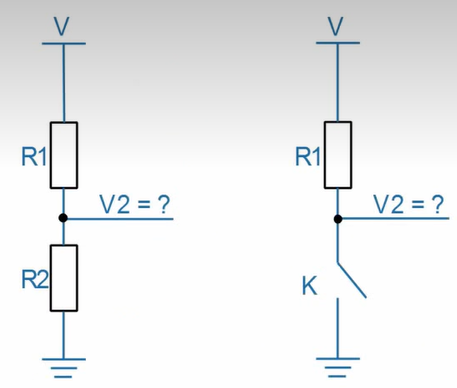
	- ```bash
	  # 1
	  R = R1 + R2
	  I = V / R = V / (R1 + R2) = V2 / R2
	  V2 = V * R2 / (R1 + R2)
	  
	  # 2
	  按键K被按下时
	  R2 = 0
	  此时V2 = 0
	  
	  按键K断开时，R2的值可以看做是无穷大
	  此时V2 = V
	  ```
	- 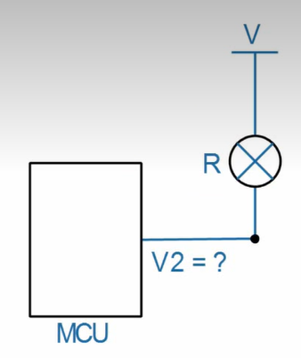
	- ```bash
	  I = (V - V2) / R
	  当MCU控制GPIO输出高电平时，V = V2，此时I = 0，LED熄灭
	  当MCU控制GPIO输出低电平时，V2 = 0，此时I = V / R，有电流流经LED，LED被点亮
	  ```
	- 电流的方向和电子流动的方向相反
		- 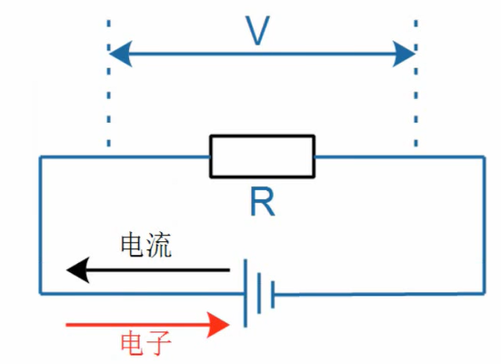
	- 电子的扩散
		- 物质会从浓度高的地方向浓度低的地方运动
- 硬件原理图
  collapsed:: true
	- 元件图
		- 对器件实物进行抽象，屏蔽实物的外形差异，用统一的抽象符号进行表示
		- 以LED为例，无论其外形如何，其共同点为：有两个引脚（触电），一正一负
	- 原理图
		- 使用抽象出来的元件图，绘制得到的连线图称为原理图
			- 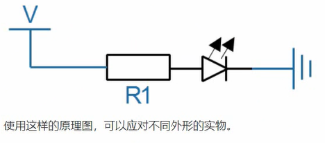
			- 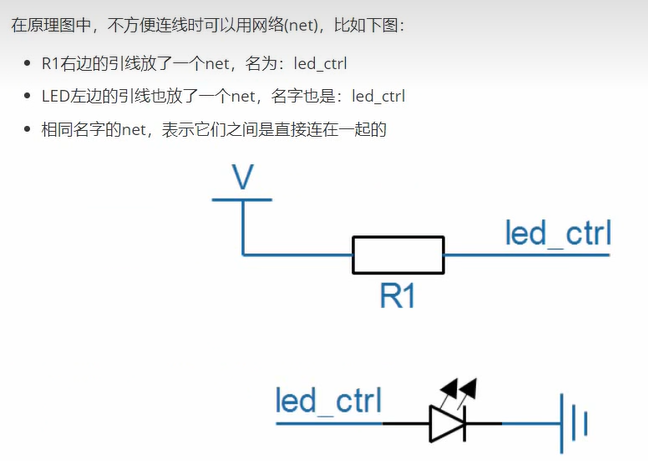
	- 芯片引脚标记
		- 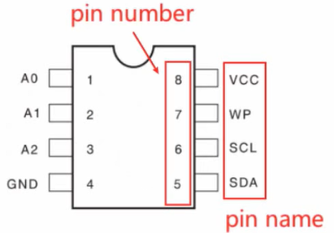
	- 电路板的制作过程
		- ```bash
		  1.元件图
		  2.原理图
		  3.封装图
		  	原理图中的元件图，在具体采购的时候可能对应不同的实物，例如LED可能是插针式LED，也可能是贴片式LED，
		      不同的实物对应不同的封装图
		  4.布局
		  	把元件的封装图摆放到合适的位置
		  5.布线
		  	根据原理图对不同的元件图之间进行连线，得到PCB图
		  6.生产PCB得到PCB实物即电路板
		  7.焊接/贴片
		  	焊接插针或贴片的元器件
		  ```
	-
- 硬件接口的类型
	- GPIO和门电路
		- 利用GPIO进行输出高低电平，或者捕获输入，或者接上各类晶体管实现逻辑运算
		- 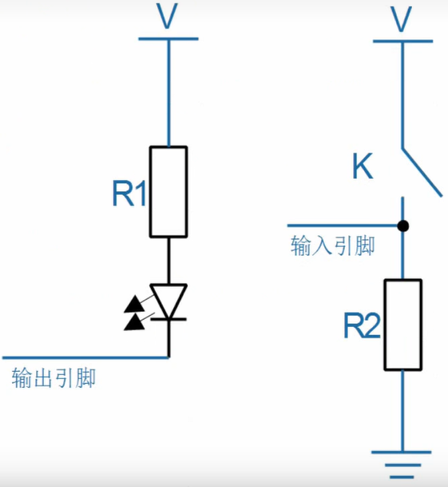
		- GPIO的应用
			- 输出功能
				- LED
				- 发射红外信号
				- 控制电机
				- 蜂鸣器
				- 数码管
			- 输入功能
				- 按键
				- 接收红外信号
				- 人体感应
			- 实现各种协议
		- 二极管
			- 二极管中流动的是电子，电流方向从正极到负极，电子流动方向从负极到正极
			- 二极管的箭头表示电流方向
			- 二极管的电流具有单向性
				- 当二极管正、负极之间的电压大于某个阈值例如0.7V时，二极管导通，导通时电阻近似于0
				- 当二极管正、负极之间的电压小于0时，二极管不导通，此时电阻近似于无穷大
		- 三极管
			- NPN三极管
				- 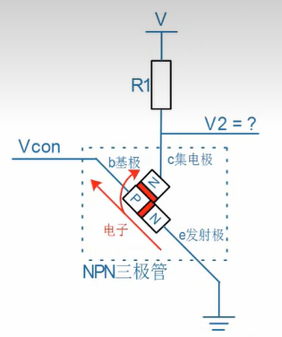
			- PNP三极管
				- 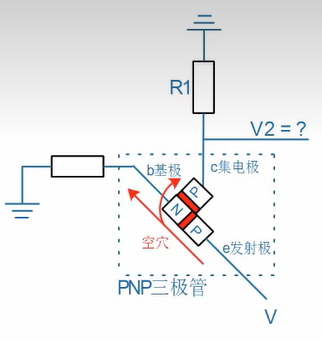
				-
	- 协议类接口
		- 两个设备之间传输的数据比较复杂，可以约定一些规则，这类接口可以归纳为“协议类”接口，如UART，I2C，SPI等
		- 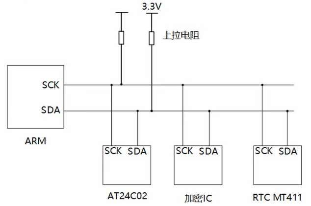
	- 类似内存的接口
		- 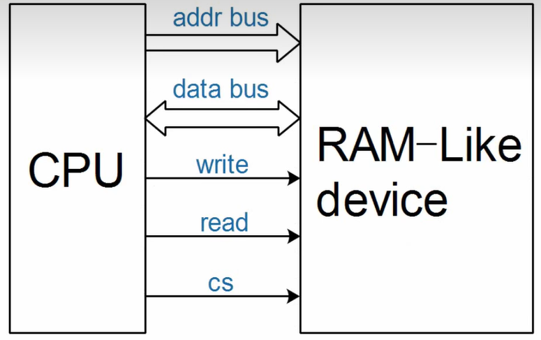
	- 模拟电路
		- 数字电路上传输的电压值只有2类，例如
			- 2.xV到3.3V，抽象为逻辑1
			- 0到2.xV，抽象为逻辑0
		- 模拟电路上传输的电压有多个取值，例如
			- ADC电路可以读取滑动电阻器上的触点电压值
			- DAC电路可以控制输出不同的电压值
			- 
		-