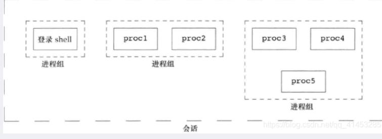

- [[top]]
	- https://man7.org/linux/man-pages/man1/top.1.html
- [[ps]]
	- https://man7.org/linux/man-pages/man1/ps.1.html
- 进程切换
	- 中断是触发模式切换（user -> kernel）的唯一途径
		- 外部中断，简称中断，相对CPU而言外部设备触发的中断
		- 内部中断，即异常，包括程序指令执行过程中出现异常，以及系统调用等
- 进程是处于执行期的程序
- 进程的创建
	- 除[[init]] 进程外其余进程通过 **fork** 系统调用创建，并通过 **exec** 函数负责读取可执行文件并将其载入地址空间开始运行
		- ```sh
		  morrism@localhost ~ $ pstree
		  systemd─┬─ModemManager───2*[{ModemManager}]
		        ├─NetworkManager───2*[{NetworkManager}]
		        ├─2*[abrt-dump-journ]
		        ├─...
		  ```
-
- 子进程的终结
	- 在进程退出的时候，内核释放该进程所占用的资源，包括打开的文件，占用的内存等。但是仍然为其==保留一定的信息==(包括**进程号 PID**，**退出状态** the termination status of the process，**运行时间** the amount of CPU time taken by the process **等**)。==直到父进程通过 wait / waitpid 来取时才释放==。
	  
	  如果一个**进程已经终止**，**但是它的父进程尚未调用 wait() 或 waitpid() 对它进行清理**，这时的进程状态称为**僵死状态**，处于僵死状态的进程称为**僵尸进程(zombie process)**。任何进程在刚终止时都是僵尸进程，正常情况下，僵尸进程都立刻被父进程清理了。
	  
	  因为**每个进程结束的时候**，系统都会扫描当前系统中所运行的所有进程，看看有没有哪个 进程是刚刚结束的这个进程的子进程，如果是的话，就由**Init进程来接管**他，成为他的父进程，从而保证每个进程都会有一个父进程。因此如果父进程先于子进程退出，子进程会被 init 进程接管，init 会成为其新的父进程并 wait 其子进程，因此被 init 进程接管的进程不会变成僵尸进程。
-
- 进程关系
	- 进程组 ==process group==：一组进程的集合，每个进程组有一个唯一的标识进程组ID即 ==PGID==(process group ID)，==用于将 signal 发给进程组的每个进程==而不是某一个特定的进程。每个进程组有一个进程组领导进程 ==process group leader== ，即创建该进程组的进程，PGID 通常为进程组领导进程的PID。
	  > A `process group` is a set of one or more processes sharing the same `process group identifier` (**PGID**). A process group ID is a number of the same type (`pid_t`) as a process ID. A process group has a `process group leader`, which is the process that creates the group and whose process ID becomes the process group ID of the group. A new process inherits its parent’s process group ID.
	- 会话 session
		- ==多个进程组==构成一个「**会话**」，==建立会话的进程是会话的领导进程，该进程 ID 为会话的 SID==。**会话中的每个进程组**称为一个「**作业**」。会话可以有一个进程组称为会话的「**前台作业**」，其它进程组为「**后台作业**」
		  
		  > A `session` is a collection of process groups. A process’s session membership is determined by its `session identifier` (**SID**), which, like the process group ID, is a number of type `pid_t`. A `session leader` is the process that creates a new session and whose process ID becomes the session ID. A new process inherits its parent’s session ID.
		  
		  一个会话可以有一个**控制[终端](https://kangxiaoning.github.io/post/2021/05/linux-terminal-tty-pty-and-shell/)**，当[控制终端](http://uw714doc.xinuos.com/en/SDK_sysprog/_The_Controlling-Terminal_and_Pr.html)有输入和输出时都会传递给前台进程组，比如Ctrl + Z。==会话的意义在于能将多个作业通过一个终端控制，一个前台操作，其它后台运行==。
		  > All of the processes in a session share a single `controlling terminal`. The controlling terminal is established when the session leader first opens a terminal device. A terminal may be the controlling terminal of at most one session.
		  
		  
		  当我们打开多个终端窗口时，实际上就创建了多个终端会话。每个会话都会有自己的前台工作和后台工作。这样，我们就为进程增加了管理和运行的层次。在没有图形化界面的时代，会话允许用户通过shell进行多层次的进程发起和管理。比如说，我可以通过shell发起多个后台工作，而此时标准输入输出并不被占据，我依然可以继续其它的工作。
		- 
-
-
- 会话 session 的建立
	- `pid_t setsid(void);`
		- 如果调用此函数的进程不是一个进程组组长，则此函数创建一个新会话：
			- 此进程变成该新会话的会话首进程（session leader，会话首进程是创建该会话的进程）。此时，该进程是该会话中的唯一进程
			- 此进程成为一个新进程组的组长进程。新进程组ID是该调用进程的进程ID
			- 此进程没有控制终端。如果在调用setsid之前此进程有一个控制终端，那么这种联系也被解除
		- 如果调用此函数的进程是一个进程组组长，则此函数出错返回
			- 为了保证不处于这种情况，通常先调用fork，然后使其父进程终止，而子进程则继续。因为子进程继承了父进程的进程组ID， 而其进程ID则是新分配的，两者不可能相等，所以这就保证了子进程不是一个进程组的组长
-
- 显示相关进程ID
	- ```sh
	  morrism@localhost ~ $ ps -Ho pid,ppid,pgid,tpgid,sess,args
	    PID    PPID    PGID   TPGID    SESS COMMAND
	   938914  497165  938914  945766  938914 -bash
	   942843  938914  942843  945766  938914   cat
	   942844  938914  942843  945766  938914   sed s/hello/goodbye/
	   945766  938914  945766  945766  938914   ps -Ho pid,ppid,pgid,tpgid,sess,args
	  
	  ```
- 查看进程映射地址空间
	- [[pmap]]
- [[守护进程]]
- [[tty]]
- [[chrt]]
- 参考文档
	- [sched(7)](https://man7.org/linux/man-pages/man7/sched.7.html)
	- [Uninterruptible Sleep](https://eklitzke.org/uninterruptible-sleep)
	- [What is an uninterruptible process?](https://stackoverflow.com/questions/223644/what-is-an-uninterruptible-process)
		- > Like most versions of Unix, Linux has two fundamental ways in which a process can be put to sleep. A process which is placed in the TASK_INTERRUPTIBLE state will sleep until either (1) something explicitly wakes it up, or (2) a non-masked signal is received. The TASK_UNINTERRUPTIBLE state, instead, ignores signals; processes in that state will require an explicit wakeup before they can run again.
	- [What Is an Uninterruptible Process in Linux?](https://www.baeldung.com/linux/uninterruptible-process)
	- [Processes](https://www.ibm.com/docs/en/aix/7.1?topic=processes-)
	- [1. Process Control](http://web.archive.org/web/20120914180018/http://www.steve.org.uk/Reference/Unix/faq_toc.html#TOC2)
	- [linux 进程](https://www.freesion.com/article/87441546619/)
		- [process groups and sessions](https://www.andy-pearce.com/blog/posts/2013/Aug/process-groups-and-sessions/)
		- [job control](https://kangxiaoning.github.io/post/2021/05/process-groups-sessions-and-job-control/)
		- [The Linux kernel](https://www.win.tue.nl/~aeb/linux/lk/lk.html#toc10)
		- [Sessions and Process Groups](https://www.informit.com/articles/article.aspx?p=397655&seqNum=6)
		- [Job Control](https://www.gnu.org/software/libc/manual/html_node/Job-Control.html)
		- [Process Groups and Terminal Signaling](https://cs162.org/static/readings/ic221_s16_lec17.html)
		- [Process Groups and Sessions](https://www.informit.com/articles/article.aspx?p=2249436&seqNum=8)
		- [The TTY demystified](http://www.linusakesson.net/programming/tty/index.php)
		- [Linux Process States](https://www.baeldung.com/linux/process-states)
		- [Linux Process States](https://www.baeldung.com/linux/process-states)