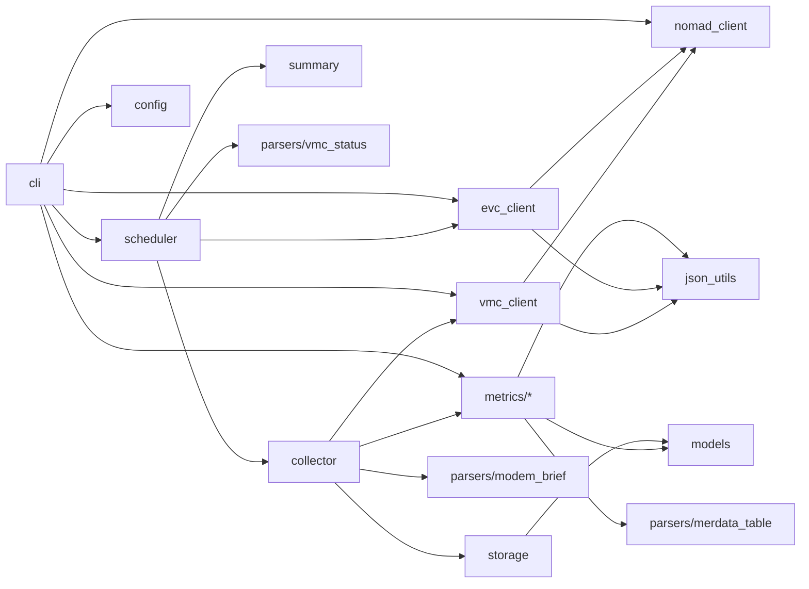
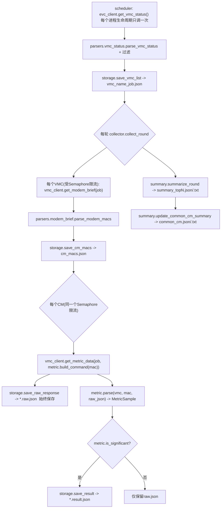

# ofdma-monitor 架构说明

本文档面向"以后要扩展/修改这个项目"的读者：介绍目录结构、每个文件的职责、数据流、
如何新增一个监控指标，以及当前实现中有哪些假设还需要对照真实系统验证。

代码是唯一的事实来源；本文档如果和代码出现分歧，以代码为准，并请顺手更新本文档。

## 1. 目录结构与文件职责

```
python/
├── pyproject.toml              打包/依赖声明；`ofdma-monitor` 控制台入口指向 cli:main
├── README.md                   快速开始
├── docs/
│   └── ARCHITECTURE.md         本文档
├── ofdma_monitor/
│   ├── __init__.py             包版本号
│   ├── __main__.py             使 `python -m ofdma_monitor` 可运行
│   ├── cli.py                  argparse 定义（run / debug-evc / debug-vmc）+ 组装所有依赖（唯一的"接线"模块）
│   ├── config.py               AppConfig：argparse 结果落地成的一个 dataclass
│   ├── logging_setup.py        配置 root logger（console + 可选 RotatingFileHandler）
│   ├── nomad_client.py         封装 `nomad alloc exec`（subprocess.run + asyncio.to_thread）
│   ├── evc_client.py           对应 evccli.sh：在 EVC 的 ncs_cli 会话里跑命令
│   ├── vmc_client.py           对应 vmccli.sh：在某个 VMC 的 confd_cli 会话里跑命令
│   ├── models.py               VmcInfo / MetricSample / RoundSummaryRow / CommonCmEntry 等 dataclass
│   ├── json_utils.py           extract_json_object（剥离CLI噪声）、iter_mac_domain_modems（通用遍历）
│   ├── parsers/
│   │   ├── vmc_status.py       解析 `show vmc status` JSON，套用 standby/graphite/hot 过滤规则
│   │   ├── modem_brief.py      解析 `modem brief` JSON，取出去重后的 CM MAC 列表
│   │   └── merdata_table.py    解析 merdata 叶子里内嵌的 ASCII RxMER 表格文本
│   ├── metrics/
│   │   ├── base.py             MetricPlugin 协议定义（唯一的插件契约）
│   │   ├── ofdma_mer.py        OfdmaMerMetric：RxMER 低于阈值的子载波计数
│   │   └── xmit_uncorrectable.py  XmitUncorrectableMetric：指定信道 UNCORRECTABLE 求和
│   ├── collector.py            asyncio 采集编排：VMC -> CM列表 -> 逐CM取指标，单一 Semaphore 限流
│   ├── storage.py               唯一知道输出目录布局的模块：原始JSON、结果、CM列表的读写
│   ├── summary.py               单轮 Top-N 排名 + 跨轮次"常客CM"交集
│   └── scheduler.py             周期循环（漂移校正）+ SIGINT/SIGTERM 优雅退出，驱动多个 metric 并发跑
└── tests/
    ├── fixtures/                四个样例 JSON（vmc_status / cm_brief / cm_ofdma_mer / cm_uncorr(+_significant)）
    ├── conftest.py              `load_json_fixture` fixture
    ├── test_cli.py              argparse 行为（`run`/`debug-evc`/`debug-vmc` 参数解析）
    ├── test_json_utils.py
    ├── test_parsers.py
    ├── test_metrics.py
    ├── test_collector.py        单个CLI调用失败(NomadExecError/JsonExtractionError)不会向外抛异常
    ├── test_scheduler.py        一个metric启动失败不会级联杀死其它metric的循环
    └── test_summary.py
```

### 模块依赖方向（避免循环依赖的心智模型）



只有 `cli.py` 知道所有具体实现类；`collector.py` / `summary.py` / `scheduler.py` 只依赖
`metrics/base.py` 里的 `MetricPlugin` 协议和 `models.py` 里的 dataclass，不 import 任何具体
metric 类，这是新增指标不用改这三个文件的原因。

## 2. 完整数据流（一轮采集）



关键点：

- **VMC 列表只在每个 metric 的调度循环启动时拉取一次**，之后每一轮都复用同一份列表，
  这是对齐原 bash 脚本行为（`gen_vmc_name_job` 在 `main()` 的 `while true` 循环之外调用一次）。
- **一个 `asyncio.Semaphore(max_parallel)` 贯穿整轮**：VMC 的 modem-brief 拉取、每个 CM 的
  指标拉取，都走同一个信号量，而不是像原脚本那样只在 VMC 粒度限流、VMC 内部严格串行。
- **原始 JSON 永久保留，解析结果按需保留**：`*.raw.json` 每个 CM 每轮都写；`*.result.json`
  只有 `metric.is_significant()` 为真才写（对齐原脚本 `*_count.txt` 只在非0时写的行为）。
- **单个 CLI 调用失败绝不能拖垮整个进程**：`collector.py` 里每次 `nomad alloc exec`
  调用都单独 try/except 住 `NomadExecError`（进程/超时失败）和
  `JsonExtractionError`（拿到的输出里没有可解析的 JSON——真实环境里观察到的一种表现是
  在并发压力下某次 stdout 为空字符串），失败就记一条 WARNING 然后跳过这个 CM/VMC，本轮
  继续。`scheduler.py::run_metric_loop` 在此之上再加一层兜底 try/except（包住
  `collect_round`+`summarize_round`+`update_common_cm_summary`，以及启动时的
  `fetch_vmc_list`），防止任何未预料到的异常经由 `run_all` 里的
  `asyncio.gather` 级联杀死**其它** metric 的循环。这是为了修复真实环境里遇到的一次
  故障：某个 CM 的响应偶发为空触发 `JsonExtractionError`，未被捕获，直接把整个
  `python -m ofdma_monitor run` 进程（两个 metric 都算在内）杀死了。

## 3. 四种 JSON 样例结构与解析代码的映射

| 样例文件 | 顶层 JSON 路径 | 解析代码 | 用途 |
|---|---|---|---|
| `vmc_status.json` | `data["vcm-vmc-mapper-svc:vmc-state"]["vmc"][]` -> `{name, status:{...}}` | `parsers/vmc_status.py` | VMC 名称+job列表（`evc_client.get_vmc_status`） |
| `cm_brief.json` | `data["ccap:ccap"]["docsis"]["docs-mac-domain"]["mac-domain"][]` -> `{mac-domain-name, "ccap-oper:modem":[{modem-mac, brief:{...}}]}` | `parsers/modem_brief.py`（经 `json_utils.iter_mac_domain_modems`） | 一个VMC下的CM MAC列表（`vmc_client.get_modem_brief`） |
| `cm_ofdma_mer.json` | 同上结构，叶子为 `"ofdma-sub-carrier-mer": {"merdata": "<ASCII表格文本>"}` | `metrics/ofdma_mer.py` + `parsers/merdata_table.py` | MER 低于阈值的子载波计数 |
| `cm_uncorr.json` | 同上结构，叶子为 `"xmit-chan-counter": [{ucid, uncorrectable, ...}]` | `metrics/xmit_uncorrectable.py` | 指定信道 UNCORRECTABLE 求和 |

三个"按 CM 取数据"的命令（`cm_brief` / `cm_ofdma_mer` / `cm_uncorr`）共享同一层
`mac-domain[] -> modem[]` 外壳，所以 `json_utils.iter_mac_domain_modems(data, leaf_key)`
是唯一需要写一次的遍历逻辑，三个 parser/metric 只是传入不同的 `leaf_key`。

## 4. 如何新增一个 MetricPlugin

假设要新增第三种监控（例如某个新的 CM 计数器）：

1. 在 `ofdma_monitor/metrics/` 下新建一个模块，实现 `metrics/base.py::MetricPlugin` 协议：
   - `name`：输出子目录名
   - `columns`：汇总表列名（顺序即打印顺序）
   - `rank_column`：暂未在协议里强制使用，但约定俗成用于说明排序依据；实际排序用的是
     `MetricSample.rank_value`（在 `parse()` 里自己算好填进去）
   - `build_command(cm_mac)`：拼出 confd_cli 命令（记得以 `| display json` 结尾）
   - `parse(vmc_name, cm_mac, raw_json)`：从 JSON 里取出目标CM的叶子数据，算出
     `MetricSample`；找不到就返回 `None`
   - `is_significant(sample)`：决定要不要写 `.result.json`（原始 `.raw.json` 不受此影响，
     始终会写）
2. 在 `ofdma_monitor/cli.py` 的 `METRIC_FACTORIES` 字典里加一行：
   `"新指标名": lambda cfg: NewMetric(...从cfg取需要的可配置项...)`。
   如果需要新的命令行参数（例如新的阈值），在 `build_arg_parser()` / `config_from_args()`
   / `config.py::AppConfig` 里各加一个字段。
3. 在 `tests/fixtures/` 放一个（或复用现有）样例 JSON，在 `tests/test_metrics.py` 里
   补充针对新插件的 `parse()` / `is_significant()` / `build_command()` 测试。

**不需要修改**：`collector.py`、`storage.py`、`summary.py`、`scheduler.py` ——它们只依赖
`MetricPlugin` 协议和 `MetricSample`/`VmcInfo` dataclass，对新指标是无感的。

## 5. 排查工具：`debug-evc` / `debug-vmc`

在真实环境跑 `run` 之前（或者跑起来发现 VMC/CM 数量不对时），先用这两个子命令验证单条
CLI 命令的实际行为，而不是直接怀疑 `run` 的采集逻辑：

```bash
# 等价于 ./evccli.sh 'show vmc status | display json'
python -m ofdma_monitor debug-evc "show vmc status | display json"

# 等价于 ./vmccli.sh "<job>" "<command>"
python -m ofdma_monitor debug-vmc vmc-morris-dentist-1 \
  "show ccap docsis docs-mac-domain mac-domain modem brief | display json"
```

两者都会依次打印：

1. `nomad alloc exec` 返回的**原始** stdout（可能包含提示符/命令回显等噪声）；
2. `json_utils.extract_json_object` 从中提取出的 JSON（如果提取失败会打印失败原因，
   而不是像 `run` 那样直接抛异常中断整个进程）。

如果 `run` 采集到 0 个 VMC/CM，优先用 `debug-evc "show vmc status | display json"`
（以及 `debug-vmc <job> "... modem brief | display json"`）核对：

- 原始 stdout 里到底有没有 JSON、JSON 是否被截断（可能是命令语法本身不对，或
  `--cli-timeout` 太短、`nomad alloc exec` 提前返回）；
- 提取出的 JSON 顶层 key 是否与 `parsers/vmc_status.py` / `parsers/modem_brief.py`
  假设的路径一致（例如模块名前缀 `vcm-vmc-mapper-svc:` / `ccap:` 是否真是这个）；
- 如果 JSON 结构本身没问题、但 `run` 里过滤后仍是 0 条，问题在
  `parsers/vmc_status.py::is_included` 的 standby/graphite/hot 判断上（见下面第 3 条
  假设），可以把 `debug-evc` 打印出的完整 JSON 贴出来，对照该函数手动核对每一条记录
  是否被误判排除。

## 6. 已知假设与待验证项

以下假设在编写本项目时无法对照真实 vCMTS 系统验证，**上线前必须逐条确认**：

1. **JSON 输出管道语法**：假设 confd_cli/ncs_cli 支持 `| display json`（类比现有的
   `| display xml`）。见 `evc_client.VMC_STATUS_COMMAND`、`vmc_client.MODEM_BRIEF_COMMAND`、
   `metrics/ofdma_mer.py`、`metrics/xmit_uncorrectable.py` 里拼接的命令字符串。用
   `debug-evc`/`debug-vmc` 验证。
2. **CLI 输出噪声**：假设交互式会话的 stdout 会在真正的 JSON 前后夹杂命令回显/提示符，
   `json_utils.extract_json_object` 用"逐个尝试 `{` 位置 + `json.JSONDecoder.raw_decode`"
   的方式剥离噪声。如果真实输出格式不同（例如噪声出现在 JSON *内部*，或提示符本身包含
   `{`），需要重新设计这个函数。用 `debug-evc`/`debug-vmc` 的"原始输出"部分验证。
3. **VMC 过滤字段映射**（`parsers/vmc_status.py`）：原 awk 用 tab 表格的
   `$1`(name)/`$2`(job)/最后一列(hot指示) 做过滤；JSON 样例里只有单一的 `vmc.name`
   和 `status.{container-name,ha-status}`。
   - ~~`vmc.name` 同时充当显示名和传给 `vmc_client` 的 Nomad `-job` 参数~~ ——
     **已在真实系统上验证为错误**：用 `vmc.name`（如 `"vmc-morris-dentist-1"`）当
     `-job` 会报 `No job(s) with prefix or ID "..." found`。
     真正的 job 名是 `status.container-name` 的**完整值**（包括结尾的 UUID），
     例如 `"vmc-evc-dentist-31432bd8-8ef9-45e3-97fb-dbdf108d4f11"`——已通过直接执行
     `nomad alloc exec -task vmc -job vmc-evc-dentist-31432bd8-8ef9-45e3-97fb-dbdf108d4f11 sh`
     验证可行（曾经短暂尝试过剥掉UUID后缀当job名，那个是错的，已撤回）。
     现在 `parse_vmc_status` 直接用 `status.container-name` 原样作为 `job`；只有
     该字段整体缺失时才退化为 `vmc.name` 兜底，并打一条 WARNING 日志。
   - `status.ha-status` 里包含 `"hot"` 时视为热备份，排除——**仍未验证**，目前样例
     里没有真实的 standby/graphite/hot 记录，需要拿到一条被排除的真实记录后核对
     `parsers/vmc_status.py::is_included`。
4. **`nomad alloc exec` 是否需要伪终端**：当前用 `subprocess.run(..., input=..., text=True)`
   一次性写入 stdin 并等待退出，假设 `ncs_cli`/`confd_cli` 在非交互 TTY 下也能正常按行读取
   命令并在管道关闭时正常退出。如果实测发现挂起或输出缺失，可能需要改用
   `pexpect`/伪终端来模拟真正的交互式会话。
5. **磁盘增长**：`*.raw.json` 每轮每个 CM 都保留，长期运行会持续累积（尤其是 MER 的
   `merdata` 文本较大）。当前没有清理机制，行为对齐原 bash 脚本（同样不清理）。如果需要
   限制磁盘占用，可以在 `storage.py` 之上加一层"仅保留最近 N 轮"的清理步骤。

验证完成后，请更新本节（划掉已验证的假设，或者补充实际行为并同步修改对应代码/测试）。
