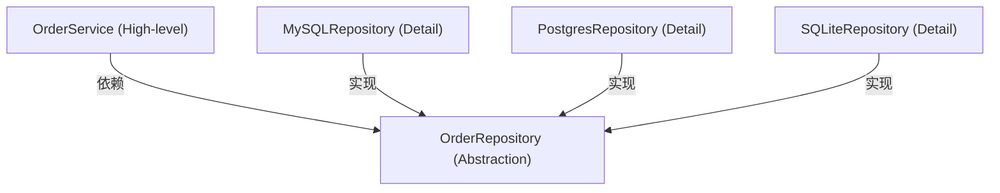

[← 返回目录](dip_00_index.md)

# Part 1 - DIP 的本质与依赖方向反转

## 1.1 四个核心概念

DIP 的官方定义（Robert C. Martin）：

> A. High-level modules should not depend on low-level modules. Both should depend on
> abstractions.
>
> B. Abstractions should not depend on details. Details should depend on abstractions.

要理解这句话，必须先精确定义四个术语。

### High-level Module（高层模块）

**定义**：包含业务策略 / 业务规则 / 用例编排的模块。它回答"系统要做什么"（what），而不是"怎么做"
（how）。

在真实项目中，High-level Module 通常是：

- `application/` 目录下的 Service / UseCase（如 `OrderService.checkout()`）
- `domain/` 目录下的领域服务（如 `PricingPolicy.calculate()`）
- `workflows/` 目录下的编排逻辑（如 `DeviceUpgradeWorkflow.run()`）

High-level Module 之所以"高层"，不是因为它在目录树的上层，而是因为它承载的是**对业务更重要、变化
频率更低、复用价值更高**的策略。`OrderService` 要不要检查库存、要不要发通知，这是公司业务规则，
比"用 MySQL 还是 PostgreSQL"重要得多，也稳定得多。

### Low-level Module（低层模块）

**定义**：实现具体技术细节的模块。它回答"怎么做"（how）。

例如：

- `MySQLOrderRepository`（怎么把订单存进 MySQL）
- `PahoMqttClient`（怎么通过 MQTT 协议收发消息）
- `NetmikoSSHConnector`（怎么用 SSH 登录设备并执行命令）

Low-level Module 的特点是：**具体、易变、可替换**。今天用 MySQL，明年可能换成 PostgreSQL 或者
DynamoDB；今天用 Netmiko，明年可能换成 Scrapli。这些变化不应该波及业务逻辑。

### Abstraction（抽象）

**定义**：一个只描述"契约"（做什么、输入输出是什么），不包含任何具体实现细节的类型。在 Python 中
它的载体可以是 `abc.ABC`、`typing.Protocol`，也可以是一份约定俗成的鸭子类型接口。

```python
class OrderRepository(Protocol):
    def save(self, order: Order) -> None: ...
    def find_by_id(self, order_id: str) -> Order | None: ...
```

这个 `OrderRepository` 不知道数据存在哪里、用什么驱动、有没有网络延迟——它只定义"能存、能查"。

### Detail（细节）

**定义**：抽象契约的一个具体满足者。它包含了所有"脏活"：SQL 语句、连接池、序列化格式、重试逻辑、
超时时间等等。

```python
class MySQLOrderRepository:
    def __init__(self, pool: MySQLConnectionPool) -> None:
        self._pool = pool

    def save(self, order: Order) -> None:
        with self._pool.cursor() as cur:
            cur.execute("INSERT INTO orders ...", (...))
```

`MySQLOrderRepository` 是 `OrderRepository` 这个 Abstraction 的一个 Detail。

## 1.2 为什么叫 Dependency *Inversion*，而不是 Dependency *Injection*

这是初学者最容易混淆的一点，必须彻底厘清。

**Dependency Injection（依赖注入，DI）** 是一种**技术手段**：把一个对象所需要的协作者，从外部
"塞给"它（通过构造函数、setter、参数），而不是让它自己在内部 `new` 出来。DI 回答的问题是：
"对象怎样拿到它的依赖？"

**Dependency Inversion（依赖倒置，DIP）** 是一种**设计原则 / 架构决策**：它规定的是"谁应该定义
接口、依赖箭头应该指向哪里"。DIP 回答的问题是："抽象应该由谁拥有？依赖方向应该朝哪边？"

两者的关系：**DI 是实现 DIP 最常用的手段之一，但不是唯一手段（还有 Factory、Protocol 结构化子
类型、Service Locator 等），反过来，用了 DI 也不代表就做到了 DIP。**

一个反例说明"用了注入，但没有倒置"：

```python
from infrastructure.mysql_repository import MySQLOrderRepository

class OrderService:
    def __init__(self, repo: MySQLOrderRepository) -> None:  # 依赖具体类型！
        self._repo = repo
```

这里业务层 `OrderService` 依然在**编译期 / 导入期**依赖了 `infrastructure.mysql_repository`
这个具体模块——类型注解写死了 `MySQLOrderRepository`。即便对象是从外部"注入"进来的，`OrderService`
所在的模块仍然 import 了 low-level 模块，依赖方向没有变。这只是 DI，不是 DIP。

真正的 DIP 要求 `OrderService` 所在的模块**根本不知道** `MySQLOrderRepository` 的存在：

```python
from domain.repository import OrderRepository  # 抽象，属于 domain 层自己

class OrderService:
    def __init__(self, repo: OrderRepository) -> None:  # 依赖抽象！
        self._repo = repo
```

**"倒置"倒的是什么？** 倒的是**抽象的归属权**和**源代码依赖箭头**：

- 在没有 DIP 的世界里，"接口"（如果有的话）通常是 Low-level 模块提供的，High-level 模块要迁就它；
  或者根本没有接口，High-level 直接 import Low-level。
- 在 DIP 的世界里，抽象由 **High-level 模块（或双方共同所在的中间层）拥有**，Low-level 模块反过来
  必须 import 并实现这个抽象、迁就 High-level 定义的契约。依赖箭头因此发生了"倒转"。

## 1.3 依赖方向到底发生了什么变化

### 错误设计（未倒置）

```
+------------------+
|     Business     |   OrderService 直接 import MySQLDatabase
|  (OrderService)  |   OrderService 知道 SQL、知道连接字符串
+---------+--------+   Business 的稳定性被 Database 的实现细节绑架
          |
          | import (源代码依赖)
          v
+------------------+
|     Database      |
|  (MySQLDatabase)  |
+------------------+
```

问题：

1. `OrderService` 想单元测试，必须启动一个真实（或伪造得很像的）MySQL。
2. 想换成 PostgreSQL，必须修改 `OrderService` 内部代码。
3. `Database` 的变化（比如连接池 API 升级）会直接波及 `Business` 层。
4. 依赖方向和"重要性方向"相反：真正重要、稳定的业务逻辑，却依赖了易变的技术细节。

### 正确设计（已倒置）

```
+------------------+
|     Business      |
|  (OrderService)   |
+---------+---------+
          |
          | 依赖（只 import 抽象）
          v
+---------------------+
|  Repository Interface |   <-- 抽象由 Business/Domain 侧拥有
|   (OrderRepository)   |
+---------------------+
          ^
          | 实现（import 并满足契约）
          |
+------------------+
|  MySQLRepository   |
+------------------+
```

注意箭头方向：`Business` 依赖 `Repository Interface`（箭头朝下，指向抽象），`MySQLRepository`
也依赖 `Repository Interface`（箭头朝上，指向抽象）。**两个箭头都指向抽象，而不是互相指向对方**。
这就是"倒置"的几何意义：原本"Business → Database"这一条从高层指向低层的箭头，被拆成了"Business
→ Abstraction ← Database"，Detail 对 Abstraction 的依赖方向和 High-level 对 Abstraction 的
依赖方向变成了同向，而 Detail 不再被 High-level 直接依赖。

### 用 Mermaid 表达同一件事（含多实现）



这里的关键洞察：`OrderRepository` 这个抽象**属于 Business/Domain 层的代码库**（即它和
`OrderService` 定义在同一个包，或者定义在 Domain 包里），而不是属于 `infrastructure` 包。
所以从"源代码组织"的角度看，也是 `infrastructure.MySQLRepository` import 了
`domain.OrderRepository`，而不是反过来。这就是为什么"抽象的归属权"如此重要——**谁拥有接口，
谁就掌握了依赖方向的主动权**。

### 运行时依赖 vs 编译期（源代码）依赖

DIP 的"倒置"专门针对的是**源代码依赖（compile-time / import-time dependency）**，而不是
运行时的调用关系。运行时，`OrderService.checkout()` 最终确实会调用到 `MySQLRepository.save()`，
数据确实是从 Business 流向 Database——这个运行时调用方向永远不会变，也不需要变。

```
运行时调用方向（Control Flow，永远存在）：
OrderService.checkout()  ---->  repo.save(order)  ---->  MySQL INSERT

源代码依赖方向（Compile-time Import，DIP 改变的对象）：
未倒置: OrderService  ------import------->  MySQLRepository
已倒置: OrderService  --import-->  OrderRepository  <--import--  MySQLRepository
```

这也是很多人学 DIP 时的第一个误区："倒置"并没有让数据反向流动，倒置的只是**代码之间"谁认识谁"
的关系**——业务代码不认识数据库代码，但数据库代码必须认识（依赖）业务定义的契约。

## 1.4 一张图总结 Part 1

```
+-----------------------------------------------------------------+
|                         DIP 四要素速查                            |
+-----------------------------------------------------------------+
| High-level Module | 业务策略/用例编排        | OrderService       |
| Low-level Module  | 技术实现细节             | MySQLRepository     |
| Abstraction        | 只讲契约，不讲实现        | OrderRepository(P) |
| Detail             | Abstraction 的具体满足者  | MySQLRepository     |
+-----------------------------------------------------------------+
| Dependency Injection | 手段：依赖如何被"给"进来的  |
| Dependency Inversion | 原则：抽象归谁、依赖方向该朝哪 |
+-----------------------------------------------------------------+
| 未倒置: Business -> Database                                    |
| 已倒置: Business -> Interface <- Database                       |
+-----------------------------------------------------------------+
```

下一步：进入 [Part 2 - 类型系统类：abc.ABC / typing.Protocol / Duck Typing](dip_02_type_system_techniques.md)，
看这套原则在 Python 中具体如何落地为代码。
