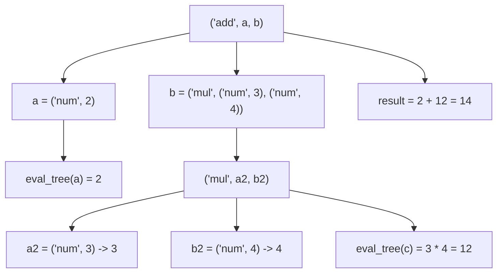

# Python `match-case` 核心心智模型（Structural Pattern Matching）

> **一句话理解：**
>
> `match-case` 不是传统语言中的 `switch-case`，而是 **Structural Pattern Matching（结构化模式匹配）**。
>
> 它匹配的是**对象的结构（Structure / Shape）**，而不仅仅是对象的值（Value）。

---

# 一、核心思想（Core Idea）

传统 `switch`：

```text
switch(value)

↓

value == constant ?
```

Python `match`：

```text
match object

↓

object 是否符合某种 Pattern？
```

因此：

> **match 的本质不是 Value Matching，而是 Pattern Matching。**

---

# 二、最重要的心智模型

## 心智模型一：Pattern = 一个过滤器（Filter）

可以把每个 `case` 看成一个过滤器。

```text
                object
                   │
                   ▼
        ┌────────────────────┐
        │    Pattern 1       │
        └────────────────────┘
             │         │
         Match      Not Match
             │
             ▼
         执行代码
```

如果失败：

```text
                object
                   │
                   ▼
             Pattern 1
                   │
                Fail
                   │
                   ▼
             Pattern 2
                   │
             Match ?
```

所以：

> 每一个 `case` 都是在问：
>
> **"这个对象是不是具有这种结构？"**

而不是：

> **"这个对象是不是等于这个值？"**

---

## 心智模型二：Pattern = Shape（对象形状）

例如：

```python
case (x, y)
```

描述的是：

```text
Tuple

┌───────┬───────┐
│   ?   │   ?   │
└───────┴───────┘
```

而不是：

```text
(3,5)
```

例如：

```python
case {"type": "ping"}
```

表示：

```text
Dictionary

{
    "type": ?
}
```

不是：

```text
整个dict必须完全一样
```

---

## 心智模型三：Pattern = Destructure（解构）

例如：

```python
case Point(x, y)
```

实际上意味着：

```text
是不是 Point？

↓

如果是：

x = obj.x

y = obj.y
```

即：

```text
Pattern

↓

解构对象

↓

绑定变量
```

所以：

> Pattern Matching = Matching + Destructuring

---

# 三、match 的执行流程

对于：

```python
match obj:
    case P1:
        ...
    case P2:
        ...
    case P3:
        ...
```

可以理解成：

```text
              obj
               │
               ▼
       能否匹配 Pattern1？
          │
     yes──┴────►执行
     no
      │
      ▼
       能否匹配 Pattern2？
          │
     yes──►执行
      │
      no
      ▼
       Pattern3...
```

因此：

> **match 按顺序尝试 Pattern，直到某一个成功。**

---

# 四、每个 Pattern 都完成两件事情

所有 Pattern 都可以理解成：

```text
Pattern

├── 判断是否匹配（Match）
└── 提取变量（Capture）
```

例如：

```python
case (x, y)
```

实际上完成：

```text
① 是否是长度为2的Tuple？

↓

② x = tuple[0]

↓

③ y = tuple[1]
```

例如：

```python
case Point(x, y)
```

完成：

```text
① 是否是 Point？

↓

② x = obj.x

↓

③ y = obj.y
```

因此：

> Pattern 不仅负责判断，还负责解包（Destructuring）。

---

# 五、Guard（模式 + 条件）

例如：

```python
case (x, y) if x == y:
```

执行流程：

```text
Pattern Matching

↓

Capture

↓

Guard 判断

↓

执行
```

即：

```text
          Pattern

             +

      Extra Condition
```

Guard 永远发生在：

> **Pattern 成功之后。**

---

# 六、Pattern 的分类

| Pattern 类型 | 示例 | 心智模型 |
|------------|------|----------|
| Literal Pattern | `case 200:` | 判断值 |
| OR Pattern | `case "a" \| "b":` | 多个值任选 |
| Capture Pattern | `case x:` | 捕获变量 |
| Wildcard Pattern | `case _:` | 任意对象 |
| Sequence Pattern | `case [a,b]:` | 匹配序列结构 |
| Star Pattern | `case [x,*rest]:` | 剩余全部收集 |
| Mapping Pattern | `case {"id":i}` | 匹配字典结构 |
| Class Pattern | `case Point(x,y)` | 匹配对象类型并解构 |
| AS Pattern | `case [x,y] as p` | 同时保留整体和局部 |
| Guard Pattern | `case p if cond` | Pattern + 条件 |

---

# 七、底层工作原理（抽象理解）

可以把：

```python
match obj:

    case Pattern:
```

理解成：

```python
if Pattern.matches(obj):

    vars = Pattern.extract(obj)

    ...
```

因此：

```text
Pattern

↓

判断

↓

解构

↓

绑定变量

↓

执行代码
```

而不是：

```text
obj == something
```

---

# 八、Pattern Matching 与 if-elif 的区别

传统写法：

```text
if obj[0] == "add":

elif obj[0] == "mul":

elif obj[0] == "num":
```

Pattern Matching：

```text
case ("add", a, b)

case ("mul", a, b)

case ("num", value)
```

优势：

- 更符合数据结构
- 自动完成解包
- 可读性更高
- 更容易扩展新的 Pattern

---

# 九、最经典的应用场景

Pattern Matching 最适用于：

- AST（抽象语法树）
- 编译器
- Interpreter（解释器）
- Parser（解析器）
- JSON 解析
- 网络协议解析
- CLI 命令解析
- 状态机
- Domain Event 分发
- DDD 中 Command/Event Dispatch

这些场景都有一个共同特点：

> **处理的是"结构化数据"，而不是简单的值。**

---

# 十、黄金法则（Golden Rules）

## 黄金法则一

> **match 匹配的是 Pattern，不是 Value。**

---

## 黄金法则二

> **Pattern 描述的是对象应该具有的结构（Shape）。**

---

## 黄金法则三

> **Pattern Matching = Matching + Destructuring。**

匹配成功后：

```text
自动完成变量绑定
```

无需再次：

```python
x = obj.x

y = obj.y
```

---

## 黄金法则四

> **每个 case 都像一个过滤器(Filter)。**

对象依次流过多个 Pattern：

```text
object

   │

   ▼

Pattern1

   │

Fail

   ▼

Pattern2

   │

Success

   ▼

Execute
```

---

## 黄金法则五

> **Guard 只是 Pattern 的额外限制。**

流程始终是：

```text
Pattern

↓

Capture

↓

Guard

↓

Execute
```

---

# 十一、终极心智模型（Master Mental Model）

```text
                         match object
                               │
          ┌────────────────────┼────────────────────┐
          ▼                    ▼                    ▼
     Value Pattern      Structure Pattern      Type Pattern
      case 200:          case [a,b]:        case Point(x,y):
          │                    │                    │
          └──────────── 判断是否匹配 ─────────────────┘
                               │
                      Match Successfully?
                               │
                 ┌─────────────┴─────────────┐
                 ▼                           ▼
      Capture Variables                  Next Pattern
      （自动解构对象）                   （继续尝试）
                 │
                 ▼
        Optional Guard（if）
                 │
                 ▼
             Execute Code
```

---

# 十二、实战示例（Worked Examples）

前面十一节讲的是心智模型，下面用 12 个由浅入深的例子，把每种 Pattern 落到具体代码上。

## 示例1：最简单——值匹配（Literal Pattern）

```python
def http(code):
    match code:
        case 200:
            return "OK"
        case 404:
            return "Not Found"
        case 500:
            return "Server Error"
        case _:
            return "Unknown"
```

调用：

```python
http(404)
```

结果：

```text
Not Found
```

这一层和传统 `switch` 几乎一样，对应表格里的 **Literal Pattern**。

---

## 示例2：多个值（OR Pattern）

```python
def color(c):
    match c:
        case "red" | "green" | "blue":
            print("RGB")
        case "black":
            print("Black")
```

输入 `"red"`，匹配过程：

```text
red
 │
 ▼
red | green | blue
 │
成功
```

这里的 `|` 就是 **OR**：只要命中其中一个值，Pattern 就算匹配成功。

---

## 示例3：变量绑定（Capture Pattern）

```python
match point:
    case (x, y):
        print(x, y)
```

输入 `point = (3, 5)`，这里发生的**不是比较**：

```text
(3, 5) == (x, y)   ← 错误理解
```

而是**拆包**：

```text
(3, 5)
   │
   ▼
x = 3
y = 5
```

相当于做了一次 `x, y = point` 的 tuple unpack，只不过是在 Pattern 匹配的同时完成的。

---

## 示例4：固定值 + 变量（混合 Pattern）

```python
match point:
    case (0, y):
        print("Y axis", y)
    case (x, 0):
        print("X axis", x)
    case (x, y):
        print("Other")
```

输入 `(0, 9)`，过程：

```text
case (0, y)
   │
   ▼
第一项必须 == 0   → 满足
   │
   ▼
第二项绑定到 y    → y = 9
```

固定值负责“过滤”，变量负责“捕获”——两者可以在同一个 Pattern 里自由组合。

---

## 示例5：列表模式（Sequence Pattern）

```python
match data:
    case [a, b]:
        print(a, b)
```

输入 `[10, 20]`，自动完成：

```text
a = 10
b = 20
```

但输入 `[10]` 会**失败**，原因是：

```text
长度不同 → Shape 不匹配
```

Sequence Pattern 同时校验了“长度”和“每个位置的子 Pattern”，这也是它比 `if len(data) == 2` 更安全的原因。

---

## 示例6：星号匹配（Star Pattern）

```python
match data:
    case [first, *rest]:
        print(first)
        print(rest)
```

输入 `[1, 2, 3, 4]`，结果：

```text
first = 1
rest  = [2, 3, 4]
```

心智模型：

```text
剩余全部交给 *rest
```

和函数参数里的 `*args` 是同一套心智模型：一个负责固定位置，一个负责“兜底收集”。

---

## 示例7：字典匹配（Mapping Pattern）

```python
match packet:
    case {"type": "ping"}:
        print("PING")
    case {"type": "data", "payload": p}:
        print(p)
```

输入：

```python
{"type": "data", "payload": "abc"}
```

匹配过程：

```text
"type"    → 固定值，必须等于 "data"
"payload" → 绑定变量 p
```

结果：

```text
p = "abc"
```

注意 Mapping Pattern 是**部分匹配**：字典里多出来的键不会导致失败，这与示例5的 Sequence Pattern（长度必须严格一致）是明显不同的行为。

---

## 示例8：类匹配（Class Pattern）

```python
from dataclasses import dataclass

@dataclass
class Point:
    x: int
    y: int

p = Point(3, 5)

match p:
    case Point(x, y):
        print(x, y)
```

Python 实际检查的是：

```text
p 是不是 Point 的实例？
   │
   ▼ 是
x = p.x
y = p.y
```

输出：

```text
3 5
```

这依赖类提供的“匹配接口”——`dataclass` 会自动生成 `__match_args__ = ("x", "y")`，告诉 `match` 应该按什么顺序把位置参数解构到对应属性上。

---

## 示例9：Guard（if 条件）

```python
match point:
    case (x, y) if x == y:
        print("Diagonal")
    case (x, y):
        print("Normal")
```

输入 `(5, 5)`，过程：

```text
Pattern 匹配成功
      │
      ▼
   Capture: x=5, y=5
      │
      ▼
Guard 检查: x == y → True
      │
      ▼
     执行
```

心智模型：

```text
Pattern + Extra Condition
```

Guard 永远发生在 Pattern **已经成功**之后，它不能替代 Pattern，只能在结构匹配的基础上再加一层值上的限制。

---

## 示例10：解析 AST（经典用途）

```python
def eval_tree(node):
    match node:
        case ("add", a, b):
            return eval_tree(a) + eval_tree(b)
        case ("mul", a, b):
            return eval_tree(a) * eval_tree(b)
        case ("num", value):
            return value
```

输入：

```python
tree = ("add",
        ("num", 2),
        ("mul",
            ("num", 3),
            ("num", 4)))
```

匹配 + 递归的展开过程：



每一层递归都只需要问一句“这是加法节点、乘法节点，还是数字节点？”，这是编译器、解释器里最经典的用法之一。

---

## 示例11：命令解析（CLI）

```python
cmd = ["copy", "a.txt", "b.txt"]

match cmd:
    case ["copy", src, dst]:
        print(f"copy {src} -> {dst}")
    case ["delete", file]:
        print(file)
    case _:
        print("Unknown")
```

这比：

```python
if cmd[0] == "copy":
    src, dst = cmd[1], cmd[2]
```

更直观，因为 `["copy", src, dst]` **同时**验证了：

```text
① 命令是不是 "copy"
② 参数个数是不是刚好 2 个
③ 把参数绑定到 src / dst
```

结构和参数数量的校验，在一个 Pattern 里就完成了。

---

## 示例12：网络协议解析（贴近网络开发）

```python
packet = {
    "proto": "tcp",
    "src": "10.0.0.1",
    "dst": "10.0.0.2",
    "port": 80,
}

match packet:
    case {"proto": "tcp", "port": 80, "src": src, "dst": dst}:
        print(f"HTTP request: {src} -> {dst}")
    case {"proto": "udp", "port": port}:
        print(f"UDP packet on port {port}")
    case _:
        print("Other packet")
```

对于网络自动化、协议分析、日志解析这类场景，`match` 可以让代码更接近协议本身的定义，而不是一堆 `packet["proto"] == "tcp" and packet["port"] == 80` 的条件拼接。

---

## 示例13：AS Pattern（保留整体 + 局部）

```python
match point:
    case (x, y) as p if x == y:
        print(f"{p} is on the diagonal, offset={x}")
```

输入 `(5, 5)`：

```text
(x, y)   → 拆包出 x=5, y=5
as p     → 同时把整体 (5, 5) 绑定给 p
```

输出：

```text
(5, 5) is on the diagonal, offset=5
```

`as` 解决的是“既想要拆开用局部变量，又想保留原始对象”的场景，常见于日志打印、错误信息里需要同时展示原始数据和关键字段。

---

## 示例14：类模式 + 关键字参数（校验特定属性）

```python
match p:
    case Point(x=0, y=0):
        print("Origin")
    case Point(x=0, y=y):
        print("On Y axis", y)
    case Point(x=x, y=0):
        print("On X axis", x)
    case Point():
        print("Somewhere else")
```

和示例8的位置参数 `Point(x, y)` 不同，这里用 `x=0` 这种**关键字形式**给某个属性加上了固定值约束：

```text
Point(x=0, y=0)   → x 和 y 都必须是 0，才算 Origin
Point(x=0, y=y)   → 只约束 x，y 仍然被捕获
```

这在只关心对象部分属性、又要求类型正确时非常有用，等价于把“类型检查 + 属性判断 + 变量捕获”合并成了一行。

---

## 示例15：类型模式（只校验类型，不关心值）

```python
def normalize(value):
    match value:
        case int() | float():
            return float(value)
        case str():
            return float(value.strip())
        case _:
            raise TypeError(f"unsupported type: {type(value)}")
```

`int()` / `float()` / `str()` 这里没有传参数，代表的是**纯类型判断**：

```text
value 是 int 或 float 的实例？
       │
       ▼ 是
   走第一条分支
```

这种写法比 `isinstance(value, (int, float))` 更贴近 `match` 的表达方式，也方便和其它结构化 Pattern 混在同一个 `match` 里使用。

---

## 示例16：状态机 / 事件分发（Domain Event Dispatch）

```python
def reducer(state, event):
    match event:
        case {"type": "increment", "amount": n}:
            return {**state, "count": state["count"] + n}
        case {"type": "reset"}:
            return {**state, "count": 0}
        case {"type": "set_name", "name": name} if name:
            return {**state, "name": name}
        case _:
            return state
```

调用：

```python
state = {"count": 0, "name": ""}
state = reducer(state, {"type": "increment", "amount": 5})
```

结果：

```text
{"count": 5, "name": ""}
```

这是章节九提到的“状态机 / Domain Event 分发”在代码里的具体样子：每种事件 `type` 对应一个结构化 Pattern，Guard 用来做进一步的合法性校验（例如 `name` 不能为空），新增事件类型只需要新增一个 `case`，不需要改动已有分支。

---

# 一句话总结

> **`match-case` 的本质不是一个更强大的 `switch`，而是 Python 提供的"结构化模式匹配（Structural Pattern Matching）"机制。**
>
> 它通过 **Pattern（模式）** 描述对象的**结构（Shape）**，在匹配成功时自动完成**解构（Destructuring）**和**变量绑定（Capture）**，使代码能够直接表达数据结构，而不是依赖大量 `if-elif`、索引访问和类型判断。这正是 Python Data Model 中"以对象结构驱动程序逻辑"的重要体现。