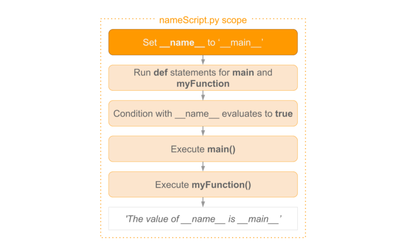
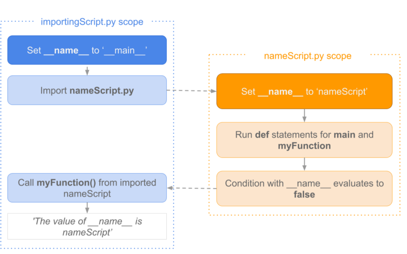

[online python](https://www.online-python.com/)  
[Python Cheatsheet](https://www.pythoncheatsheet.org/)  
[Python Tips and Trick, You Haven't Already Seen](https://martinheinz.dev/blog/1)  

## type hints (类型提示)
[Type hints cheat sheet](https://mypy.readthedocs.io/en/stable/cheat_sheet_py3.html)  
[Python Type Checking (Guide)](https://realpython.com/python-type-checking/)  
[typing — Support for type hints](https://docs.python.org/3/library/typing.html)  
```python

```

## 解析 YAML 配置文件
```python
# pip install pyyaml  # 基础解析库
# pip install python-dotenv  # 可选，用于环境变量管理

# 实例 1
config.yaml:
# 服务器配置
server:
  host: "0.0.0.0"
  port: 8080
  ssl: true
  timeout: 30.5

# 数据库配置
database:
  adapter: postgresql
  name: production_db
  credentials:
    username: !env DB_USER  # 使用环境变量
    password: !env DB_PASS

# 功能开关
features:
  caching: enabled
  analytics: disabled

app.py:
import yaml
import os
from pathlib import Path
from dotenv import load_dotenv

# 加载环境变量
load_dotenv()

def load_config(file_path='config.yaml'):
    """安全加载 YAML 配置"""
    try:
        # 添加自定义标签解析器
        def env_var_constructor(loader, node):
            value = loader.construct_scalar(node)
            return os.environ.get(value, '')
        
        yaml.SafeLoader.add_constructor('!env', env_var_constructor)

        with open(file_path, 'r') as f:
            return yaml.safe_load(f)
            
    except FileNotFoundError:
        raise Exception(f"Config file not found: {file_path}")
    except yaml.YAMLError as exc:
        raise Exception(f"YAML syntax error: {exc}")

def validate_config(config):
    """配置验证逻辑"""
    required_sections = ['server', 'database', 'features']
    for section in required_sections:
        if section not in config:
            raise ValueError(f"Missing required section: {section}")

    if not isinstance(config['server']['port'], int):
        raise TypeError("Server port must be an integer")

if __name__ == "__main__":
    # 加载配置
    config = load_config()
    
    # 验证配置
    validate_config(config)
    
    # 使用配置
    print(f"Server will run on {config['server']['host']}:{config['server']['port']}")
    print(f"Database user: {config['database']['credentials']['username']}")

# 实例2 ：解析 YAML 文件并执行 YAML 文件中指定的 linux 命令
commands.yaml:
commands:
  - ls
  - echo "Hello, World!"
  - uname -a

run_commands.py:
import yaml
import subprocess

# 定义一个函数来加载和解析 YAML 文件
def load_yaml(file_path):
    with open(file_path, 'r') as file:
        return yaml.safe_load(file)

# 定义一个函数来执行 Linux 命令
def run_command(command):
    try:
        result = subprocess.run(command, shell=True, check=True, stdout=subprocess.PIPE, stderr=subprocess.PIPE)
        print(result.stdout.decode('utf-8'))
    except subprocess.CalledProcessError as e:
        print(f"Error executing command: {command}\n{e.stderr.decode('utf-8')}")

# 主函数
def main():
    # 加载 YAML 文件
    yaml_file = 'commands.yaml'
    data = load_yaml(yaml_file)

    # 获取并执行 commands 列表中的命令
    commands = data.get('commands', [])
    for command in commands:
        print(f"Running command: {command}")
        run_command(command)

if __name__ == "__main__":
    main()

```

## argparse 解析命令行参数
```python
import argparse

def parse_arguments():
    """Handles command line argument parsing"""
    parser = argparse.ArgumentParser(description="File processing tool")
    
    parser.add_argument("input_file", help="Path to input file")
    parser.add_argument("-o", "--output", 
                        default="output.txt",
                        help="Output file path (default: %(default)s)")
    parser.add_argument("-l", "--lines",
                        type=int, 
                        default=0,
                        help="Maximum lines to process (0=all)")
    parser.add_argument("-v", "--verbose",
                        action="store_true",
                        help="Enable verbose output mode")
    
    return parser.parse_args()

def validate_arguments(args):
    """Validates input arguments"""
    if args.lines < 0:
        raise ValueError("Line count cannot be negative")
    # Add more validation as needed

def process_file(input_path, output_path, max_lines, verbose=False):
    """Core file processing logic"""
    try:
        if verbose:
            print(f"Processing: {input_path}")
            limit_info = f"first {max_lines} lines" if max_lines > 0 else "all lines"
            print(f"Output: {output_path}, Processing: {limit_info}")

        # Read input
        with open(input_path, 'r') as f:
            content = f.readlines()[:max_lines] if max_lines > 0 else f.readlines()
        
        # Write output
        with open(output_path, 'w') as f:
            f.writelines(content)
        
        if verbose:
            print(f"Processed {len(content)} lines")
            print(f"Saved to: {output_path}")
    
    except FileNotFoundError:
        print(f"Input file not found: {input_path}")
    except Exception as e:
        print(f"Error: {str(e)}")

def main():
    """Main program execution flow"""
    args = parse_arguments()
    validate_arguments(args)
    
    # Convert arguments to processing parameters
    processing_params = {
        'input_path': args.input_file,
        'output_path': args.output,
        'max_lines': args.lines,
        'verbose': args.verbose
    }
    
    process_file(**processing_params)

if __name__ == "__main__":
    main()
```

## best practice
```python
# Use List Comprehensions: Instead of loops, try using list comprehensions for concise and readable code
data = [-3, 7, 2, -5, 0, 8]
positive_numbers = [num for num in data if num > 0]
print(positive_numbers)  # Output: [7, 2, 8]

# Use enumerate(): Instead of manually tracking the index in a loop, use enumerate() for cleaner code
tasks = ['Write code', 'Test program', 'Fix bugs']
for index, task in enumerate(tasks, start=1):
    print(f"{index}. {task}")
# Output:
# 1. Write code
# 2. Test program
# 3. Fix bugs

# Use zip(): Combine two or more iterables easily with zip()
products = ['apple', 'banana', 'cherry']
prices = [1.2, 0.5, 2.5]
product_price_dict = dict(zip(products, prices))
print(product_price_dict)  # Output: {'apple': 1.2, 'banana': 0.5, 'cherry': 2.5}

# Use F-strings for Formatting: Format strings cleanly and efficiently with f-strings (Python 3.6+)
name = "John"
age = 30
print(f"Hello, {name}! You are {age} years old.")  # Output: Hello, John! You are 30 years old.

# Use *args and **kwargs: These allow functions to accept an arbitrary number of positional and keyword arguments
def add_numbers(*args):
    return sum(args)

result = add_numbers(1, 2, 3, 4)
print(result)  # Output: 10

# Handle Exceptions Gracefully: Always use try-except blocks to handle errors without crashing your program
def divide(a, b):
    try:
        return a / b
    except ZeroDivisionError:
        return "Error: Division by zero is not allowed."

print(divide(10, 2))  # Output: 5.0
print(divide(10, 0))  # Output: Error: Division by zero is not allowed.

# Use with for File Handling: It automatically closes the file, even if exceptions occur
with open('data.txt', 'r') as file:
    content = file.read()
print(content)  # File is automatically closed after reading

# Leverage Generators: For memory efficiency, use generators instead of storing large data in lists
def large_range_gen():
    for i in range(1, 1000000):
        yield i

for number in large_range_gen():
    if number > 10:  # Stop early as an example
        break

# Use Built-in Functions: Python has many useful built-in functions like sum(), min(), max(), and sorted(). Use them when you can
temperatures = [22.5, 25.6, 21.3, 28.1, 24.2]
highest_temp = max(temperatures)
print(highest_temp)  # Output: 28.1

# Master Dictionary Operations: Use .get(), .keys(), .items() for working with dictionaries
sentence = "apple banana apple cherry banana apple"
words = sentence.split()
word_count = {}

for word in words:
    word_count[word] = word_count.get(word, 0) + 1  # word_count.get(word, 0) returns default value 0 if the key doesn’t exist

print(word_count)  # Output: {'apple': 3, 'banana': 2, 'cherry': 1}

```
- 省略号
    ```python
    在Python中，一切皆对象，省略号也不例外

    type(...)       # <class 'ellipsis'>
    bool(...)       # True

    def func():
        ...
    等价于
    def func():
        pass
    ```
- 使用 end 来结束代码块
    ```python
    __builtins__.end = None

    def my_abs(x):
        if x > 0:
            return x
        else:
            return -x
        end
    end
    ```
- 可直接运行的 zip 包
    ```python
    $ ls demo
        calc.py  __main__.py  __pycache__
    $ cat demo/calc.py
        def add(x, y):
            return x+y
    $ cat demo/__main__.py
        import calc

        print(calc.add(2, 3))
    $ python3 -m zipfile -c demo.zip demo/*
    $ python3 demo.zip
    5
    ```
- 反斜杠
    ```python
    1.在行尾时，用做续行符
    print("hello "\
        "world")
    2.转义字符
    print('\nhello')

    str3 = "\"      # SyntaxError: EOL while scanning string literal
    str4 = r"\"     # SyntaxError: EOL while scanning string literal
    ```
- 修改解释器提示符
    ```python
    import sys
    print(sys.ps1)
    print(sys.ps2)

    sys.ps1 = "morris>"
    sys.ps2 = "---"
    morris>for i in range(2):
    ---     print(i)
    ---
    0
    1
    ```
- 简洁而优雅的链式比较
    ```python
    False == False == True
    等价于
    False == False and False == True

    if 80 < score <= 90:
        print("xxx")
    ```
- and 和 or 的短路效应
    ```python
    1.当一个 or 表达式中所有值都为真，Python会选择第一个值
    2.当一个 and 表达式 所有值都为真，Python 会选择最后一个值
    >>>(2 or 3) * (5 and 6 and 7)
    14  # 2*7
    ```
- 连接多个列表最极客的方式
    ```python
    >>> a = [1,2]
    >>> b = [3,4]
    >>> c = [5,6]
    >>>
    >>> sum((a,b,c), [])
    [1, 2, 3, 4, 5, 6]
    ```
- 字典居然是可以排序的
    ```python
    在 Python3.6 + 中字典已经是有序的
    # Python3.6.7
    >>> mydict = {str(i):i for i in range(5)}
    >>> mydict
    {'0': 0, '1': 1, '2': 2, '3': 3, '4': 4}
    ```
- 哪些情况下不需要续行符
    ```python
    在这些符号中间的代码换行可以省略掉续行符：[],(),{}
    my_list = [1, 2, 3
               4, 5, 6]
    my_tuple = (1, 2, 3
               4, 5, 6)
    
    my_dict = {"name": "xiaoming"
               "gender": "male"}

    在多行文本注释中 ''' ，续行符也可以省略
    text = '''talk is cheap,
              show me the code'''
    ```
- 用户无感知的小整数池
    ```python
    为避免整数频繁申请和销毁内存空间，Python 定义了一个小整数池 [-5, 256] 这些整数对象是提前建立好的，不会被垃圾回收
    a = -6
    b = -6
    a is b      // False

    a = 256
    b = 256
    a is b      // True

    a = 257
    b = 257
    a is b      // False

    a = 257; b = 257    # 当在同一行同时给两个变量赋同一值时，解释器知道这个对象已经生成，那么它就会引用到同一个对象。如果分成两行的话，解释器并不知道这个对象已经存在了，就会重新申请内存存放这个对象
    a is b      // True
    ```
- 字符串的 intern 机制
    ```python
    Python解释器中使用了 intern（字符串驻留）的技术来提高字符串效率，即同样的字符串对象仅仅会保存一份，放在一个字符串储蓄池中，是共用的(字符串是不可变对象)
    s1 = "hello"
    s2 = "hello"
    s1 is s2        // True

    # 如果字符串中包含空格，默认不启用 intern 机制
    s1 = "hell o"
    s2 = "hell o"
    s1 is s2        // False
    ```
- site-packages和 dist-packages
    ```python
    一般情况下，而你所安装的包也将安装在 site-packages 这个目录下
    dist-packages 其实是 debian 系的 Linux 系统（如 Ubuntu）才特有的目录，使用 apt 去安装的 Python 包会使用 dist-packages，而你使用 pip 或者 easy_install 安装的包还是照常安装在 site-packages 下

    如何查找 package 安装目录
    from distutils.sysconfig import get_python_li
    print(get_python_lib())     # /usr/lib/python3.8/site-packages
    ```
- argument 和 parameter 
    ```python
    parameter：形参（formal parameter），体现在函数内部，作用域是这个函数体
    argument ：实参（actual parameter），调用函数实际传递的参数

    def output_msg(msg):    # msg 为 parameter
            print(msg)
    output_msg("error")     # "error" 为 argument
    ```
- `/usr/bin/env python` 有什么用
    ```python
    当执行 env python 时，自动进入了 python console 的模式
    当执行 env python 时，它其实会去 env | grep PATH 里指定的路径里去依次查找名为python的可执行文件，找到一个就直接执行

    # 如果在 PATH 路径下指定一个名为 python 的可执行文件，执行 env python 时会执行该文件
    $ echo $PATH
    /usr/share/Modules/bin:/usr/lib64/ccache:/usr/local/bin:/usr/bin:/usr/local/sbin:/usr/sbin

    $ cat /usr/local/bin/python
    #!/usr/bin/python

    print("hello")

    $ env python
    hello

    应该优先使用 #!/usr/bin/env python，因为不是所有的机器的 python 解释器都是 /usr/bin/python
    ```
- dict() 与 {} 生成空字典有什么区别
    ```python
    在运行效率上，{} 会比 dict() 快三倍左右

    使用 timeit 模块，可以轻松测出这个结果
    $ python -m timeit -n 1000000 -r 5 -v "dict()"
    raw times: 0.0626 0.0605 0.0616 0.0604 0.0622
    1000000 loops, best of 5: 0.0604 usec per loop
    $ python -m timeit -n 1000000 -r 5 -v "{}"
    raw times: 0.0202 0.0196 0.0194 0.0192 0.0191
    1000000 loops, best of 5: 0.0191 usec per loop

    探究这个过程，可以使用 dis 模块
    $ cat demo.py
    {}
    $ python -m dis demo.py
    1           0 BUILD_MAP                0
                3 POP_TOP
                4 LOAD_CONST               0 (None)
                7 RETURN_VALUE

    $ cat demo.py
    dict()
    $ python3 -m dis demo.py
    1           0 LOAD_NAME                0 (dict)
                2 CALL_FUNCTION            0
                4 POP_TOP
                6 LOAD_CONST               0 (None)
                8 RETURN_VALUE
    使用 dict()，会多了个调用函数的过程，而这个过程会有进出栈的操作，相对更加耗时
    ```
- 正负得负，负负得正
    ```python
    5--3	// 8
    5+-3	// 2
    5++3	// 8
    5---3	// 2
    ```
- return不一定都是函数的终点
    ```python
    try ... finally ... 的用法是：不管try里面是正常执行还是有报异常，最终都能保证finally能够执行
    def func():
        try:
            return 'try'
        finally:
            return 'finally'
    
    func()      // 'finally'
    // try中的 return 会被直接忽视，因为要保证 finally 能够执行

    def func():
        try:
            return 'try'
        finally:
            print('finally')
    
    func()      // finally\n'try'
    // 当 finally 下没有 reutrn ，其实 try 里的 return 仍然还是有效的

    如果 finally 里有显式的 return，那么这个 return 会直接覆盖 try 里的 return，而如果 finally 里没有 显式的 return，那么 try 里的 return 仍然有效
    ```
- 字符串里的缝隙
    ```python
    "aabb".count("a")       // 2
    "aabb".count("ab")      // 1
    "aabb".count("")        // 5
    // 在 Python 看来，两个字符之间都是一个空字符，通俗的说就是缝隙
    (" " * 10).count("")        // 11
    "" in ""                    // True
    "" in "M"                   // True
    ```
- 字母也玩起了障眼法
    ```python
    ord('e')	// 101      拉丁字母e
    ord('е')	// 1077     西里尔字母
    ```
- 切片异常
    ```python
    alist = [0, 1, 2, 3, 4]
    alist[5]            // IndexError: list index out of range

    alist[5:]           // []
    alist[100:]         // []
    ```
- x 与 +x 等价吗
    ```python
    n1 = 123
    n2 = +123
    n1 == n2        // True

    from collections import Counter
    ct = Counter('abcdefg')

    ct          // Counter({'a': 1, 'b': 1, 'c': 1, 'd': 1, 'e': 1, 'f': 1, 'g': 1})

    ct['c'] = 0
    ct['d'] = -2

    ct          // Counter({'a': 1, 'b': 1, 'e': 1, 'f': 1, 'g': 1, 'c': 0, 'd': -2})
    +ct         // Counter({'a': 1, 'b': 1, 'e': 1, 'f': 1, 'g': 1})
    ```
- += 不等同于=+
    ```python
    对列表 进行+= 操作相当于 extend，而使用 =+ 操作是新增了一个列表
    a = [1, 2, 3, 4]
    b = a
    a = a + [5, 6, 7, 8]
    a       // [1, 2, 3, 4, 5, 6, 7, 8]
    b       // [1, 2, 3, 4]


    a = [1, 2, 3, 4]
    b = a
    a += [5, 6, 7, 8]
    a       // [1, 2, 3, 4, 5, 6, 7, 8]
    b       // [1, 2, 3, 4, 5, 6, 7, 8]
    ```
- 局部/全局变量
    ```python
    在非全局下定义声明的变量都是局部变量
    a = 1

    def add():
        a += 1      // Python 解释器认为在函数内部要给 a 这个变量赋值，因此 a 是局部变量，但是此时 a 尚未定义，因此报错
    
    add()

    def output():
        print(a)
    
    output()        // 1
    ```
- break /continue 和 上下文管理器哪个优先级高
    ```python
    import  time
    import contextlib

    @contextlib.contextmanager
    def runtime(value):
        time.sleep(1)
        print("start: a = " + str(value))
        yield
        print("end: a = " + str(value))

    a = 0
    while True:
        a += 1
        with runtime(a):
            if a % 2 == 0:
                break

    output:
    start: a = 1
    end: a = 1
    start: a = 2
    end: a = 2
    当 a = 2 时执行了 break ，此时的并不会直接跳出循环，依然要运行上下文管理器里清理释放资源的代码

    continue 与 break 一样，如果先遇到上下文管理器会先进行资源的释放
    for 循环也是同样的
    ```
- 如何像 awk一样分割字符串
    ```python
    msg='hello    world'
    msg.split(' ')      // ['hello', '', '', '', 'world']

    msg.split()         // ['hello', 'world']        必须是空字符（比如制表符、换行符），就可以使用

    适用于所有的分隔符
    msg='hello----world'
    msg.split('-')      // ['hello', '', '', '', 'world']
    list(filter(None, msg.split('-')))  // ['hello', 'world']
    list(filter(lambda item: True if item else False, msg.split('-')))  // ['hello', 'world']
    ```
- 如何让大数变得更易于阅读
    ```python
    num = 123_456_789
    num     // 123456789
    ```
- 懒人必备技能：使用 _
    ```python
    1. _ 可以用作占位符
    2. 在交互式模式下，_ 可以用来返回上一次的运行结果
    >>> 3+ 4
    7
    >>> _
    7

    class mytest():
        def __str__(self):
            return "hello"
        
        def __repr__(self):
            return "world"
    
    >>> mt = mytest()
    >>> mt
    world
    >>> print(mt)
    hello
    >>> _
    world

    // __repr__输出的内容可以被 _ 获取到的，print函数打印出来的不行
    ```
- 查看包搜索路径的方式
    ```python
    # 1
    >>> import sys
    >>> from pprint import pprint
    >>> pprint(sys.path)
    ['',
    '/usr/lib/python37.zip',
    '/usr/lib/python3.7',
    '/usr/lib/python3.7/lib-dynload',
    '/home/morrism/.local/lib/python3.7/site-packages',
    '/usr/local/lib/python3.7/dist-packages',
    '/usr/lib/python3/dist-packages']

    # 2
    $ python -c "print('\n'.join(__import__('sys').path))"

    /usr/lib/python2.7
    /usr/lib/python2.7/plat-x86_64-linux-gnu
    /usr/lib/python2.7/lib-tk
    /usr/lib/python2.7/lib-old
    /usr/lib/python2.7/lib-dynload
    /usr/local/lib/python2.7/dist-packages
    /usr/lib/python2.7/dist-packages

    # 3
    $ python3 -m site
    sys.path = [
        '/mnt/c/Users/morrism/Downloads/go',
        '/usr/lib/python37.zip',
        '/usr/lib/python3.7',
        '/usr/lib/python3.7/lib-dynload',
        '/home/morrism/.local/lib/python3.7/site-packages',
        '/usr/local/lib/python3.7/dist-packages',
        '/usr/lib/python3/dist-packages',
    ]
    USER_BASE: '/home/morrism/.local' (exists)
    USER_SITE: '/home/morrism/.local/lib/python3.7/site-packages' (exists)
    ENABLE_USER_SITE: True
    ```
- 使用 json.tool 来格式化 JSON
    ```python
    $ cat demo.json
    {"_id":"5f12d319624e57e27d1291fe","index":0,"guid":"4e482708-c6aa-4ef9-a45e-d5ce2c72c68d","isActive":false,"balance":"$2,954.93","picture":"http://placehold.it/32x32","age":36,"eyeColor":"green","name":"MasseySaunders","gender":"male","company":"TALAE","email":"masseysaunders@talae.com","phone":"+1(853)508-3237","address":"246IndianaPlace,Glenbrook,Iowa,3896","about":"Velitmagnanostrudexcepteurduisextemporirurefugiataliquasunt.Excepteurvelitquiseuinexinoccaecatoccaecatveliteuet.Commodonisialiquipirureminimconsequatminimconsecteturipsumsitex.\r\n","registered":"2017-02-06T06:42:20-08:00","latitude":-10.269827,"longitude":-103.12419,"tags":["laborum","excepteur","veniam","reprehenderit","voluptate","laborum","in"],"friends":[{"id":0,"name":"DorotheaShields"},{"id":1,"name":"AnnaRosales"},{"id":2,"name":"GravesBryant"}],"greeting":"Hello,MasseySaunders!Youhave8unreadmessages.","favoriteFruit":"apple"}

    $ python3 -m json.tool demo.json
    {
        "_id": "5f12d319624e57e27d1291fe",
        "index": 0,
        "guid": "4e482708-c6aa-4ef9-a45e-d5ce2c72c68d",
        "isActive": false,
        "balance": "$2,954.93",
        "picture": "http://placehold.it/32x32",
        "age": 36,
        "eyeColor": "green",
        "name": "MasseySaunders",
        "gender": "male",
        "company": "TALAE",
        "email": "masseysaunders@talae.com",
        "phone": "+1(853)508-3237",
        "address": "246IndianaPlace,Glenbrook,Iowa,3896",
        "about": "Velitmagnanostrudexcepteurduisextemporirurefugiataliquasunt.Excepteurvelitquiseuinexinoccaecatoccaecatveliteuet.Commodonisialiquipirureminimconsequatminimconsecteturipsumsitex.\r\n",
        "registered": "2017-02-06T06:42:20-08:00",
        "latitude": -10.269827,
        "longitude": -103.12419,
        "tags": [
            "laborum",
            "excepteur",
            "veniam",
            "reprehenderit",
            "voluptate",
            "laborum",
            "in"
        ],
        "friends": [
            {
                "id": 0,
                "name": "DorotheaShields"
            },
            {
                "id": 1,
                "name": "AnnaRosales"
            },
            {
                "id": 2,
                "name": "GravesBryant"
            }
        ],
        "greeting": "Hello,MasseySaunders!Youhave8unreadmessages.",
        "favoriteFruit": "apple"
    }
    ```
- 命令行式执行 Python 代码
    ```python
    $ python -c "import hashlib;print(hashlib.md5('hello').hexdigest())"
    5d41402abc4b2a76b9719d911017c592
    ```
- 用调试模式执行脚本
    ```python
    python -m pdb demo.py
    ```
- 快速搭建 HTTP 服务器
    ```python
    默认端口是8000
    # python2
    python -m SimpleHTTPServer 8888

    # python3
    python3 -m http.server 8888
    ```
- 快速构建 HTML 帮助文档
    ```python
    # 开启一个 HTTP 服务，xxx 为端口
    python -m pydoc -p xxx

    $ python -m pydoc -p 5200
    pydoc server ready at http://localhost:5200/

    ```
- 最正确且优雅的装包方法
    ```python
    使用 pip 来安装第三方的模块
    pip intall xxx
    如果环境中存在着多个版本的 Python时，到底把包安装在了哪里呢？

    # 在 python2 中安装
    $ python -m pip install requests

    # 在 python3 中安装
    $ python3 -m pip install requests

    # 在 python3.8 中安装
    $ python3.8 -m pip install requests

    # 在 python3.9 中安装
    $ python3.9 -m pip install requests
    ```
- 让脚本报错后立即进入调试模式
    ```python
    执行脚本时 带着 -i 参数
    $ cat demo.py
    msg = "hello"
    raise Exception
    $ python3 -i demo.py
    Traceback (most recent call last):
    File "demo.py", line 2, in <module>
        raise Exception
    Exception
    ```
- python shell quiet mode
    ```python
    $ python3 -q
    >>>
    ```
- 在执行任意代码前添加定制的处理（类似.bash_profile的功能）
    ```python
    $ python3 -q
    >>> import site
    >>> site.getusersitepackages()
    '/home/morrism/.local/lib/python3.7/site-packages'
    >>>
    $ vim /home/morrism/.local/lib/python3.7/site-packages/usercustomize.py     // 注意名字必须是usercustomize.py
    $ cat /home/morrism/.local/lib/python3.7/site-packages/usercustomize.py
    msg=r"""
    This is a customized banner message ...
    """
    print(msg)
    $ python3 -q

    This is a customized banner message ...

    >>>
    ```
- 启动 Python Shell 前自动执行某脚本
    ```python
    # 只适用于 Python Shell
    $ export PYTHONSTARTUP=/mnt/c/Users/morrism/Downloads/go/demo.py
    $ cat demo.py
    msg = "hello"
    print(msg)
    $ python3 -q
    hello
    >>>

    # 适用于 Python 执行脚本的方法: 手动加载执行
    $ export PYTHONSTARTUP=/mnt/c/Users/morrism/Downloads/go/demo.py

    cat startup.py:
    import os
    filename = os.environ.get('PYTHONSTARTUP')
    if filename and os.path.isfile(filename):
        with open(filename) as fobj:
            startup_file = fobj.read()
        exec(startup_file)
    
    print("everything is ok")

    $ python3 -q startup.py
    hello
    everything is ok
    ```
- 把模块当做脚本来执行 7 种方法及原理
    ```python
    # 快速搭建一个 HTTP 服务
    $ python3 -m http.server 8888

    #快速构建 HTML 帮助文档
    $ python -m pydoc -p 5200

    #快速进入 pdb 调试模式
    $ python -m pdb demo.py

    # 最优雅且正确的包安装方法
    $ python3 -m pip install requests

    # 快速美化 JSON 字符串
    $ echo '{"name": "MING"}' | python -m json.tool

    # 快速打印包的搜索路径
    $ python -m site

    # 用于快速计算程序执行时长
    $ python3 -m timeit '"-".join(map(str, range(100)))'

    # 原理剖析
    最好的学习方式，莫过于模仿，直接以 pip 和 json 模块为学习对象，看看目录结构和代码都有什么特点
    [pip](https://github.com/pypa/pip/tree/main)
    
    使用 -m 的方式执行模块，有两种方式：
    1.以 -m <package> 的方式执行，只要在 package 下写一个 __main__.py 的文件即可
    2.以 -m <package.module> 的方式执行，只要在 module 的代码中，定义一个 main 函数，然后在最外层写入下面这段固定的代码
    if __name__ == '__main__':
        main()
    -m 的使用情况分为两种，但是实际上，只有一种，对于第一种，你完全可以将 -m <package> 理解为 -m <package.__main__> 的简写形式

    # 1
    $ tree demo
    demo
    └── __main__.py

    0 directories, 1 file
    $ cat demo/__main__.py
    print("hello")
    $ export PATH=${PATH}:`pwd`
    $ python3 -m demo
    hello

    # 2
    $ tree demo
    demo
    ├── foobar.py
    └── __main__.py

    0 directories, 2 files

    $ cat demo/foobar.py
    # foobar.py
    def main():
        print("hello foobar")

    if __name__ == "__main__":
        main()

    $ python3 -m demo.foobar
    hello foobar
    ```
- 快速计算字符串 base64编码
    ```python
    # 对字符串编码和解码
    $ echo "hello, world" | python3 -m base64
    aGVsbG8sIHdvcmxkCg==
    $ echo "aGVsbG8sIHdvcmxkCg==" | python3 -m base64 -d
    hello, world

    # 对文件进行编码和解码
    $ python3 -m base64 demo.py
    bXNnID0gImhlbGxvIgpwcmludChtc2cpCg==
    $ echo "bXNnID0gImhlbGxvIgpwcmludChtc2cpCg==" | python3 -m base64 -d
    msg = "hello"
    print(msg)
    $ echo "bXNnID0gImhlbGxvIgpwcmludChtc2cpCg==" | python3 -m base64 -d | python3
    hello
    ```
- 指定文件的mime类型
    ```python
    # 可在线检测
    $ python -m mimetypes https://docs.python.org/3/library/mimetypes.html
    type: text/html encoding: None

    # 也可离线检测
    $ python -m mimetypes index.html
    type: text/html encoding: None
    ```
- 查看 Python 的环境信息
    ```python
    python3 -m sysconfig
    信息包括：
    你当前的操作系统平台
    Python 的具体版本
    包的搜索路径
    以及各种环境变量
    ```
- 快速解压和压缩文件
    ```python
    # 将 demo 文件夹压缩成 demo.tar
    $ python3 -m tarfile -c demo.tar demo
    # 解压 demo.tar 到 demo_new 文件夹下
    $ python3 -m tarfile -e demo.tar demo_new
    # 将 message.html 文件夹压缩成 message.gz   (gzip 的输入，只能是一个文件，而不能是一个目录)
    $  python3 -m gzip message
    # 解压 message.gz
    $ python3 -m gzip -d message.gz
    # 压缩  demo 文件夹为 demo.zip
    $ python3 -m zipfile -c demo.zip demo
    #解压一个 zip 格式的压缩包
    $ python3 -m zipfile -e demo.zip demo
    ```
- pyc 文件
    ```python
    pyc是一种二进制文件，是由py文件经过编译后，生成的文件，是一种byte code，py文件变成pyc文件后，加载的速度会有所提高
    $ ls demo
    main.py
    $ cat demo/main.py
    print("hello")
    $ python3 -O -m compileall demo             # 编译成 pyc 文件
    Listing 'demo'...
    Compiling 'demo/main.py'...
    $ ls demo
    main.py  __pycache__
    $ ls demo/__pycache__/
    main.cpython-37.opt-1.pyc
    $ python3 demo/__pycache__/main.cpython-37.opt-1.pyc
    hello
    ```
- 使用 telnet 端口检测工具
    ```python
    # 检查 135.242.60.169 上的 22 端口有没有开放
    $ python3 -m telnetlib -d 135.242.60.169 22
    Telnet(135.242.60.169,22): recv b'SSH-2.0-OpenSSH_8.0\r\n'
    SSH-2.0-OpenSSH_8.0
    ```
- 快速将项目打包成应用程序
    ```python
    $ tree demo
    demo
    ├── main.py
    └── utils.py

    0 directories, 2 files
    $ cat demo/main.py
    import utils

    def main():
        utils.say_hello()

    if __name__ == "__main__":
        main()
    $ cat demo/utils.py
    def say_hello():
        print("hello")
    $ python3 -m zipapp demo -m "main:main"         # main:main 第一个main指的是 main.py ，第二个 main 指的是 main 函数
    $ ls demo*
    demo.json  demo.py  demo.pyz

    demo:
    main.py  utils.py
    $ ls -l demo.py
    demo.py   demo.pyz
    $ ls -l demo.pyz
    -rwxrwxrwx 1 morrism morrism 473 Mar 21 09:06 demo.pyz
    $ python3 demo.pyz
    hello
    ```
- 快速打印函数的调用栈
    ```python
    $ cat t1.py
    import traceback        # import traceback module
    import sys

    def print_hello():
        traceback.print_stack(file=sys.stdout)      # print stack
        print("hello")

    def main():
        print_hello()

    if __name__ == "__main__":
        main()

    $ python3 t1.py
    File "t1.py", line 12, in <module>
        main()
    File "t1.py", line 9, in main
        print_hello()
    File "t1.py", line 5, in print_hello
        traceback.print_stack(file=sys.stdout)
    hello
    ```
- `__name__`
    `__name__` 是一个特殊的 Python 变量，它的值取决于使用者如果执行包含该变量的脚本

    1.当直接执行脚本 nameScript.py 时

    

    2.当 import nameScript 时

    
- 
    ```python
    # http server
    python3 -m http.server --directory /home/morrism/python/templates 8888
    ```
- 
    ```python
    ```