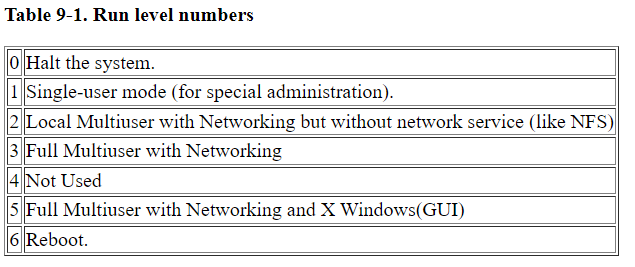

- > A *run level* is a state of **init** and the whole system that defines what system services are operating. Run levels are identified by numbers.
  When **init** starts, it looks for a line in /etc/inittab that specifies the default run level:
      id:5:initdefault:
- Run level numbers
	- 
- reboot
	- ```bash
	  # linux的重启命令，如下几个是等价的
	  reboot
	  shutdown -r 0
	  init 6
	  
	  
	  Exp.
	  root@slot-120:~ [P1]# which reboot
	  /sbin/reboot
	  root@slot-120:~ [P1]# ls -l /sbin/reboot
	  lrwxrwxrwx 1 root root 21 Sep 11 05:08 /sbin/reboot -> /sbin/reboot.sysvinit
	  root@slot-120:~ [P1]# ls -l /sbin/reboot.sysvinit
	  lrwxrwxrwx 1 root root 13 Sep 11 05:08 /sbin/reboot.sysvinit -> halt.sysvinit
	  root@slot-120:~ [P1]# ls -l /sbin/halt.sysvinit
	  -rwsr-xr-- 1 root shutdown 67076 Mar  9  2018 /sbin/halt.sysvinit
	  root@slot-120:~ [P1]# file /sbin/halt.sysvinit
	  /sbin/halt.sysvinit: setuid ELF 32-bit MSB executable, PowerPC or cisco 4500, version 1 (SYSV)
	  , dynamically linked, interpreter /lib/ld.so.1, BuildID[sha1]=aeca716fcd4c97ab6adef81812fc788d
	  36e1b34b, for GNU/Linux 3.2.0, stripped
	  
	  root@slot-120:~ [P1]# ls -l /sbin/*init
	  -rwsr-xr-- 1 root shutdown 67076 Mar  9  2018 /sbin/halt.sysvinit
	  lrwxrwxrwx 1 root root        19 Sep 11 05:08 /sbin/init -> /sbin/init.sysvinit
	  -rwxr-xr-x 1 root root     67700 Mar  9  2018 /sbin/init.sysvinit
	  lrwxrwxrwx 1 root root        13 Sep 11 05:08 /sbin/poweroff.sysvinit -> halt.sysvinit
	  lrwxrwxrwx 1 root root        13 Sep 11 05:08 /sbin/reboot.sysvinit -> halt.sysvinit
	  lrwxrwxrwx 1 root root        12 Sep 11 05:08 /sbin/run-init -> /bin/busybox
	  -rwxr-xr-x 1 root root     66976 Mar  9  2018 /sbin/runlevel.sysvinit
	  -rwsr-xr-- 1 root shutdown 67092 Mar  9  2018 /sbin/shutdown.sysvinit
	  lrwxrwxrwx 1 root root         4 Sep 11 05:08 /sbin/telinit -> init
	  ```
- 参考文档
	- [man runlevel](https://www.man7.org/linux/man-pages/man8/runlevel.8.html)
	- [Run levels](https://tldp.org/LDP/sag/html/run-levels-intro.html)