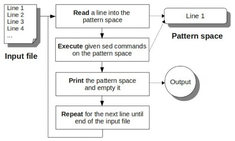

- > sed was built for and is used for one thing - editing lines on a per-line basis given an instruction.
- how sed works
	- {:height 286, :width 463}
	- Read, Execute, Print, Repeat
		- **Read a line** into the pattern space (an internal temporary sed buffer, where it places the line it reads from the input file).
		- **Execute the sed command** on the line in the sed pattern space. If there are more than one sed commands available, either via a sed script, -e options, or { }, it executes all the sed commands one by one in sequence on the line that is currently in the pattern space.
		- **Print the line** from the pattern space. After printing this line, the sed pattern space will be empty.
		- **Repeat** this again until the end of the input file is reached.
- 常用命令
	- ```bash
	  sed -i 's/SEARCH_REGEX/REPLACEMENT/g' INPUTFILE
	  sed -i 's/\bfoo\b/linux/g' file.txt
	  #use the word-boundary expression (\b) at both ends of the search string. This ensures 
	  the partial words are not matched.
	  sed -i 's/foo/linux/gI' file.txt
	  #make the pattern match case insensitive
	  sed -i 's/\/bin\/bash/\/usr\/bin\/zsh/g' file.txt
	  sed -i 's|/bin/bash|/usr/bin/zsh|g' file.txt
	  #use any other character as delimiter character
	  sed -i 's/\b[0-9]\{3\}\b/number/g' file.txt
	  sed -i 's/\b[0-9]\{3\}\b/{&}/g' file.txt
	  
	  
	  # 打印不连续的若干行
	  sed -n '1p; 3p; 5p' file
	  
	  #忽略大小写
	  sed -n '/GAINSPEED-\(ENVMON\|MEMORY\|PROCESS\)/Ip' XXX
	  
	  # Replace Using Word Boundary
	  echo "We felt happy because we saw the others were happy." | sed 's/\bwe\b/you/g'
	  
	  ```
- 使用shell环境变量
	- 直接使用
		- `var=abc; echo abc | sed "s/$var/& &/g"`
	- 双引号单独使用
		- `var=abc; echo abc | sed 's/'"$var"'/& &/g'`
-
- 匹配后替换整行
	- `echo "pattern 123 456" | sed '/pattern/ s/.*/xxxx/'`
-
- sed工作原理
- 
- pattern space
	- sed逐行处理文本，每行内容临时存放到pattern space，模式空间的内容会==自动打印==，之后被==自动清空==，用来接收下一行输入
- hold space
	- 该缓冲区的内容==不会自动清空==，也==不会自动打印==，==需要sed的命令来进行处理==
-
- sed命令
	- d
		- ==删除==pattern space的内容，==开始下一行==处理
	- h H
		- ==复制/追加==pattern space的内容到==hold space==
	- g G
		- ==复制/追加==hold space的内容到==pattern space==
	- x
		- ==交换==hold space和pattern space的内容
-
### 命令举例
	- 文件倒序输出
		- `seq 3 | sed '1!G;h;$!d'`
		   **命令执行过程**
		   读取第一行                                    `1!G`                                  `h`                                        `$!d`
		                      pattern space: 1      pattern space: 1              pattern space: 1                pattern space:           
		                      hold space:             hold space:                      hold space: 1                    hold space: 1
		  
		    读取第二行                                    `1!G`                                  `h`                                        `$!d`
		                      pattern space: 2       pattern space: 2\\n1      pattern space: 2\\n1           pattern space:
		                      hold space: 1            hold space: 1                hold space: 2\\n1               hold space: 2\\n1
		  
		   读取第三行                                    `1!G`                                  `h`                                          `$!d`
		                      pattern space: 3      pattern space: 3\\n2\\n1    pattern space: 3\\n2\\n1      pattern space: 3\\n2\\n1 --> 打印输出
		                      hold space: 2\\n1     hold space:   2\\n1            hold space: 3\\n2\\n1          hold space: 3\\n2\\n1
		- `sed -n '745,1681 s/^[0-9]\+: \+//p' debug_file.txt`
-
- 参考文档
	- [How to Use sed to Find and Replace String in Files](https://linuxize.com/post/how-to-use-sed-to-find-and-replace-string-in-files/)
	- [Regular Expression Syntax](https://www.gnu.org/software/sed/manual/html_node/Regular-Expressions.html#Regular-Expressions)
	- [Sed and Awk 101 Hacks](https://vds-admin.ru/sed-and-awk-101-hacks)
	- [sed, a stream editor](https://www.gnu.org/software/sed/manual/sed.html)
	- [Introduction to Sed](https://www.grymoire.com/Unix/Sed.html#toc_Table_of_Contents)
	- [Handy one-liners for SED](https://edoras.sdsu.edu/doc/sed-oneliners.html)
	- [Awk and Sed One-Liners Explained](https://www.osnews.com/story/21004/awk-and-sed-one-liners-explained/)
	  id:: 636e49a8-9cf8-4544-be5a-58502f81d054
	- [sed & awk](https://doc.lagout.org/operating%20system%20/linux/Sed%20%26%20Awk.pdf)
	- [sed & awk](https://docstore.mik.ua/orelly/unix/sedawk/) #online
	- [sed and awk](https://cs.nyu.edu/~mohri/unix08/lect5.pdf)
	- [Sed - An Introduction and Tutorial by Bruce Barnett](https://www.grymoire.com/Unix/Sed.html#toc_Sed_-_An_Introduction_and_Tutorial_by_Bruce_Barnett)
	- [How to Match a Pattern “N” Times Using sed](https://www.baeldung.com/linux/sed-match-pattern-n-times)
	- [How to Replace Text After a Specific Word Using  sed](https://www.baeldung.com/linux/sed-replace-text-after-word)
-
- [打印两个pattern之间的行](https://www.baeldung.com/linux/print-lines-between-two-patterns)
	- 包含 BEGIN 和 END pattern的边界
		- `sed -n '/DATA BEGIN/, /DATA END/p' input.txt`
	- 只包含 BEGIN 边界
		- `sed -n '/DATA BEGIN/, /DATA END/{ /DATA END/!p}' input.txt`
	- 只包含 END 边界
		- `sed -n '/DATA BEGIN/, /DATA END/{ /DATA BEGIN/!p}' input.txt`
	- 不包含 BEGIN 和 END pattern 的边界
		- `sed -n '/DATA BEGIN/, /DATA END/{ /DATA BEGIN/! {/DATA END/!p}}' input.txt`
	- [print lines between 2 patterns](https://stackoverflow.com/questions/38972736/how-to-print-lines-between-two-patterns-inclusive-or-exclusive-in-sed-awk-or/38972737#38972737)
	- [sedsed](https://github.com/aureliojargas/sedsed) Debugger and code formatter for sed scripts