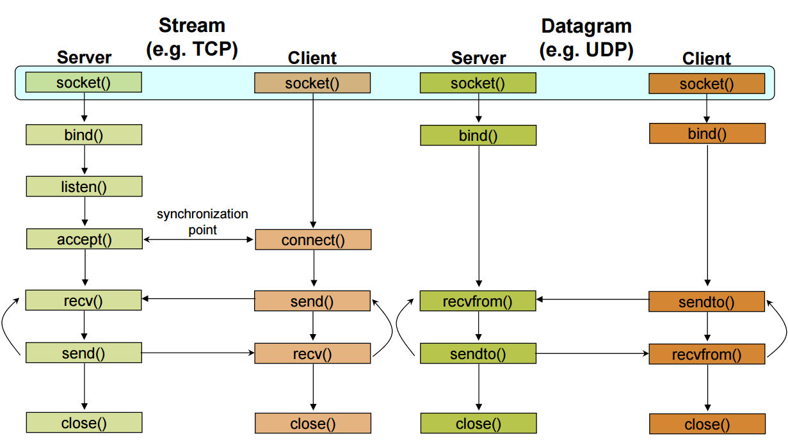
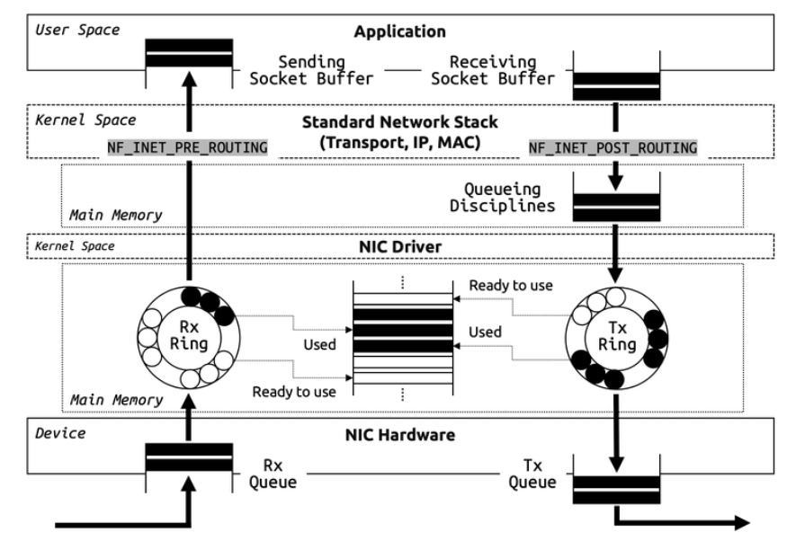

- 客户-服务器模型
	- server
		- 服务器被动等待和响应客户端的请求
		- 被动socket
	- client
		- 客户端初始化通信
		- 必须知道服务器的地址和端口
		- 主动socket
- socket通信过程
	- 
		- socket
			- `int sockid = socket(family, type, protocol)`
			- 创建通信的端点
		- bind
			- `int status = bind(sockid, &addrport, size)`
			- 绑定本地地址至socket
		- listen
			- `int status = listen(sockid, queueLimit)`
			- 声明接收客户端的连接
		- accept
			- `int s = accept(sockid, &clientAddr, &addrLen)`
			- 阻塞调用者直到收到连接请求
		- connect
			- `int status = connect(sockid, &foreignAddr, addrlen)`
			- 主动尝试建立连接
		- send
			- `int count = send(sockid, msg, msgLen, flags)`
			- `int count = sendto(sockid, msg, msgLen, flags, &freignAddr, addrlen)`
			- 通过连接发送数据
		- receive
			- `int count = recv(sockid, recvBuf, bufLen, flags)`
			- `int count = recvfrom(sockid, recvBuf, bufLen, flags, &clientAddr, addrlen)`
			- 通过连接接收数据
		- close
			- `int status = close(sockid)`
			- 释放连接
		- setsockopt
			- `int r = setsockopt(sockid, level, optName, optVal, optLen)`
		- getsockopt
			- `int r = getsockopt(sockid, level, optName, optVal, optLen)`
- Packet queueing in the Linux network stack
	- 
- [packet(7)](https://linux.die.net/man/7/packet)
	- ```bash
	  # packet - packet interface on device level
	  Packet sockets are used to receive or send raw packets at the device driver (OSI Layer 2) 
	  level. They allow the user to implement protocol modules in user space on top of the physical
	  layer.
	  
	  packet_socket = socket(AF_PACKET, int socket_type, int protocol);
	  ```
- 参考文档
	- [**H3C 网络互通配置指导**](https://www.h3c.com/cn/d_202203/1578744_30005_0.htm)
	- [**Huawei Technical Guides**](https://support.huawei.com/enterprise/en/routers/ar100-200-pid-256863195?category=configuration-commissioning&subcategory=technical-guides)
	- [**Keyword Search the Single UNIX Specification**](https://pubs.opengroup.org/onlinepubs/7908799/)
	- [The Open Group Base Specifications](https://pubs.opengroup.org/onlinepubs/9699919799/)
	- [C Language Examples of IPv4 and IPv6 Raw Sockets for Linux](https://www.pdbuchan.com/rawsock/rawsock.html)
	- [linux socket](https://liuhangbin.netlify.app/post/linux-socket/)
	- [raw(7)](https://man7.org/linux/man-pages/man7/raw.7.html)
	- [socket(7)](https://man7.org/linux/man-pages/man7/socket.7.html)
	- [Beej's Guide to Network Programming 简体中文](https://beej-zhcn.netdpi.net/)
	- [Beej's Guide to Network Programming](https://www2.cs.uh.edu/~gnawali/courses/cosc4377-s12/readings/beejs.pdf)
	- [Beej's Guide to Network Programming](https://teoriadeisegnali.it/appint/html/altro/bgnet/index.html)
	- [Socket Programming HOWTO](https://docs.python.org/3/howto/sockets.html)
	- [A Guide to Java Sockets](https://www.baeldung.com/a-guide-to-java-sockets)
	- [A Complete Guide to Socket Programming in Python](https://www.datacamp.com/tutorial/a-complete-guide-to-socket-programming-in-python)
	- [Socket programming](https://www.ibm.com/docs/en/i/7.5?topic=communications-socket-programming)
	- [UDP and the sendto Socket API](https://people.computing.clemson.edu/~westall/853/notes/udpsend.pdf)
	- [**Manpages**](https://man.cx/) #online
	- [Socket Programming in Python (Guide)](https://realpython.com/python-sockets/)
	- [C socket calls](https://www.ibm.com/docs/en/zos/3.1.0?topic=interface-c-socket-calls)
	- [Linux Raw Sockets](https://www.schoenitzer.de/blog/2018/Linux%20Raw%20Sockets.html)
	- [**Beej's Guide to Network Programming**](https://beej.us/guide/bgnet/)
	- [socket参数对用户接收报文的影响](https://segmentfault.com/a/1190000020103410)
	- [Netfilter 是如何工作的](https://segmentfault.com/t/netfilter)
	- [通俗理解IP路由](https://segmentfault.com/a/1190000019363010)
	- [backlog参数对TCP连接建立的影响](https://segmentfault.com/a/1190000019252960)
	- [TCP拥塞控制之基础](https://segmentfault.com/a/1190000019102072)
	- [图解 epoll 是如何工作的](https://segmentfault.com/a/1190000018517562)
	- [The Implementation of epoll](https://idndx.com/the-implementation-of-epoll-1/)
	- [linu内核协议栈源码阅读理解详细注释](https://github.com/y123456yz/Reading-and-comprehense-linux-Kernel-network-protocol-stack)
	- [Linux Network Stack Walkthrough (2.4.20)](https://jsevy.com/network/Linux_network_stack_walkthrough.html)
	- [Networking](https://www.kernel.org/doc/html/latest/networking/)
	- [Queueing in the Linux Network Stack](https://www.coverfire.com/articles/queueing-in-the-linux-network-stack/)
	- 
	- [[bpf]]
	- [The Linux Socket Filter: Sniffing Bytes over the Network](https://www.linuxjournal.com/article/4659)
	- [Inside the Linux Packet Filter](https://www.linuxjournal.com/article/4852)
	- [Inside the Linux Packet Filter, Part II](https://www.linuxjournal.com/article/5617)
	- [man 2 getsockopt](https://man7.org/linux/man-pages/man2/setsockopt.2.html)
- [Raw Socket 接收和发送数据包](https://github.com/xgfone/snippet/blob/master/snippet/docs/linux/program/raw-socket.md) #github
- [rawSocketToolkit](http://csci.viu.ca/~pwalsh/teaching/460/atLabTools24jan06a/rawSocketToolkit/)
- [**Advanced Sockets API for IPv6**](https://datatracker.ietf.org/doc/html/rfc2292)
- [How to: Raw sockets in IPv6](https://blog.apnic.net/2017/10/24/raw-sockets-ipv6/)
- [**Guide to IP Layer Network Administration with Linux**](http://linux-ip.net/html/index.html)
- [RIB and FIB – Understanding the terminology](https://www.dasblinkenlichten.com/rib-and-fib-understanding-the-terminology/)
- [计算机网络](https://kiprey.github.io/tags/%E8%AE%A1%E7%AE%97%E6%9C%BA%E7%BD%91%E7%BB%9C/)
- [CS144-Computer-Network](https://github.com/PKUFlyingPig/CS144-Computer-Network/tree/master)
- [CS144: Introduction to Computer Networking](https://www.scs.stanford.edu/10au-cs144/)
- [PcapPlusPlus](https://pcapplusplus.github.io/v1912/docs/)
- [**PcapPlusPlus Example Applications**](https://pcapplusplus.github.io/v1912/docs/examples)
- [raw - Linux IPv4 raw sockets](https://manpages.ubuntu.com/manpages/jammy/man7/raw.7.html)
- [**Introduction to RAW-sockets**](https://tuprints.ulb.tu-darmstadt.de/6243/1/TR-18.pdf)
- 
- [**network programming**](https://www.tenouk.com/Module42a.html)
- [Network Programming Guide](https://techpubs.jurassic.nl/library/manuals/0000/007-0810-050/sgi_html/index.html)
- [What Are Raw Sockets?](https://www.baeldung.com/cs/raw-sockets)
- [Packet MMAP](https://www.kernel.org/doc/html/latest/networking/packet_mmap.html#packet-mmap)
- [packet(7)](https://man7.org/linux/man-pages/man7/packet.7.html)
- [Introduction to AF_PACKET sockets](https://googleprojectzero.blogspot.com/2017/05/exploiting-linux-kernel-via-packet.html)
- [Deep dive into AF_PACKET socket](https://csulrong.github.io/blogs/2022/03/10/linux-afpacket/)
- [What Is Maximum Transmission Unit (MTU)?](https://support.huawei.com/enterprise/en/doc/EDOC1100202534)
- [MTU and MSS: What You Need to Know](https://www.imperva.com/learn/application-security/what-is-mtu-mss/)
- [DHCP Relay](https://support.huawei.com/enterprise/en/doc/EDOC1100172313/eff6c15f/how-to-configure-security-policies-to-allow-dhcp)
- [What is NAT](https://support.huawei.com/enterprise/en/doc/EDOC1100086645#EN-US_TOPIC_0170224627)
- [L2TP VPN](https://support.huawei.com/enterprise/en/doc/EDOC1100176155)
- [IP Routing Basics](https://support.huawei.com/enterprise/en/doc/EDOC1100086956?idPath=24030814%7C21782164%7C7923148%7C256863195)
- [What Is LACP?](https://support.huawei.com/enterprise/en/doc/EDOC1100086560)
