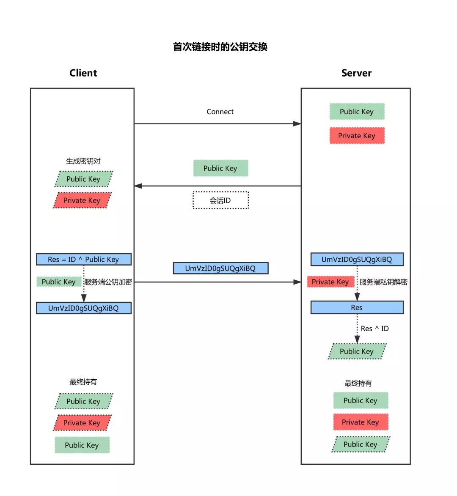
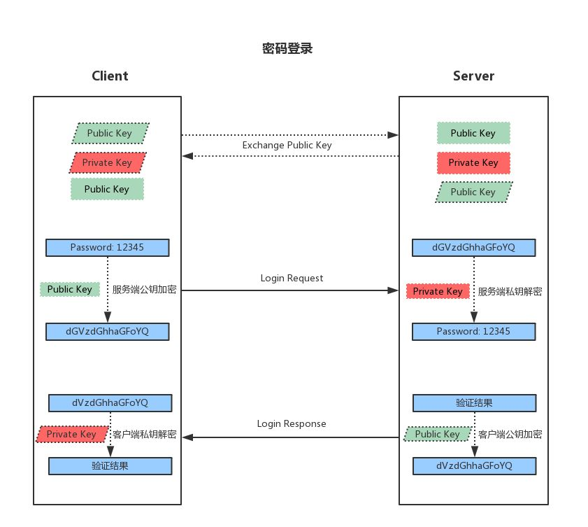
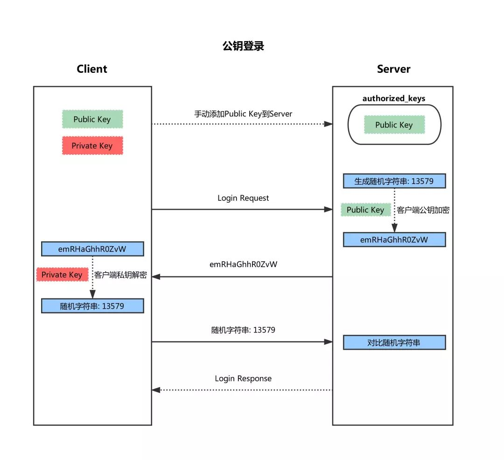

- `client_loop: send disconnect: Broken pipe`
	- [解决ssh连接长时间不操作断开连接的问题（client_loop/ send disconnect/ Broken pipe）](https://zhuanlan.zhihu.com/p/431249844)
- list tunnels created by `ssh`
	- ```bash
	  sudo lsof -i -n | egrep '\<ssh\>'
	  
	  # see the tunnels / connections made to a sshd
	  sudo lsof -i -n | egrep '\<sshd\>'
	  ```
- ssh(Secure Shell), 采用==**非对称加密**==方式实现**主机间**的安全**登陆**及**数据传输**。
- ```bash
  sshpass -p MO87@vecima ssh -CNfR 0.0.0.0:58080:127.0.0.1:3128 morrism@135.242.60.169
  
       -C      Requests compression of all data (including stdin, stdout,
               stderr, and data for forwarded X11, TCP and UNIX-domain
               connections).  The compression algorithm is the same used
               by gzip(1).  Compression is desirable on modem lines and
               other slow connections, but will only slow down things on
               fast networks.  The default value can be set on a host-by-
               host basis in the configuration files; see the Compression
               option in ssh_config(5).
       -N      Do not execute a remote command.  This is useful for just
               forwarding ports.  Refer to the description of SessionType
               in ssh_config(5) for details.
       -f      Requests ssh to go to background just before command
               execution.  This is useful if ssh is going to ask for
               passwords or passphrases, but the user wants it in the
               background.  This implies -n.  The recommended way to start
               X11 programs at a remote site is with something like ssh -f
               host xterm.
  
               If the ExitOnForwardFailure configuration option is set to
               “yes”, then a client started with -f will wait for all
               remote port forwards to be successfully established before
               placing itself in the background.  Refer to the description
               of ForkAfterAuthentication in ssh_config(5) for details.
       -R [bind_address:]port:host:hostport
       -R [bind_address:]port:local_socket
       -R remote_socket:host:hostport
       -R remote_socket:local_socket
       -R [bind_address:]port
               Specifies that connections to the given TCP port or Unix
               socket on the remote (server) host are to be forwarded to
               the local side.
  
               This works by allocating a socket to listen to either a TCP
               port or to a Unix socket on the remote side.  Whenever a
               connection is made to this port or Unix socket, the
               connection is forwarded over the secure channel, and a
               connection is made from the local machine to either an
               explicit destination specified by host port hostport, or
               local_socket, or, if no explicit destination was specified,
               ssh will act as a SOCKS 4/5 proxy and forward connections
               to the destinations requested by the remote SOCKS client.
  
               Port forwardings can also be specified in the configuration
               file.  Privileged ports can be forwarded only when logging
               in as root on the remote machine.  IPv6 addresses can be
               specified by enclosing the address in square brackets.
  
               By default, TCP listening sockets on the server will be
               bound to the loopback interface only.  This may be
               overridden by specifying a bind_address.  An empty
               bind_address, or the address ‘*’, indicates that the remote
               socket should listen on all interfaces.  Specifying a
               remote bind_address will only succeed if the server's
               GatewayPorts option is enabled (see sshd_config(5)).
  
               If the port argument is ‘0’, the listen port will be
               dynamically allocated on the server and reported to the
               client at run time.  When used together with -O forward,
               the allocated port will be printed to the standard output.
  ```
- 服务器端配置
	- `/etc/ssh/sshd_config`
	- 常用配置
		- `Port`
			- > **Port** Specifies the port number that **[sshd](https://linux.die.net/man/8/sshd)**(8) listens on. The default is 22. Multiple options of this type are permitted. See also **ListenAddress**.
		- ForceCommand
			- > Forces the execution of the command specified by **ForceCommand**, ignoring any command supplied by the client and *~/.ssh/rc* if present. The command is invoked by using the user's login shell with the -c option. This applies to shell, command, or subsystem execution. It is most useful inside a **Match** block. The command originally supplied by the client is available in the SSH_ORIGINAL_COMMAND environment variable. Specifying a command of ''internal-sftp'' will force the use of an in-process sftp server that requires no support files when used with **ChrootDirectory**.
		- Match
			- > Introduces a conditional block. If all of the criteria on the **Match** line are satisfied, the keywords on the following lines override those set in the global section of the config file, until either another **Match** line or the end of the file.
			  The arguments to **Match** are one or more criteria-pattern pairs. The available criteria are **User**, **Group**, **Host**, and **Address**. The match patterns may consist of single entries or comma-separated lists and may use the wildcard and negation operators described in the *PATTERNS* section of **[ssh_config](https://linux.die.net/man/5/ssh_config)**(5).
		- 示例
			- ```bash
			  # /etc/ssh/sshd_config
			  Port 5617
			  Match User support
			  	ForceCommand /etc/ssh/support_command.sh
			  # 当以support用户通过ssh远程登陆该server时，强制执行脚本/etc/ssh/support_command.sh
			  # 从而达到限制或者接管用户ssh登陆的目的
			  
			  # /etc/ssh/support_command.sh
			  #!/bin/sh
			  
			  if [ -n "${SSH_ORIGINAL_COMMAND}" ]; then
			          case $SSH_ORIGINAL_COMMAND in
			          'scp'*)
			                  $SSH_ORIGINAL_COMMAND
			                  ;;
			          *)
			                  echo "The command is not supported."
			                  ;;
			          esac
			  else
			          exec /usr/bin/gs_cli
			  fi
			  ```
- SSH^^连接创建^^过程(公钥交换)
  collapsed:: true
	- 
		- 客户端发起链接请求
		- 服务端返回自己的公钥，以及一个会话ID（这一步客户端得到服务端公钥）
		- 客户端生成密钥对
		- 客户端用自己的公钥异或会话ID，计算出一个值，并用服务端的公钥加密
		- 客户端发送加密后的值到服务端，服务端用私钥解密
		- 服务端用解密后的值异或会话ID，计算出客户端的公钥（这一步服务端得到客户端公钥）
		- 至此，双方各自持有三个秘钥，分别为自己的一对公、私钥，以及对方的公钥，之后的所有通讯都会被加密
- SSH^^密码登陆^^过程
  collapsed:: true
	- 
		- 服务端收到登录请求后，首先互换公钥，详细步骤如上一节所述。
		- 客户端用服务端的公钥加密账号密码并发送
		- 服务端用自己的秘钥解密后得到账号密码，然后进行验证
		- 服务端用客户端的公钥加密验证结果并返回
		- 服务端用自己的秘钥解密后得到验证结果
- SSH^^公钥登录^^过程
  collapsed:: true
	- {:height 573, :width 620}
	- 客户端==公钥==手动添加到服务器的authorized_keys的文件
	- 客户端发起登录请求，并且发送一个自己公钥的指纹（具有唯一性，但不是公钥）
	- 服务端根据指纹检测此公钥是否保存在自己的authorized_keys中
		- 若存在，服务端便生成一段随机字符串，然后利用客户端公钥加密并返回
	- 客户端收到后用自己的私钥解密，再利用服务端公钥加密后发回
	- 服务端收到后用自己的私钥解密，如果为同一字符串，则验证通过
-
- SSH客户端配置文件
	- 配置文件位置: `~/.ssh/config`
	  ```sh
	  touch ~/.ssh/config
	  chmod 600 ~/.ssh/config
	  ```
	- SSH配置文件结构与样式
		- SSH配置文件由若干个节(section)组织而成，每个节以`Host`指令开头，客户端按节(section)读取配置文件进行选项匹配，因此==特定主机==的声明=放在前面=，一般且==通用的声明==放在==后面==。
			- ```sh
			  Host targaryen
			    HostName 192.168.1.10
			    User daenerys
			    Port 7654
			    IdentityFile ~/.ssh/targaryen.key
			  
			  Host tyrell
			    HostName 192.168.10.20
			  
			  Host martell
			    HostName 192.168.10.50
			  
			  Host *ell
			    user oberyn
			  
			  Host * !martell
			    LogLevel INFO
			  
			  Host *
			    User root
			    Compression yes
			  
			  ```
				- 不同用户的选项列表
					- targaryen
						- ```sh
						  HostName 192.168.1.10
						  User daenerys
						  Port 7654
						  IdentityFile ~/.ssh/targaryen.key
						  LogLevel INFO
						  Compression yes
						  ```
					- tyrell
						- ```sh
						  HostName 192.168.10.20
						  User oberyn
						  LogLevel INFO
						  Compression yes
						  ```
					- martell
						- ```sh
						  HostName 192.168.10.50
						  User oberyn
						  Compression yes
						  ```
					- 其他用户
						- ```sh
						  LogLevel INFO
						  User root
						  Compression yes
						  ```
	- 配置文件读取顺序
		- 命令行选项
		- `~/.ssh/config`.
		- `/etc/ssh/ssh_config`.
	- 覆盖 SSH配置文件选项
		- 指定单一选项(-o)
		  ```sh
		  ssh -o "User=root" dev
		  ```
		- 指定或者忽略配置文件选项(-F)
		  ```sh
		  ssh -F /dev/null user@example.com
		  ```
-
- sshfs
	- 挂载远程文件系统
		- ```sh
		  sshfs [user@]host:[dir] mountpoint [options]
		  ```
- ssh端口转发
	- local port forwarding
		- 本地端口转发主要用来内部私有网络访问远程主机的服务如数据库或者VNC服务
		- 注意: 远程SSH SERVER的`AllowTcpForwarding`必须使能
		- `ssh -L [LOCAL_IP:]LOCAL_PORT:DESTINATION:DESTINATION_PORT [USER@]SSH_SERVER`
			- `[LOCAL_IP:]LOCAL_PORT`
				- 本地主机ip和端口号，LOCAL_IP默认为本地主机
			- `DESTINATION:DESTINATION_PORT`
				- 目的主机的IP地址或者名称，以及端口号
				- 如果目的主机和SSH SERVER相同，DESTINATION可以用`localhost`表示
			- `[USER@]SERVER_IP`
				- 远程SSH的用户名及服务器IP地址
				- ```bash
				  # 假定私有网络中的主机db001:3306运行着MySQL服务，主机pub001.host可以访问主机db001的MySQL服务
				  但是本地主机不可以直接访问主机db001的MySQL服务，此时可以通过ssh本地转发实现本地主机访问主机db001的MySQL服务
				  
				  ssh -L 3336:db001.host:3306 user@pub001.host
				  
				  # 此时在本地主机访问127.0.0.1:3336，连接会通过主机pub001转发给主机db001.host:3306的MySQL服务，
				  此时主机pub001充当中间转发服务器的角色
				  
				  # 转发多个端口到多个目的主机
				  ssh -L 3336:db001.host:3306 3337:db002.host:3306 user@pub001.host
				  ```
				- ```bash
				  # 假定VNC SERVER和SSH SERVER运行在同一个主机上，但是该主机无法通过外部主机直接进行VNC访问，
				  此时可通过如下命令实现
				  ssh -L 5901:127.0.0.1:5901 -N -f user@remote.host
				  
				  -f	命令在后台执行
				  -N	不执行远程命令
				  ```
	- remote port forwarding
		- 远程端口转发主要用来给外部的人员提供内部服务的访问
		- 注意: 远程SSH SERVER的``GatewayPorts``必须设置为`YES`
		- `ssh -R [REMOTE:]REMOTE_PORT:DESTINATION:DESTINATION_PORT [USER@]SSH_SERVER`
			- `[REMOTE:]REMOTE_PORT`
				- 远程SSH SERVER的ip和端口号，REMOTE为空意味着远程SSH SERVER绑定所有端口
			- `DESTINATION:DESTINATION_PORT`
				- 目的主机的IP或者主机名称， 以及端口号
			- `[USER@]SERVER_IP`
				- 远程SSH SERVER的用户名及IP地址
			- ```bash
			  # 假设你在本地主机上开发了一个web应用，本地主机没有公网ip，所以其他开发者无法通过互联网直接访问，
			  此时可以通过如下命令让其他开发者可以访问你的本地服务
			  
			  ssh -R 8080:127.0.0.1:3000 -N -f user@remote.host
			  
			  # 该命令的功能是使SSH SERVER监听端口8080，并且tunnel所有来自该端口的流量到你的本地主机的3000端口
			  此时其他的开发者可以通过在浏览器上输入the_ssh_server_ip:8080来访问你本地主机的web应用
			  ```
- 参考文档
	- [SSH Again](https://eklitzke.org/ssh-again)
	- [man ssh_config](https://linux.die.net/man/5/ssh_config)
		- > **GatewayPorts**
		  Specifies whether remote hosts are allowed to connect to local forwarded ports. By default, **[ssh](https://linux.die.net/man/1/ssh)**(1) binds local port forwardings to the loopback address. This prevents other remote hosts from connecting to forwarded ports. **GatewayPorts** can be used to specify that ssh should bind local port forwardings to the wildcard address, thus allowing remote hosts to connect to forwarded ports. The argument must be ''yes'' or ''no''. The default is ''no''.
	- [man 5 sshd_config](https://linux.die.net/man/5/sshd_config)
	- [SSH Tunneling Explained](https://goteleport.com/blog/ssh-tunneling-explained/)
	- [How to Use SSH Port Forwarding](https://phoenixnap.com/kb/ssh-port-forwarding)
	- [How to Set up SSH Tunneling](https://linuxize.com/post/how-to-setup-ssh-tunneling/)
	- [SSH Tunneling: Examples, Command, Server Config](https://www.ssh.com/academy/ssh/tunneling-example)
	- [Automating ssh-copy-id](https://www.baeldung.com/linux/ssh-copy-id-automate)
	- [Authorized Keys File in SSH](https://www.ssh.com/academy/ssh/authorized-keys-file)
	- [How To Configure SSH Key-Based Authentication on a Linux Server](https://www.digitalocean.com/community/tutorials/how-to-configure-ssh-key-based-authentication-on-a-linux-server)