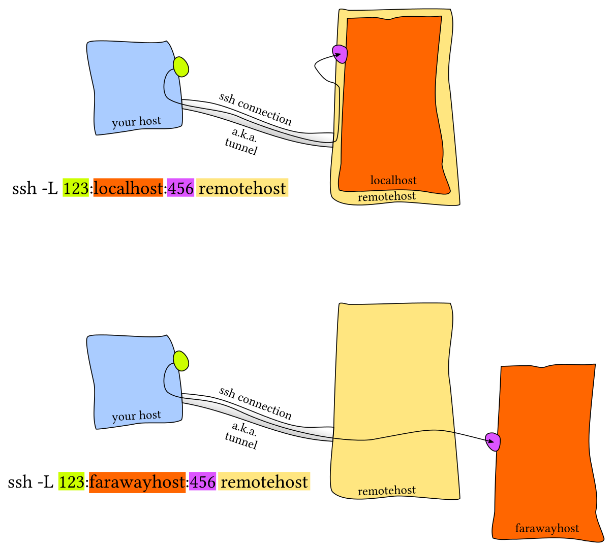
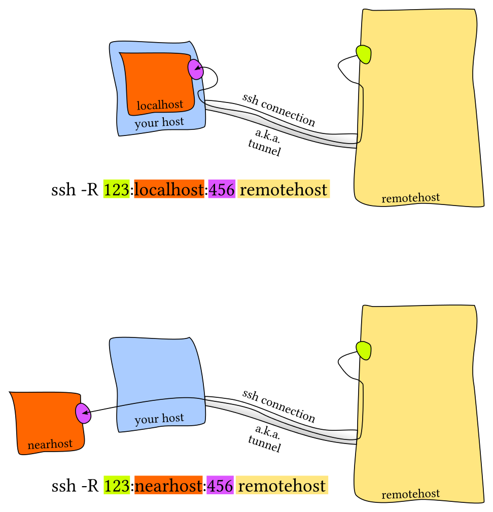

[ssh](https://www.mankier.com/1/ssh)  
[ssh_config](https://www.mankier.com/5/ssh_config)  
[sshd_config](https://www.mankier.com/5/sshd_config)  

[Restricting and Locking Down SSH Users](https://www.jamieweb.net/blog/restricting-and-locking-down-ssh-users/)  
[Managing Your SSH known_hosts Using Git](https://www.jamieweb.net/blog/managing-your-ssh-known_hosts-using-git/)  
[Introduction to BGP Routing and Security](https://www.jamieweb.net/blog/bgp-routing-security-prelude-connecting-to-the-dn42-overlay-network/)  
[The Little known SSH ForceCommand](https://shaner.life/the-little-known-ssh-forcecommand/)  
[]()  
[]()  

## exec remote cmd which has an interactive cli
```bash
# 1 use here-doc
$ ssh server 'python3 <<EOF
import os
print(os.getcwd())
exit()
EOF
'

#
nomad alloc exec -task evc <alloc_id> sh -c 'ncs_cli -u admin <<EOF
show cable modem brief | t
EOF
'


# 2 use input file
# on server
/tmp/cmds.txt:
import os
print(os.getcwd())
exit()
# on client
ssh server 'python3 < /tmp/cmds.txt'

# 
nomad alloc exec -task evc <alloc_id> sh -c 'ncs_cli -u admin < /path/to/commands.txt'


# Some interactive CLIs require a TTY to run, in that case use 'ssh -t server'
```

## run specific command automatically upon login
```bash
# 1 (~/.ssh/config)
Host myserver
    HostName server.example.com
    User morris
    #RemoteCommand /path/to/my/script.sh
    #RemoteCommand cd /tmp && exec $SHELL -l						# triggered for scp, rsync -e, ...
    #RemoteCommand test -t 0 || { cd /tmp && exec $SHELL -l; }		# triggered only for interactive sessions

# 2 inline command
ssh -t myserver 'mycommand && exec $SHELL -l'	# -t forces SSH to allocate a pseudo-terminal (PTY), $SHELL -l then runs as a real login shell and shows a prompt
ssh myserver 'mycommand && exec $SHELL -l'		# start a shell, but no tty, it waits silently
ssh myserver 'mycommand'	# one-off, just login to myserver, execute mycommand, then exit login

ssh myserver 'mycommand && $SHELL -i'	# because it’s not a login shell, it does not read the usual startup files like ~/.bash_profile or ~/.profile (for bash)
```

## ssh login process using public key
```
 [Client Machine]                           [Remote Server]
+-------------------+                    +-------------------+
|                   |                    |                   |
| ~/.ssh/id_rsa     |                    | ~/.ssh/           |
| (Private Key)     |                    | authorized_keys   |
|                   |                    | (Public Key)      |
|                   |                    |                   |
|   [SSH Client]    |                    |   [SSH Server]    |
|   1. Initiates    |                    |                   |
|      ssh devuser@ |---- Connect ------>| 1. Accepts        |
|      203.0.113.10 |                    |    connection     |
|                   |                    |                   |
|   2. Verifies     |<--- Host Key ------| 2. Sends host key |
|      host key     |                    |                   |
|                   |                    |                   |
|   3. Negotiates   |<--- Session Key -->| 3. Negotiates     |
|      session key  |                    |    session key    |
|                   |                    |                   |
|   4. Offers public|---- Offer Auth --->| 4. Checks         |
|      key auth     |                    |    authorized_keys|
|                   |                    |                   |
|   5. Loads private|                    |                   |
|      key (id_rsa) |                    |                   |
|                   |                    |                   |
|   6. Signs        |<--- Challenge -----| 6. Sends challenge|
|      challenge    |                    |                   |
|      with private |                    |                   |
|      key          |                    |                   |
|                   |---- Signature ---->| 7. Verifies       |
|                   |                    |    signature with |
|                   |                    |    public key     |
|                   |                    |                   |
|   8. Session      |<-- Access Granted -| 8. Grants access  |
|      established  |                    |    if valid       |
|                   |                    |                   |
+-------------------+                    +-------------------+
```

```bash
# 自动远程登陆 under windows terminal(PowerShell)
type ~\.ssh\id_rsa.pub | ssh user@ipaddr "cat >> .ssh/authorized_keys"

cat ~/.ssh/id_rsa.pub | ssh devuser@203.0.113.10 "mkdir -p ~/.ssh && cat >> ~/.ssh/authorized_keys && chmod 600 ~/.ssh/authorized_keys"

ssh devuser@203.0.113.10 "mkdir -p ~/.ssh && cat >> ~/.ssh/authorized_keys && chmod 600 ~/.ssh/authorized_keys" < cat ~/.ssh/id_rsa.pub

[Local Machine]                            [Remote Server: 203.0.113.10]
+-------------------+                    +-------------------+
|                   |                    |                   |
| ~/.ssh/id_rsa.pub |                    |                   |
|                   |                    |                   |
|   [cat]           |                    |                   |
|   Reads public    |                    |                   |
|   key             |                    |                   |
|                   |                    |                   |
|   | (stdout)      |                    |                   |
|   v               |                    |                   |
|   [Pipe] ---------|---- SSH ---------->|                   |
|                   |  (stdin)           | [Remote Command]  |
|                   |                    |                   |
|                   |                    | 1. mkdir -p ~/.ssh|
|                   |                    |    Creates .ssh   |
|                   |                    |    directory      |
|                   |                    |                   |
|                   |                    |    | (if needed)  |
|                   |                    |    v              |
|                   |                    | 2. cat >> ~/.ssh/ |
|                   |                    |    authorized_keys|
|                   |                    |    Appends key    |
|                   |                    |                   |
|                   |                    |    |              |
|                   |                    |    v              |
|                   |                    | 3. chmod 600      |
|                   |                    |    ~/.ssh/        |
|                   |                    |    authorized_keys|
|                   |                    |    Sets perms     |
|                   |                    |                   |
+-------------------+                    +-------------------+

ssh登陆流程：
1.远程主机收到用户的登录请求，把自己的公钥发给用户
2.用户收到远程主机发送的公钥后，利用公钥将登陆密码加密，发送给远程主机
3.远程主机使用自己的私钥，解密登陆密码，如果密码正确，就同意用户登录

跳过 ssh 首次连接远程主机的 fingerprint
方法1
ssh -o "StrictHostKeyChecking no" USER@HOST
方法2
在配置文件 ~/.ssh/config 或者 /etc/ssh/ssh_config 中增加配置选项
StrictHostKeyChecking no

# Permissions for .ssh folder and key files
1. .ssh directory: 700 (drwx------)
2. public key (.pub files): 644 (-rw-r--r--)
3. private key (id_rsa): 600 (-rw-------)
4. lastly your home directory should not be writeable by the group or others (at most 755 (drwxr-xr-x))

# commands to change the permissions
sudo chmod 700 ~/.ssh
sudo chmod 644 ~/.ssh/id_example.pub
sudo chmod 600 ~/.ssh/id_example

# Summary
+------------------------+-------------------------------------+-------------+-------------+
| Directory or File      | Man Page                            | Recommended | Mandatory   |
|                        |                                     | Permissions | Permissions |
+------------------------+-------------------------------------+-------------+-------------+
| ~/.ssh/                | There is no general requirement to  | 700         |             |
|                        | keep the entire contents of this    |             |             |
|                        | directory secret, but the           |             |             |
|                        | recommended permissions are         |             |             |
|                        | read/write/execute for the user,    |             |             |
|                        | and not accessible by others.       |             |             |
+------------------------+-------------------------------------+-------------+-------------+
| ~/.ssh/authorized_keys | This file is not highly sensitive,  | 600         |             |
|                        | but the recommended permissions are |             |             |
|                        | read/write for the user, and not    |             |             |
|                        | accessible by others                |             |             |
+------------------------+-------------------------------------+-------------+-------------+
| ~/.ssh/config          | Because of the potential for abuse, |             | 600         |
|                        | this file must have strict          |             |             |
|                        | permissions: read/write for the     |             |             |
|                        | user, and not accessible by others. |             |             |
|                        | It may be group-writable provided   |             |             |
|                        | that the group in question contains |             |             |
|                        | only the user.                      |             |             |
+------------------------+-------------------------------------+-------------+-------------+
| ~/.ssh/identity        | These files contain sensitive data  |             | 600         |
| ~/.ssh/id_dsa          | and should be readable by the user  |             |             |
| ~/.ssh/id_rsa          | but not accessible by others        |             |             |
|                        | (read/write/execute)                |             |             |
+------------------------+-------------------------------------+-------------+-------------+
| ~/.ssh/identity.pub    | Contains the public key for         | 644         |             |
| ~/.ssh/id_dsa.pub      | authentication.  These files are    |             |             |
| ~/.ssh/id_rsa.pub      | not sensitive and can (but need     |             |             |
|                        | not) be readable by anyone.         |             |             |
+------------------------+-------------------------------------+-------------+-------------+
```

```bash
  sshpass -p MO87@vecima ssh -CNfR 58080:127.0.0.1:3128 morrism@135.242.60.169
  
       -C      Requests compression of all data
       -N      Do not execute a remote command.  This is useful for just forwarding ports.
       -f      Requests ssh to go to background just before command execution.
       -R [bind_address:]port:host:hostport
       -R [bind_address:]port:local_socket
       -R remote_socket:host:hostport
       -R remote_socket:local_socket
       -R [bind_address:]port
               Specifies that connections to the given TCP port or Unix socket on the remote (server) host are to be forwarded to the local side.
```
## 服务器端配置
```bash
# /etc/ssh/sshd_config

# options
	Port
	ForceCommand
	Match

# example
Port 5617
Match User support
ForceCommand /etc/ssh/support_command.sh
# 当以support用户通过ssh远程登陆该server时，强制执行脚本/etc/ssh/support_command.sh
# 从而达到限制或者接管用户ssh登陆的目的

# /etc/ssh/support_command.sh
#!/bin/sh

if [ -n "${SSH_ORIGINAL_COMMAND}" ]; then
		case $SSH_ORIGINAL_COMMAND in
		'scp'*)
				$SSH_ORIGINAL_COMMAND
				;;
		*)
				echo "The command is not supported."
				;;
		esac
else
		exec /usr/bin/gs_cli
fi
```

SSH连接创建过程(公钥交换)
	- 
		- 客户端发起链接请求
		- 服务端返回自己的公钥，以及一个会话ID（这一步客户端得到服务端公钥）
		- 客户端生成密钥对
		- 客户端用自己的公钥异或会话ID，计算出一个值，并用服务端的公钥加密
		- 客户端发送加密后的值到服务端，服务端用私钥解密
		- 服务端用解密后的值异或会话ID，计算出客户端的公钥（这一步服务端得到客户端公钥）
		- 至此，双方各自持有三个秘钥，分别为自己的一对公、私钥，以及对方的公钥，之后的所有通讯都会被加密
SSH密码登陆过程
	- 
		- 服务端收到登录请求后，首先互换公钥，详细步骤如上一节所述。
		- 客户端用服务端的公钥加密账号密码并发送
		- 服务端用自己的秘钥解密后得到账号密码，然后进行验证
		- 服务端用客户端的公钥加密验证结果并返回
		- 服务端用自己的秘钥解密后得到验证结果
SSH公钥登录过程
	- {:height 573, :width 620}
	- 客户端==公钥==手动添加到服务器的authorized_keys的文件
	- 客户端发起登录请求，并且发送一个自己公钥的指纹（具有唯一性，但不是公钥）
	- 服务端根据指纹检测此公钥是否保存在自己的authorized_keys中
		- 若存在，服务端便生成一段随机字符串，然后利用客户端公钥加密并返回
	- 客户端收到后用自己的私钥解密，再利用服务端公钥加密后发回
	- 服务端收到后用自己的私钥解密，如果为同一字符串，则验证通过

## SSH客户端配置文件
```bash
# ~/.ssh/config
chmod 600 ~/.ssh/config

# example
Host targaryen
HostName 192.168.1.10
User daenerys
Port 7654
IdentityFile ~/.ssh/targaryen.key

Host tyrell
HostName 192.168.10.20

Host martell
HostName 192.168.10.50

Host *ell
user oberyn

Host * !martell
LogLevel INFO

Host *
User root
Compression yes

# 配置文件读取顺序
1. 命令行选项
2. ~/.ssh/config
3. /etc/ssh/ssh_config

# 覆盖 SSH配置文件选项
# 指定单一选项(-o)
ssh -o "User=root" dev
# 指定或者忽略配置文件选项(-F)
ssh -F /dev/null user@example.com
```

## sshfs 挂载远程文件系统

## ssh端口转发
[**What's ssh port forwarding and what's the difference between ssh local and remote port forwarding**](https://unix.stackexchange.com/questions/115897/whats-ssh-port-forwarding-and-whats-the-difference-between-ssh-local-and-remot)  


```bash
## local forward (-L)
# You create a port on your local machine that forwards traffic through the SSH connection to some destination (reachable from the remote host).
ssh -L [LOCAL_PORT]:[DEST_HOST]:[DEST_PORT] user@ssh-server
localhost:LOCAL_PORT -->  ssh-server  -->  DEST_HOST:DEST_PORT

ssh -L 5432:127.0.0.1:5432 devuser@203.0.113.10
# “When I connect to localhost:5432 on my machine, send it through SSH to 203.0.113.10, and from there connect to that host’s own 127.0.0.1:5432 (its local loopback)
# on local host: psql -h localhost -p 5432 connects to the remote machine’s PostgreSQL

 [Your App] ---> localhost:5432
                  |
                  v
          +-------------------+
          |    SSH tunnel     |
          +-------------------+
                  |
                  v
    [Remote host: 203.0.113.10]
             connects to
          127.0.0.1:5432 (on remote)


## remote forward (-R)
# You create a port on the remote machine that forwards traffic through the SSH connection back to a destination reachable from your local machine.
ssh -R [REMOTE_PORT]:[DEST_HOST]:[DEST_PORT] user@ssh-server
ssh-server:REMOTE_PORT  -->  localhost  -->  DEST_HOST:DEST_PORT

ssh -R 9000:127.0.0.1:8080 devuser@203.0.113.10
# “On the remote server (203.0.113.10), listen on port 9000. Anything connecting there will be tunneled back to my local computer’s 127.0.0.1:8080.”
# on the remote host: curl localhost:9000 connects back to your local port 8080

 [Remote App] ---> localhost:9000 (on remote)
                        |
                        v
                +-------------------+
                |    SSH tunnel     |
                +-------------------+
                        |
                        v
         [Your local machine]
            connects to
        127.0.0.1:8080 (on local)


local port forwarding (主要用于内部私有网络访问远程主机的服务如数据库或者VNC服务)
	远程SSH SERVER的 "AllowTcpForwarding" 必须使能
	ssh -L [LOCAL_IP:]LOCAL_PORT:DESTINATION:DESTINATION_PORT [USER@]SSH_SERVER
	# 1 私有网络中的主机db001:3306运行着MySQL服务，主机pub001.host可以访问主机db001的MySQL服务，但是本地主机不可以直接访问主机db001的MySQL服务，此时可以通过ssh本地转发实现本地主机访问主机db001的MySQL服务
	ssh -L 3336:db001.host:3306 user@pub001.host
	此时在本地主机访问127.0.0.1:3336，连接会通过主机pub001转发给主机db001.host:3306的MySQL服务，此时主机pub001充当中间转发服务器的角色

	# 2 转发多个端口到多个目的主机
	ssh -L 3336:db001.host:3306 3337:db002.host:3306 user@pub001.host

	# 3 VNC SERVER和SSH SERVER运行在同一个主机上，但是该主机无法通过外部主机直接进行VNC访问
	ssh -L 5901:127.0.0.1:5901 -N -f user@remote.host


remote port forwarding (主要用来给外部的人员提供内部服务的访问)
	远程SSH SERVER的 "GatewayPorts" 必须设置为 YES
	ssh -R [REMOTE:]REMOTE_PORT:DESTINATION:DESTINATION_PORT [USER@]SSH_SERVER

	# 1 假设你在本地主机上开发了一个web应用，本地主机没有公网ip，所以其他开发者无法通过互联网直接访问
	ssh -R 8080:127.0.0.1:3000 -N -f user@remote.host
	该命令的功能是使SSH SERVER监听端口8080，并且tunnel所有来自该端口的流量到你的本地主机的3000端口，此时其他的开发者可以通过在浏览器上输入the_ssh_server_ip:8080来访问你本地主机的web应用


local forward (ssh creates an additional local port which it will forward to a port on the remote system)
	ssh -L 8080:127.0.0.1:80 user@webserver

	Then in your browser on local use URL http://localhost:8080/, it will connect to local machines port 8080, which ssh will forward on to remote ssh, and it will then make a request to 127.0.0.1:80. Note 127.0.0.1 is actually the remote server's localhost, but it could have been a host/IP available at the remote machine's network.

remote forward (ssh creates a listening port on the remote machine which it will forward back (Reverse) to the local ssh to forward on)
	ssh -R 10123:127.0.0.1:123 user@webserver

	After ssh connects to webserver, the remote ssh creates and lsitens on a port 10123. A process on webserver connecting to 10123, ssh will pick it up and send it back to the local machine's ssh, which sends it on to 127.0.01:123 port

Examples:

# 1
	ssh -L 80:localhost:80 SUPERSERVER

	You specify that a connection made to the local port 80 is to be forwarded to port 80 on SUPERSERVER. That means if someone connects to your computer with a webbrowser, he gets the response of the webserver running on SUPERSERVER. You, on your local machine, have no webserver running.

# 2
	ssh -R 80:localhost:80 tinyserver

	You specify, that a connection made to the port 80 of tinyserver is to be forwarded to port 80 on your local machine. That means if someone connects to the small and slow server with a webbrowser, he gets the response of the webserver running on your local machine. The tinyserver, which has not enough diskspace for the big website, has no webserver running. But people connecting to tinyserver think so.

# 3
	ssh -R 80:localhost:30180 tinyserver1
	ssh -R 80:localhost:30280 tinyserver2
	etc.

	The powerful machine has five webservers running on five different ports. If a user connects to one of the five tinyservers at port 80 with his webbrowser, the request is redirected to the corresponding webserver running on the powerful machine.

# 4
	ssh -R 80:SUPERSERVER:30180 tinyserver1
	ssh -R 80:SUPERSERVER:30280 tinyserver2
	etc

	Your machine is only the connection between the powerful and the small servers. Then it would be (for one of the tinyservers that play to have their own webservers)
```

[SSH Transport Layer Protocol](https://www.rfc-editor.org/rfc/rfc4253#page-3)  
[SSH(1)](http://linuxcommand.org/lc3_man_pages/ssh1.html)  
[SSH Again](https://eklitzke.org/ssh-again)  
[man ssh_config](https://linux.die.net/man/5/ssh_config)  
	- > **GatewayPorts**
		Specifies whether remote hosts are allowed to connect to local forwarded ports. By default, **[ssh](https://linux.die.net/man/1/ssh)**(1) binds local port forwardings to the loopback address. This prevents other remote hosts from connecting to forwarded ports. **GatewayPorts** can be used to specify that ssh should bind local port forwardings to the wildcard address, thus allowing remote hosts to connect to forwarded ports. The argument must be ''yes'' or ''no''. The default is ''no''.
[man 5 sshd_config](https://linux.die.net/man/5/sshd_config)  
[SSH Tunneling Explained](https://goteleport.com/blog/ssh-tunneling-explained/)  
[How to Use SSH Port Forwarding](https://phoenixnap.com/kb/ssh-port-forwarding)  

[What Is SSH?](https://info.support.huawei.com/info-finder/encyclopedia/en/SSH.html)  
[**Guide to Using SSH Port Forwarding (SSH Tunneling)**](https://builtin.com/software-engineering-perspectives/ssh-port-forwarding)  
[**How to Set up SSH Tunneling**](https://linuxize.com/post/how-to-setup-ssh-tunneling/)  
[SSH Tunneling: Examples, Command, Server Config](https://www.ssh.com/academy/ssh/tunneling-example)  
[Automating ssh-copy-id](https://www.baeldung.com/linux/ssh-copy-id-automate)  
[Authorized Keys File in SSH](https://www.ssh.com/academy/ssh/authorized-keys-file)  
[How To Configure SSH Key-Based Authentication on a Linux Server](https://www.digitalocean.com/community/tutorials/how-to-configure-ssh-key-based-authentication-on-a-linux-server)  
[Permissions for .ssh folder and key files](https://frankindev.com/2020/11/26/permissions-for-.ssh-folder-and-key-files/)  
[SSH Essentials: Working with SSH Servers, Clients, and Keys](https://www.digitalocean.com/community/tutorials/ssh-essentials-working-with-ssh-servers-clients-and-keys)  
[Understanding SSH](https://support.huawei.com/hedex/hdx.do?docid=EDOC1100351682&id=EN-US_CONCEPT_0000001563753685)  

## SSH working mechanism
1. Connection setup
	The SSH server listens to port 22 for SSH connections. After the client sends a connection request to the server, a TCP connection is set up between the client and server.
2. Version negotiation
	The server and client determine which SSH version to use through version negotiation.
3. Algorithm negotiation
	SSH supports multiple algorithms. Based on their supported algorithms, the server and client negotiate the following algorithms: key exchange algorithm for generating a session key, encryption algorithm for encrypting data, public key algorithm for digital signature and authentication, and hash-based message authentication code (HMAC) algorithm for data integrity protection.
4. Key exchange
	The server and client dynamically generate a session key to protect data transmission and a session ID to identify the SSH connection through Diffie-Hellman key exchange. The client also authenticates the server during this stage.
5. Client authentication
	The client sends an authentication request to the server, and the server authenticates the client.
6. Session request
	After the authentication succeeds, the client sends a session request to the server, requesting the server to provide a certain type of service (STelnet, SFTP, or SCP). That is, the client requests to establish a session with the server.
7. Session interaction
	After a session is established, the server and client exchange data.
