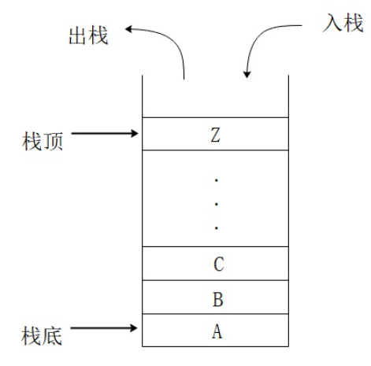

- 栈(Stack)
	- 栈是一种按照 FILO(First In Last Out) 的原则存储数据的结构，从技术上说，它是 CPU 寄存器里的某个指针所指向的一块内存区域，某个指针对于`x86/x64`而言是`ESP/ERP`，对ARM而言是`SP`
	- 栈的相关概念
		- 栈顶与栈底
			- 允许元素插入与删除的一端，另一端成为栈底
		- 压栈Push
			- 栈的插入操作，^^先^^将`ESP/ERP/SP`的值^^减^^去4或8，然^^后^^将操作数^^写^^到寄存器所指向的内容中
		- 出栈Pop
			- 栈的删除操作，^^先^^从栈指针指向的内容中^^读^^取数据，然^^后^^将栈指针的数值^^加^^上4或8
		- 无论是出栈还是入栈都是在栈顶进行，栈底不动
		  background-color:: red
		  
	- 栈的作用
		- 暂时保存函数的局部变量
		- 调用函数时传递参数
		- 保存函数的返回地址
- 栈帧
	- 也叫过程活动记录，是编译器用来实现函数调用的一种数据结构，它利用栈帧指针EBP寄存器访问局部变量、函数参数、函数返回地址。
	- 栈帧结构
	  ```asm
	  PUSH EBP		;函数开始使用EBP前先将之前的EBP值压栈
	  MOV EBP, ESP	;保存当前ESP到EBP
	  
	  ...				;函数体
	  				;无论ESP的值如何变化，EBP的值始终不变，可以安全的访问函数的局部变量和参数
	  
	  MOV ESP, EBP	;将函数的起始地址返回到ESP中
	  POP EBP			;函数返回前弹出保存在栈上的值
	  RETN			;函数终止
	  ```
		- 帧指针（Frame Pointer）: EBP
		- 栈指针（Stack Pointer）：ESP
-
- 参考文档
	- [函数调用原理](https://gitbook.coder.cat/function-call-principle/)
	- [function stack](https://www.tenouk.com/Bufferoverflowc/Bufferoverflow2a.html)
	- [Understanding how function call works](https://zhu45.org/posts/2017/Jul/30/understanding-how-function-call-works/)