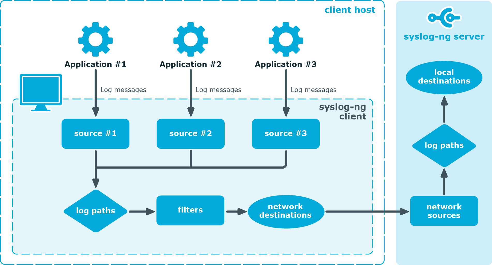

- ```bash
  # 可能会影响到系统时间和syslog时间戳的文件
  /etc/TZ
  /etc/localtime
  
  
  # for debug
  rsyslogd -dn
  ```
- syslog是一套用来创建和传输log的标准
  
  > syslog 应用接收日志消息并转发给指定的目标地址。消息的来源可以是文件，远程主机或者其他的 source ，syslog 接收来自指定 source 的日志并发送给一个或者多个 destination.
  > 
  > source 和 destination 是两个独立的物件，log path 定义了如何处理日志消息。一条 log path 包含一个或者多个 source ，以及一个或者多个 destination ，来自某一个 source 的日志消息被发送给 log path 中指定的一个或者多个 destination.
  > 
  > log 语句中可以包含 **_parsers_ and _rewriting rules_**， parser 用来将日志消息分割成不同的域来方便消息的处理，而 rewrite rule 则通过添加，修改或者删除日志消息的部分内容来达到修改日志消息的目的
- 不同场景下 syslog 的含义
	- syslog service: 通过创建socket /dev/log来接收和处理syslog消息和监听事件。
		- [rsyslogd](https://www.rsyslog.com/doc/v8-stable/)
		- [syslog-ng](https://www.syslog-ng.com/technical-documents/doc/syslog-ng-open-source-edition/3.30/administration-guide/4#TOPIC-1594857)
	- syslog protocol: 定义如何通过网络传输日志，以及消息的具体格式。
		- [RFC3164](https://www.rfc-editor.org/rfc/rfc3164)
		- [RFC5424](https://www.rfc-editor.org/rfc/rfc5424)
	- syslog message: 格式化过的syslog消息
- syslog 消息的发送过程
	- 
	- 客户端发送log到指定的source，source通常指具体的文件路径，如`/var/log/apache`
	- 客户端的syslog client从指定的source如`/var/log/apache`读取日志
	- 客户端的syslog client处理包含指定source如`/var/log/apache`的第一条日志
	- 客户端的syslog client对日志消息进行一些可选的操作如message filtering, parsing, and rewriting等，之后发送日志到指定的syslog server。
	- syslog server接收到来自syslog client的日志，执行一些可选的操作，之后可以将日志发送到其他的syslog server。
- 代码示例
	- ```c
	  /* syslog-demo.c */
	  #define _GNU_SOURCE     /* for basename( ) in <string.h> */
	  #include <syslog.h>
	  #include <string.h>
	  
	  int count = 0;
	  char *host = "some-machine";
	  int main(int argc, char *argv[]) {
	        openlog(basename(argv[0]), LOG_PID, LOG_LOCAL3);
	        syslog(LOG_WARNING, "%d connection attempts from %s", count, host);
	        syslog(LOG_AUTHPRIV|LOG_ERR, "intruder alert!");
	        syslog(LOG_ERR, "can't open configuration file: %m");
	        closelog( );
	        return(0);
	  }
	  ```
- 日志轮替
	- [[log rotation]]
- [[logger]]命令行工具
- syslog进程处理消息的来源
	- ```bash
	  1. Applications, via /dev/log
	  2. Network via port 514
	  3. The kernel, via /proc/kmsg
	  
	  root@slot-120:/etc/init.d []# ls -l /dev/log /dev/kmsg /proc/kmsg
	  crw-r--r-- 1 root root 1, 11 Dec 31  1969 /dev/kmsg
	  srw-rw-rw- 1 root root     0 Sep 13 01:47 /dev/log
	  -r-------- 1 root root     0 Sep 13 01:47 /proc/kmsg
	  
	  ```
	- [how are early logs logged in rsyslog, when rsyslog is not yet running?](https://unix.stackexchange.com/questions/606913/how-are-early-logs-logged-in-rsyslog-when-rsyslog-is-not-yet-running)
	- [Understand logging in Linux](https://unix.stackexchange.com/questions/205883/understand-logging-in-linux)
	- [What is the difference between /proc/kmsg and /dev/kmsg?](https://unix.stackexchange.com/questions/585919/what-is-the-difference-between-proc-kmsg-and-dev-kmsg)
	- [`/dev/kmsg`](https://www.kernel.org/doc/Documentation/ABI/testing/dev-kmsg)
- 参考文档
	- [rsyslog document](https://rsyslog.readthedocs.io/en/latest/configuration/templates.html)
	- [Syslog Configuration and /etc/syslog.conf](https://softpanorama.org/Logs/syslog.shtml)
	- [The rsyslog.conf files](https://fog.ccsf.edu/~gboyd/cs260a/online/privileges_rsyslog/syslog_conf.html)
	- [man rsyslog.conf](https://man7.org/linux/man-pages/man5/rsyslog.conf.5.html)
	- [man 3 syslog](https://www.man7.org/linux/man-pages/man3/syslog.3.html)
	- [Guide to Centralized Logging with Syslog](https://devconnected.com/the-definitive-guide-to-centralized-logging-with-syslog-on-linux/)
	- [Overview of Syslog](https://www.gnu.org/software/libc/manual/html_node/Overview-of-Syslog.html)
	- [Kernel logging: API and implementation](https://developer.ibm.com/tutorials/l-kernel-logging-apis/)
	- [Rsyslog Manual](https://www.rsyslog.com/doc/v8-stable/)
	- [Controlling what logs where with rsyslog.conf](https://www.the-art-of-web.com/system/rsyslog-config/)
	- [rsyslog Modules](https://www.rsyslog.com/doc/v8-stable/configuration/modules/index.html)
	- [How to create a debug log](https://www.rsyslog.com/doc/master/troubleshooting/howtodebug.html)
	- [The Syslog Protocol](https://datatracker.ietf.org/doc/html/rfc5424)
	- [rsyslog](https://github.com/rsyslog/rsyslog) #github
	- [Changing Date Format in Syslog](https://www.baeldung.com/linux/syslog-change-date-format)
	- [Modules](https://www.rsyslog.com/doc/v8-stable/configuration/modules/#modules)
	- [RainerScript](https://rsyslog.readthedocs.io/en/latest/rainerscript/index.html) the prime configuration language used for rsyslog
	- [rsyslog releases](https://www.rsyslog.com/news-releases/)