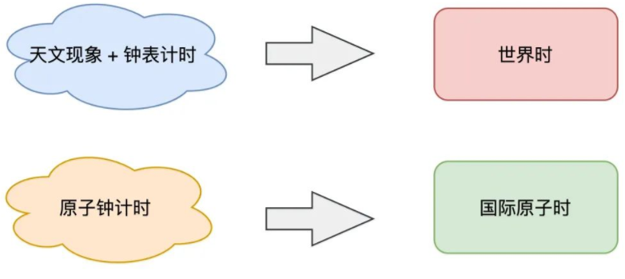
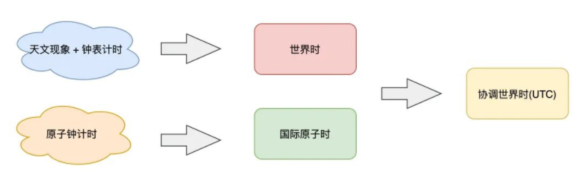
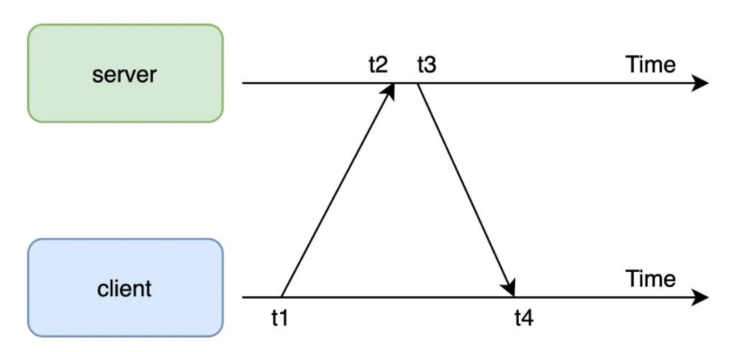

### 时间为什么不准
钟表和计算机内部有一个器件叫做「**晶体振荡器**」，给它**加电压**，它就会**以固定的频率振动**，这个**振动频率的「稳定性」**，取决于它的制造工艺，以及外界环境的影响，同时晶体振荡器也会受到「温度」变化带来的影响，在工作过程中，也会有产生误差，日积月累下来，误差就越来越明显，就会导致时间不准。
### 时间是怎么来的？
#### 以「天文现象」来确定的时间
- 地球的「自转」为一天
- 地球围绕太阳公转一周就被定义为一「年」
- 一天平均划分为 24 等份是「时」，1 小时划分 60「分钟」，1 分钟划分为 60「秒」，1 秒 = 1 / 24 * 60 * 60 = 1 / 86400 天
  
  这些定义，都与「地球自转」和「太阳」息息相关，但是，地球的公转轨道并不是一个正圆，而是一个「椭圆」，也就是说公转速度是「不均匀」的，这意味着每天的时间不是等长的，那根据天推算出的秒，自然也不是「等长」的，把一年内所有天的时长加起来，然后求「平均」，得到相对固定的「天」，然后再计算得出「相对平均」的秒，这样就减小了误差
#### 世界时（Universal Time，简称 UT）
人们以基于「天文现象」+「钟表计时」，确立了第一套时间标准
随着科技的发展，人类对太阳的观测越来越精准，人们发现，地球每天的自转速度也「不是匀速」的，地球的自转受到潮汐、地壳运动、冰川融化、地震等自然现象的影响，越来越慢！会导致之前规定的，每年平均下来一天的时间，现在来看，也是不一样长的
### 一秒到底有多长？
「秒」的定义需求，从本质上讲，就是想要一个「完全稳定」的周期，也就是说，期望每一秒都是固定「等长」的

那在微观世界层面，是否存在一种元素，它的运动周期是「高度稳定」，不受外界环境影响的呢？

每个原子都有一个原子核，核外分层排布着高速运转的电子，当原子受电磁辐射时，它的轨道电子可以从一个位置「跳」到另一个位置，物理学上称此为「跃迁」。当原子内的电子发生跃迁时，原子会吸收或放出一定能量的「电磁波」，这类电磁波就是一种「周期运动」，我们也可以把它看成原子内部的「振荡」。

**铯原子**内部的**振荡周期比其它原子都要更短、更稳定**，而且，这个过程**基本不受环境因素的干扰**。经过层层试验，科学家们认为这是目前人类在地球上可测量到的，运动周期最短、周期最稳定的元素！国际度量衡大会决定采用，**以铯原子跃迁 9192631770 个周期，所持续的时间长度定义为 1 秒**
### 原子钟
基于==铯原子==振荡制造出来的时钟
精准程度：2000 万年不差 1 秒
#### 国际原子时TAI(International Atomic Time)
基于原子钟又确立了一套新的时间标准
### 两套时间标准
- **世界时**：基于天文现象 + 钟表计时，永远与地球自转时间相匹配
- **国际原子时**：基于原子钟计时，每一秒的周期完全等长且固定
  {:height 197, :width 424} 
  两套时间标准都很重要，那两者都保留，不会互相取代
	-
- ### 协调世界时UTC(Coordinated Universal Time)
  **原子时** + **世界时**「协调」得出的时钟
   
  建立一套「新的时间标准」，这套时间以「原子时为基准」，开始计时，走的每一秒都是稳定、精确的。同时，为了兼顾基于天文测量的世界时，人类会「持续观测」世界时与这个新时钟的差距。如果发现两者相差过大时，我们就「人为」地调整一下这个时钟（加一秒或减一秒「闰秒」），让两者相差不超过 0.9 秒。
	-
### 授时
位于陕西省的中国科学院国家授时中心，产生北京时间后，会通过一系列方式，把这个时间广播(无线电波、网络、电话)出去的过程

一个时间服务器，原来是通过国家授时中心同步时间，然后再给其它终端提供时间同步服务的

考虑到数据在网络传输过程中，也是需要时间的，这个时间也会影响到时间的准确性，因此出现了服务器上「自动校准」时间的服务NTP(Network Time Protocol)用来保证机器的时间与时间服务器保持同步
- [[NTP]] 如何同步时间
  
- 网络延时 = (t4 - t1) - (t3 - t2)
	-
- 时间差 = t2 - t1 - 网络延时 / 2 = ((t2 - t1) + (t3 - t4)) / 2
  
  > 注意：这个计算过程假设网络来回路径是对称的，并且时延相同
#### 同步时间时，对正在运行的程序有没有影响？
- **墙上时钟**：通常就是指前面讲到的世界协调时 UTC，校准时间后，可能发生回拨
- **单调时钟**：计算机自启动以后经历的纳秒数，不会回拨
  
  程序调用的「时间 API」，通常获取的时间是墙上时钟，所以，如果时间发生校准，就可能会发生「时光倒流」的情况
#### NTP校准时间的 2 种方式
1. ntpdate：一切以服务端时间为准，「强制修改」本机时间
2. ntpd：采用「润物细无声」的方式修改本机时间，把时间差均摊到每次小的调整上
### 总结
1. 人类的早期生活，依靠观测「天文现象」来测量时间，基于地球自转规律，定义了一套时间标准：「世界时」。
2. 后来人们发现，由于地球公转轨道是一个椭圆，并且地球自转还受到地球内部的影响，自转速度越来越慢，人们发现世界时测算出的时间「不准」。
3. 科学家们开始从「微观世界」寻找更稳定的周期运动，最终确定以「铯原子」的振动频率为基准，制造出了「原子钟」，确立了「世界原子时」，并重新定义了「秒」长度，时长高度精确。
4. 但由于人类社会活动已高度依赖「世界时」，所以科学家们基于「原子时」和「世界时」，最终确立出新的时间标准：「世界协调时」，把它定义成了全球的时间标准，至此，世界标准时间诞生。
5. 中国基于「世界协调时」再加上 8 小时时区之差，确立了「北京时间」，并广播给整个中国大地使用。
6. 「国家授时中心」把北京时间广播给全国的「时间服务器」，我们生活中使用的时间，例如计算机，就是通过时间服务器自动同步校准的。
7. 计算机通过 NTP 完成和时间服务器的「自动校准」，我们的应用程序基于此，才得以获取到准确的时间。
8. NTP 服务应该采用润物细无声的方式同步时间，避免时间发生「倒流」。