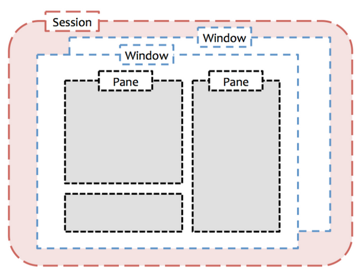

```tmux
# ~/.tmux.conf

bind r source-file ~/.tmux.conf \; display '~/.tmux.conf sourced'


# set -g prefix C-a
# unbind C-b
# bind C-a send-prefix


# Remap window(pane?) navigation to vim
# 用 vim 的方式在窗格间移动光标
unbind-key j
bind-key j select-pane -D
unbind-key k
bind-key k select-pane -U
unbind-key h
bind-key h select-pane -L
unbind-key l
bind-key l select-pane -R


# 开启鼠标模式
set-option -g mouse on


# 允许鼠标选择窗格
#set -g mouse-select-pane on

setw -g mode-keys vi
```
- 常用命令
	- ```bash
	  #1
	       kill-server
	               Kill the tmux server and clients and destroy all sessions.
	  
	       kill-session [-aC] [-t target-session]
	               Destroy the given session, closing any windows linked to it
	               and no other sessions, and detaching all clients attached
	               to it.  If -a is given, all sessions but the specified one
	               is killed.  The -C flag clears alerts (bell, activity, or
	               silence) in all windows linked to the session.
	  
	  #2 copy mode
	  Ctrl b + [
	  
	  #按照指定格式启动tmux
	  tmux new-session -d 'vi ~/.tmux.conf' \; split-window -d \; attach
	  
	  Ex1:
		#!/usr/bin/bash

		: <<COMMENT
		if tmux has-session -t =VCMTS; then
			tmux kill-session -t =VCMTS
			echo "kill session VCMTS ..."
		fi
		COMMENT

		if ! tmux has-session -t =VCMTS; then
			# create session
			tmux new-session -d -s VCMTS


			# rename for the default window
			tmux rename-window -t =VCMTS:0 code


			# create new windows(build, vcoreserver)
			tmux new-window -d -t =VCMTS -n build -c /tmp
			tmux new-window -d -t =VCMTS -n vcoreserver -c /tmp


			# split windows into panes
			tmux split-window -v -t =VCMTS:=code.0
			tmux split-window -v -t =VCMTS:=build.0
			tmux split-window -v -t =VCMTS:=vcoreserver.0


			# send commands for specific panes
			tmux send-keys -t =VCMTS:=code.0 "cd /home/morrism/repos" Enter
			tmux send-keys -t =VCMTS:=code.1 "cd /home/morrism/repos" Enter

			tmux send-keys -t =VCMTS:=build.0 "cd /home/morrism/code/vcmos" Enter
			tmux send-keys -t =VCMTS:=build.1 "cd /home/morrism/code/build" Enter

			tmux send-keys -t =VCMTS:=vcoreserver.0 "ssh vcoreserver" Enter
			tmux send-keys -t =VCMTS:=vcoreserver.1 "ssh vcoreserver" Enter
		fi

		tmux attach -t =VCMTS
	  ```
- Tmux **是一种终端复用器（terminal multiplexer）**
- 
- 快捷键
	- CTRL+b  $   Rename current session
	- CTRL+b  d   Detach client from current session
	- CTRL+b  s   List all sessions
	- CTRL+b  c   Create window
	- CTRL+b  ,   ==Rename window==
	- CTRL+b  w   List all windows
	  background-color:: yellow
	- CTRL+b  &   ==Kill the current window==
	- CTRL+b  %   ==Split horizontally==
	- CTRL+b  "    ==Split vertically==
	- **CTRL+b  q**   Show pane numbers
	- CTRL+b  ?   Show key bindings
	- CTRL+b  x   ==Close current pane==
	- CTRL+b  z   ==Toggle current pane to full screen==
	- CTRL+b  q   Show pane numbers
- detach已经存在在另一个session中的tmux session
	- Ctrl+b  Ctrl+b  d
- 配置文件
	- ```tmux
	  # ~/.tmux.conf
	  
	  bind r source-file ~/.tmux.conf \; display '~/.tmux.conf sourced'
	  
	  # set -g prefix C-a
	  # unbind C-b
	  # bind C-a send-prefix
	  
	  # Remap window(pane?) navigation to vim
	  # 用 vim 的方式在窗格间移动光标
	  unbind-key j
	  bind-key j select-pane -D
	  unbind-key k
	  bind-key k select-pane -U
	  unbind-key h
	  bind-key h select-pane -L
	  unbind-key l
	  bind-key l select-pane -R
	  
	  # 开启鼠标模式
	  set-option -g mouse on
	  
	  # 允许鼠标选择窗格
	  #set -g mouse-select-pane on
	  ```
- 参考文档
	- [Tmux Manual 1](https://zhauniarovich.com/post/2021/2021-03-tmux/)
	- [Tmux Manual 2(Tmux Script to Create New Post Environment)](https://zhauniarovich.com/post/2021/2021-07-new-post-script/)
	- [Scripting A Tmux Work-space Start-up](https://ryan.himmelwright.net/post/scripting-tmux-workspaces/)
	- [tmux](https://www.mankier.com/1/tmux)
	- [TMUX Guide](https://tmuxguide.readthedocs.io/en/latest/tmux/tmux.html)
	- [man tmux](https://man7.org/linux/man-pages/man1/tmux.1.html)
	- [Scripting tmux](https://www.arp242.net/tmux.html)
	- [Tmux Script to Create New Post Environment](https://zhauniarovich.com/post/2021/2021-07-new-post-script/)
- [tmux 学习笔记](https://yuhi.xyz/post/tmux-%E5%AD%A6%E4%B9%A0%E7%AC%94%E8%AE%B0/)
- [Tmux 简介与使用](https://blog.donothing.site/2016/09/29/tmux/)
- [配置 tmux](https://aquaregia.gitbooks.io/tmux-productive-mouse-free-development_zh/content/book-content/Chapter2.html)
- [Tmux 入门教程](https://blog.twofei.com/807/)
- [tao-of-tmux 中文版](https://tao-of-tmux.readthedocs.io/zh-cn/latest/index.html)
- [Scripting tmux](https://toastdriven.com/blog/2009/oct/08/scripting-tmux/)