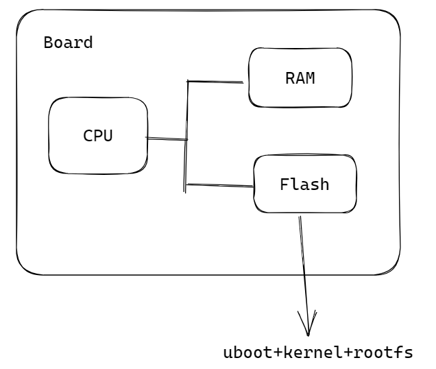
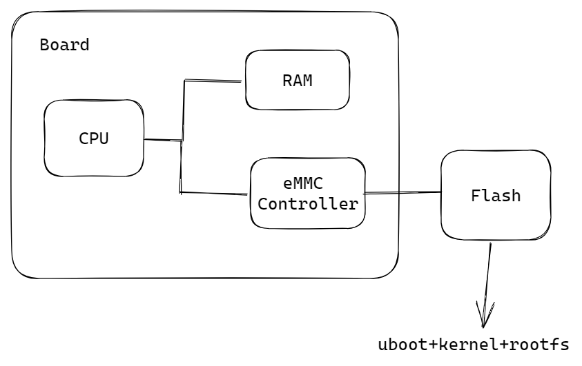

- uboot功能：uboot=裸机程序，核心功能是启动内核
	- uboot为了启动内核，需要做以下的事情
		- 读取Flash，把内核拷贝进内存
			- 硬件初始化
				- 初始化内存
				- 初始化其他硬件（Flash, UART等）
			- 拷贝内核到内存
		- 启动内核
	- 
	- 
- linux内核为了运行用户的应用程序
	- 启动应用程序
		- 能读写flash：驱动程序，以及其他各种驱动程序
		- 能读写文件：文件系统
		- 找到应用程序并启动
- uboot:通用的bootloader（Universal Bootloader）
	- 通用的：支持不同架构下的不同SOC厂家，不同芯片，不同板卡厂家，不同型号的开发板
	- ARM（架构）
		- Samsung
		- NXP（SOC厂家）
			- IMX6ULL（芯片）
				- 100ask（板卡厂家）
					- pro（板卡型号）
					- mini
				- 米尔
			- IMX8
		- ST
	- RISC-V
	- x86
- uboot不一定是板子上电后运行的第一个程序
	- XIP的概念
		- Execute In Place
		- XIP设备
			- CPU可以直接从XIP设备读取并运行指令，例如SRAM，NORFLASH为XIP设备，SD卡为非XIP设备
	- 对于支持从非XIP设备（SD卡，UART等）启动的板卡，必定存在BRom（Boot Rom），CPU上电后运行的第一个程序为BRom
	- BRom
		- CPU上电后读取并运行BRom指令
		- BRom拷贝uboot到内存
		- 执行uboot
			- 硬件初始化（不再初始化内存）
			- 拷贝内核到内存
			- 启动内核
	-
- 参考文档
	- [100 ask百度企业网盘](https://eyun.baidu.com/enterprise/share/link?cid=8272059741155048395&uk=2520074993&sid=202001143120857057#sharelink/path=%2F)