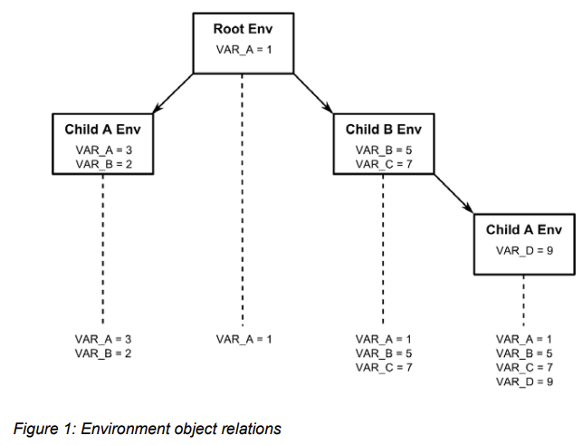
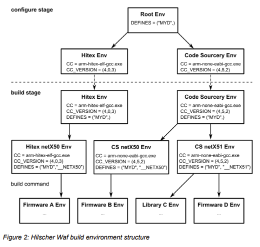

- waf是一个基于python的框架，用来配置，编译和安装软件
- wscript是waf的配置文件，用来指定全局配置，例如定义构建目标，指定所使用的工具链，以及定义不同目标之间的依赖
- 构建过程
	- Option阶段
		- waf解析命令行参数，加载顶层的wscript并调用其中的option函数来获取特定项目的命令行选项并加载扩展命令行选项
	- Configure阶段
		- waf定位外部的应用程序，例如编译器，链接器，脚本解释器等其他工具。waf构建环境对象，即一系列构建变量和设置的集合，最后waf保存环境对象到文件夹`build/c4che`
	- Build阶段
		- 多个build任务可以同时执行，每个build任务执行相关的动作以及更新相关的结果，waf分析源文件依赖并利用依赖自动执行相关任务
	- 环境对象
		- waf使用环境对象(environment objects)来管理与build阶段相关的路径，设置以及参数，这些环境对象继承自父对象
			- 
			- 需要注意的是，根环境对象
		- 通常基于waf的构建系统在configure阶段产生环境对象，但是Hilscher的实现与标准waf不同，它只在配置阶段进行基本的环境准备，大部分的环境对象是在build阶段来配置
			- 
- 参考文档
	- [The Waf Book](https://waf.io/book/)
	- [waflib Python Module Index](https://waf.io/apidocs/py-modindex.html)
	- [Hilscher Waf Build System](https://kb.hilscher.com/download/attachments/89054021/Hilscher%20Waf%20Build%20System%20OI%2002%20EN.pdf?version=1&modificationDate=1516783323450&api=v2)
	- [waf](https://waf.io/)
	- [Bare metal WAF](https://matthew-brett.github.io/pydagogue/bare_metal_waf.html)